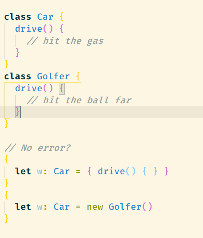

# 24

1. 好文分享：

   一个名字叫“喂”的女人

   [https://www.huxiu.com/article/391585.html](https://www.huxiu.com/article/391585.html)

摘要：李新梅记得，妈妈的枕头下面总是横放着一把刀。有时候是水果刀，有时候是剪刀，刀柄朝向床外，刀刃向内。

这是一个真实动人的故事，催人泪下。

1. 每日一句分享： 群友: 为什么我的室友码代码的时候时常要发出"嘶..嘶"的声音? 沙雕群友: 因为他在写 python
2. 图片分享：

   

3. 招聘信息分享：

   \[上海\]错过这班车你还要再等多久？字节跳动前端架构团队需要你

   [https://v2ex.com/t/726846\#reply34](https://v2ex.com/t/726846#reply34)

4. 短信息分享: 财联社11月24日讯，根据彭博亿万富翁指数显示，马斯克的净资产升至1280亿美元，超越比尔·盖茨，跃升成为全球第二大富豪，仅次于亚马逊创始人贝索斯。
5. `const React = state => view`
6. TypeScript 设计中的最大槽点就是支持鸭子类型。

   

   每次看到具有该特性的代码, 都令我无法忍受.

   在我看来 这种设计只有坏处:

   1. 上下文更难以分析, 数据会无意间具有另一个身份（Type）
   2. 更难以追踪接口, 只能借助编辑器
   3. 与静态类型的原则相违背

7. 快餐文分享：

   1.2W字 \| 了不起的 TypeScript 入门教程

   [https://juejin.cn/post/6844904182843965453](https://juejin.cn/post/6844904182843965453)

   基础的语法，知识点都有提到。

   一份不可多得的 TS 学习指南（1.8W字） [https://juejin.cn/post/6872111128135073806](https://juejin.cn/post/6872111128135073806)

8. 快餐文分享：

   The Tech Stack of a One-Man SaaS

   [https://panelbear.com/blog/tech-stack/](https://panelbear.com/blog/tech-stack/)

   文章列举了作者搭建私有分析服务项目时所用到的技术栈，很全面并都有相应介绍。

9. 快餐文分享：

   每个开发者都应该知道的 SOLID 原则

   [https://mp.weixin.qq.com/s?\_\_biz=MjM5MTA1MjAxMQ==&mid=2651241242&idx=1&sn=e51b1519bf59ad6793567f5d81b915f7](https://mp.weixin.qq.com/s?__biz=MjM5MTA1MjAxMQ==&mid=2651241242&idx=1&sn=e51b1519bf59ad6793567f5d81b915f7)

   1. 单一职责原则
   2. 开闭原则
   3. 里氏替换原则
   4. 接口隔离原则
   5. 依赖倒置原则

10. 女拳主义与 Github 的故事 [https://github.com/CNwoman-bot/evil-man](https://github.com/CNwoman-bot/evil-man)
11. 招聘信息分享: \[社招\] \[校招\] 字节跳动前端后端招聘 [https://v2ex.com/t/728851\#reply0](https://v2ex.com/t/728851#reply0)
12. Spring是否代表着目前Java技术的顶峰，未来的Java将如何发展？ - 大宽宽的回答 - 知乎 [https://www.zhihu.com/question/387902282/answer/1198090641](https://www.zhihu.com/question/387902282/answer/1198090641)
13. 会不会出现不同编程语言的使用者对同一个的概念理解不一致的现象？ - 大宽宽的回答 - 知乎 [https://www.zhihu.com/question/366449539/answer/981637860](https://www.zhihu.com/question/366449539/answer/981637860)
14. 为什么 Java 坚持多线程不选择协程？ - 大宽宽的回答 - 知乎 [https://www.zhihu.com/question/332042250/answer/734115120](https://www.zhihu.com/question/332042250/answer/734115120)
15. 为什么只有Java多线程有可见性问题？ - 大宽宽的回答 - 知乎 [https://www.zhihu.com/question/330803860/answer/724901797](https://www.zhihu.com/question/330803860/answer/724901797)
16. 编程究竟难在哪？ - 大宽宽的回答 - 知乎 [https://www.zhihu.com/question/311432227/answer/681616817](https://www.zhihu.com/question/311432227/answer/681616817)
17. 函数式编程（Functional Programming）相比面向对象编程（Object-oriented Programming）有哪些优缺点？ - 大宽宽的回答 - 知乎 [https://www.zhihu.com/question/19732025/answer/530161703](https://www.zhihu.com/question/19732025/answer/530161703)

