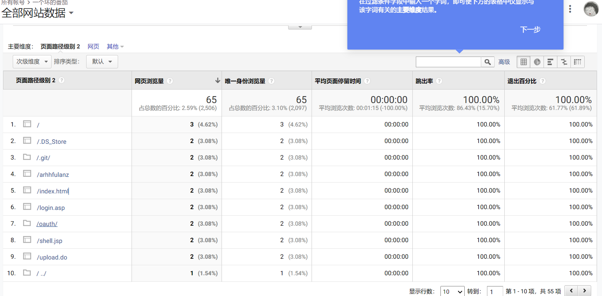

# 25-00

1. 快餐文分享:

   Ruby 3.0.0 Released

   [https://www.ruby-lang.org/en/news/2020/12/25/ruby-3-0-0-released/](https://www.ruby-lang.org/en/news/2020/12/25/ruby-3-0-0-released/)

   迭代了近5年的Ruby 3.0 发布了, 主要的提升聚集在三方面: 性能 并发 类型

   Matz\(作者\) 声明 Ruby3 比 Ruby2 快3倍.

   性能方面: 主要引入了 JIT 即时编译技术, 算得上几乎所有现代语言的编译器内置功能了

   并发方面: Ruby 的实现居然是 Erlang 的 Actor-model 方案, 这就有点意思了

   ​ 并且对于 block 操作, Ruby 还引入了 Fiber Scheduler 设计..

   ​ 哈哈, async await 的思想算是现代语言标配了

   其余信息可以查阅上面链接~

2. 分享一个很有趣的视频

   中国地产第一疑案，武斗抢公章，合同不盖章，兄弟不认账，融创躺中枪

   [https://www.youtube.com/watch?v=es9zFXWc4OM&ab\_channel=%E5%86%B2%E6%B5%AA%E6%99%AE%E6%8B%89%E6%96%AF](https://www.youtube.com/watch?v=es9zFXWc4OM&ab_channel=%E5%86%B2%E6%B5%AA%E6%99%AE%E6%8B%89%E6%96%AF)

   这作者 我也是一路关注过来的, 他的视频都很有质量\(起码很用心\),很符合我胃口.

   算是除了巫师后, 我最喜欢的一位博主了.

   这个视频内容也很有趣, 时长一小时, 可以吃饭的时候刷, 里面讲的故事是 融绿股权之争, 一场充满“人情味”中国式并购案。

3. Question: 如何在浏览器环境 实现 sleep 函数, 可以给出 异步函数, 同步函数 两种实现方案吗?

   

   Question: 当我执行 同步 sleep 函数,比如 sleepBySync\(9e9\), 这个时候浏览器 tab 会怎样?

   A: 9e9有点大了。。

   B: hahah 随意啦 也可以 9\_000\_000\_000

   A: 页面啥交互的操作都无效吧

   B: 是的. tab 直接假死..

   A: 异步的这个使用场景是啥呀

   B: 最简单的就是 mock 网络请求过程..

   B: 那假设是在 react支持 concurrent 版本中, 一个事件 里面调用 sleepBySync\(9e9\), 那页面还会卡死吗

   其实 promise 最有趣的 resolve, reject 这两个函数了, 我一直把他们理解为 异步环境下的 "PV"原语

   可以 把resolve, reject 传到其他异步场景中, 再调用..

   就好比 手动 join 下其他线程, 或者 发出个信号 这样

   C: 好理解

   B: 我根据刚刚的讨论 以及我对 promise 的理解, 写了个限制网络请求数量的demo

   C: 我面字节就考的这个 没答出来

   B: 

   超过限制的request, 会将 resolve 传到了 全局, 等到 resolve 被消费 才会执行\(await\), 已经完成的 网络请求 会按照顺序消耗 resolve 信号.

   典型的 "PV"原语...

   D: 咦，这个我能听懂

   B: 现在 并发方案 业界, 学术界有挺多不同的模式了..

   就比如 上午我说 ruby3 引进的 actor-model, 还有 golang 的 csp, 以及函数式宗教信奉的通过编程范式 去天然引进并发..

   B: 以下来自我之前的一条微博:

   CSP 模型 和 Actor 模型, 具有相同的设计理念: 通过通信来实现共享内存，而不是用共享内存来实现通信。

   然而它们的侧重点不同，Actor 关心通信的实体（对 OOP 更加友好），CSP关心通信的工具。 如果要选其一的话，我更加欣赏 CSP模型。

   假设通信的数据，可以自我实现状态管理，这样一来就不会被通信双方所约束，消息传递的过程 就可以增加更多的抽象。 目前，业界的 CSP 代表 Golang 结合 Context 包已经实现了这一点。

   C: 但是像JS这样的单线程语言，感觉玩不出多少花样来

   B: 对啊.. 撑死就是借用下 异步 api, 去模拟下 fiber 了...

   谁叫 js 天生单线程呢..

4. A: 我说我的网站怎么日活超5k了..

   原来是被人扫描了..

   

   hah 对方一看就是个 新手

   B: 这啥后台啊

   A: Google Analytics 我只接入了 Google tag manager

   如果接 国内的服务, 可以明确查看到 ip 信息的

   就比如百度站长 完全可以.. 但是国内服务 我很排斥..

   除了 我的微博点赞 使用的是 leancloud 国际版, 其他的服务就没有国内的了

   B: 我今天给你微博点赞了 看得到不？

   A: hah 当然

   B: 能看到点赞人的信息吗？

   A: 你觉得呢...

   

   B: 对的我还看了这个请求。。。没看懂

   A: 点赞信息 只是一个简单的kv store, 存储的地方是 leancloud

   k 就是每一条微博的 ID, v 就是微博点赞的数量 hh

   B: 了解了hhh

   A: 我是一直想开源的, 但我觉得 有这需求的人 好像都没几个..

5. 每日一句分享: 2006年，两名美国学生完成了一个名为"发送阳光"的项目。如果手机发现，你的朋友在天气不好的地方，而你在天气很好的地方，那么手机就会提示你，拍一张照片发送给朋友，让他们振作起来。

   后来，两人当中的 Mike Krieger 创建了 Instagram。

6. 快餐文分享:

   JavaScript: Conditional JavaScript, only download when it is appropriate to do so

   [https://umaar.com/dev-tips/242-considerate-javascript/](https://umaar.com/dev-tips/242-considerate-javascript/)

   如何根据终端的配置来进一步优化 UX 呢?这篇文章给出了一些例子.

7. 快餐文分享:

   The headers we don't want

   [https://www.fastly.com/blog/headers-we-dont-want](https://www.fastly.com/blog/headers-we-dont-want)

   本文不是 HTTP response header 的最佳实践, 而是介绍了 有哪些 field 实质上是没有必要的.

8. 好文分享:

   CSS Utility Classes and "Separation of Concerns"

   [https://adamwathan.me/css-utility-classes-and-separation-of-concerns/](https://adamwathan.me/css-utility-classes-and-separation-of-concerns/)

   摘要: Over the last several years, the way I write CSS has transitioned from a very "semantic" approach to something much more like what is often called "functional CSS."  
   这篇文章介绍了 HTML-CSS 编写的多种范式 以及 各种范式之间的差异与感触.本文的作者同时也是 TailWind CSS 的作者, 值得一读. 说实话 我几乎没有思考过 CSS HTML 之间的依赖, 一直按照文中的第一种 或者 BEM 规范去写, 原来它们之间一直没有做到 关注点分离, 一直存在依赖. 不过 现在 CSS IN JS, CSS Module 方案已经从编译方面打开了新出路

