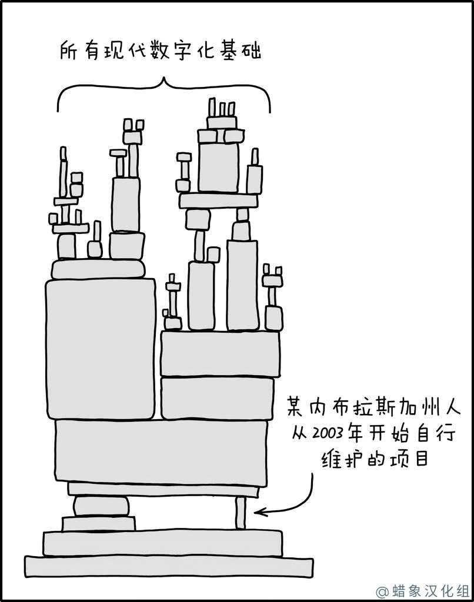

# 12

1.  用 Scala unfold 算子定义斐波那契数列，很简单明了：

    ```
    val fibonacci: Iterator[Int] =      
        Iterator.unfold((1, 1)) {        
            case (x, y) => Some((x, (y, x + y)))      
        }
    ```
2.  惊讶系列分享：

    Implementing Raft for Browsers with Rust and WebRTC

    [https://eevans.co/blog/wraft/](https://eevans.co/blog/wraft/)

    一篇想法很超前的文章，文中讲述了 作者在浏览器终端模拟 Raft 算法的经历，仓库如下。

    [https://github.com/shosti/wraft](https://github.com/shosti/wraft)

    WebRTC 提供了 P2P 的能力（抛开中心信令服务器不谈），现代 Web 也有很多持久化的能力（比如 IndexDB ），那么可不可以将浏览器视为一个节点，去实现一套类似于 etcd 的分布式数据库系统呢？

    文中虽然没有实现该系统，但给了一个很赞的启发。

    在浏览器中去实现 CAP 原理中的 C，可太有趣了。
3.  快餐文分享：

    React Lazy Loading - A Guide to Code Splitting for React Components

    [https://javascript.plainenglish.io/a-guide-to-react-lazy-loading-6bca6be7159](https://javascript.plainenglish.io/a-guide-to-react-lazy-loading-6bca6be7159)

    文中介绍了一种工程实践，利用 React.lazyLoad 将非首屏的资源 拆包后延迟加载，从最开始的 首屏加载 1mb 的资源变成 只加载 几十kb 的资源，收益非常明显。
4.  好文分享：

    Generator Tricks For Systems Programmers

    [http://www.dabeaz.com/generators/Generators.pdf](http://www.dabeaz.com/generators/Generators.pdf)

    一篇讲述 Python Generator 的好文，文中用大量例子去证明生成器在处理数据 IO 时的优美便捷性。

    这种内部 DSL 设计得确实很赞，既可以流式处理数据源，又可以像 C# Linq 那样查询过滤数据。
5. .png>)
6.  分享个惊艳的项目：

    liriliri/chii - Remote debugging tool

    [https://github.com/liriliri/chii](https://github.com/liriliri/chii)

    这是一个调试神器，原理类似于多年前的 Weinre。

    可以做到 远程（互联网）、跨终端设备限制（就算是 WKWebview）、且无需代理去调试当前设备浏览的页面。

    其流程是需要在页面中注入一段脚本，然后脚本与远程服务器建立 Websocket 连接。 服务器拿到终端页面的信息后，通过 Chrome 开源的 Devtool fronted，渲染出 调试页面供用户使用。

    用户在调试页面交互时，会发送消息到终端。

    而刚刚提到终端注入的脚本 可以视为 Chrome devtools protocol JavaScript implementation，是对于调试动作的消费端。

    一句话概述：通过 WS 建连， Chrome devtools protocol 作为通信规范，Chrome devtools-fronted 作为调试工具页面，很大程度上 模拟出 开发时的调试体验。

    值得一提的，chill 还有提供 whistle 插件。

    [https://github.com/liriliri/whistle.chii](https://github.com/liriliri/whistle.chii)

    而 阿里开源的 lightproxy 调试工具 正是基于 ws + 该插件的 electron 封装。

    该工具，有很大的市场前景，可以被挖掘下，天下唯 WKWebview 调试苦矣。
7.  每日一句分享：

    The modern web is a nightmare without an adblocker and annoyance blocklists.
8.  快餐文分享：

    Async I/O for Dummies

    [https://www.alwaysrightinstitute.com/async-io-by-example/](https://www.alwaysrightinstitute.com/async-io-by-example/)

    一篇讲述异步IO、高并发基础概念的文章。

    开篇先是从处理IO 时的 回调地狱到 Future 模式再到最后的 async，简单概述了下语法层面的各种方式，但 async 也有函数染色的问题。

    后面主要用例子解释了 面临 C10K 问题时 NIO 的必要性。

    最后提到的 Back-Pressure 类似于限流，削峰 的概念。
9.  快餐文分享：

    VasSonic成长历程[https://github.com/Tencent/VasSonic/blob/master/assets/sonic%E5%8F%91%E5%B1%95%E5%8E%86%E7%A8%8B.md](https://github.com/Tencent/VasSonic/blob/master/assets/sonic%E5%8F%91%E5%B1%95%E5%8E%86%E7%A8%8B.md)

    文章介绍了 腾讯开源下 专注于首屏性能的全链路项目 VasSonic。

    项目中用了很多奇技淫巧、黑科技，值得学习、借鉴。

    但该项目 不是一个通用的解决方案，客户端、前端、服务端都要同步接入，侵入性太大..
10. .png>)
11. 快餐文分享：

    Service worker caching and HTTP caching

    [https://web.dev/service-worker-caching-and-http-caching/](https://web.dev/service-worker-caching-and-http-caching/)

    文章介绍了 SW Cache 与 HTTP 缓存之间的异同，可以看出 SW Cache 使用场景比HTTP Cache 更多样，可以精确控制每个文件的缓存时间，缓存策略，并且使用时也没有 HTTP 缓存的大小限制。
12. 快餐文分享：

    Defensive CSS

    [https://ishadeed.com/article/defensive-css/](https://ishadeed.com/article/defensive-css/)

    防御性编程一直以来都是保障稳定性的规范之一，在编写样式时，常见的措施有 stylelint，CSS reset 库，但这些都很通用，太通用就不实用。

    而文中结合实际场景介绍了大量 CSS 防御性编程的案例，有很多都值得学习。
13. 每日一句分享：

    Logging should not do any side effects except writing to the log.

    （Log4j 是今天最亮的一颗星，一己之力 hack 调互联网）

    
14. 分享一本最近读完的书：

    《字节跳动：从0到1的秘密》

    [https://book.douban.com/subject/35544985/](https://book.douban.com/subject/35544985/)

    我曾经认为，想要创业成功 最直观的方式是解决一个没人没解决过的问题，或者挖掘一个全新的垂类、信息交互场景，然后像大多数创业故事那样一骑绝尘。

    但现在看来 想要创业成功，关键不在于你的 idea，解决方案，因为复制想法的成本很低，就比如文中讲述的抖音发展历程，或者国内那些国民应用。关键应该在于你是否有入场机会，以及有入场机会后 各方面资源的协同 补足性。

    创新与想法不是关键。
15. 好文分享：

    I blew $720 on 100 notebooks from Alibaba and started a Paper Website business

    [https://daily.tinyprojects.dev/paper\_website](https://daily.tinyprojects.dev/paper\_website)

    文章介绍了作者的初创项目，整个项目仅来自作者无意间的一个荒诞想法："Can you build a website from a piece of paper?"

    想法虽然很荒诞，但现在 OCR 的识别能力 已经可满足大部分场景，关键难题就延伸成 如何提高识别的准确率，文中作者使用 GPT-3 训练出了一个 spellchecker，然后再将识别出来的内容，生成网页文章。

    当基本满足自己使用后，作者开始考虑产品的商业模式，他使用了常见 saas 产品的订阅服务，一年 3600💲…

    万事俱备后，就差推广了，作者的推广路径很原始，在社区中不停宣传，然后被某专注于高效率办公自媒体发现宣传后，最终获得了流量、客户。同时更大的意义是 它做到了改变人们的写作方式。

    Can you build a website from a piece of paper? People were doing it right now!

    从文章可以看出，一个成功的产品离不开，对可行性产品的挖掘能力，执行力 快速打造mvp，以及根据现有资源的推广。
16. 快餐文分享：

    从消费者行为模式到用户增长模型

    [https://www.biaodianfu.com/consumer-behavior-model.html](https://www.biaodianfu.com/consumer-behavior-model.html)

    文章先是梳理了 消费者的行为，包括上图的多种模式，这些模式之间的侧重点不同，整体偏学术；文章后半部分以一些互联网公司的案例 分析了各种用户增加模型，其中模型中指标的深层含义与消费者行为密切关联。

    .png>)
17. 快餐文分享：

    Why C# goes well with TypeScript

    [https://nate.org/csharp-and-typescript](https://nate.org/csharp-and-typescript)

    文章是一篇非常主观 谈编程语言的文章，作者用了很多例子来比较 ts、js 与 csharp 语法的异同，并单独讲了一些 csharp 中设计很赞的语法糖，值得一提的是 ts 与 csharp 都是被 Anders Hejlsberg 设计的，出自大师手笔。
18. 快餐文分享：

    Record, replay and measure user flows

    [https://developer.chrome.com/docs/devtools/recorder/](https://developer.chrome.com/docs/devtools/recorder/)

    Chrome 将在 97 版本新增 Recorder 特性，可记录保存用户在页面上的操作，回放操作时也可以增加某些步骤编辑，或者做性能评测。 算是自动化场景的杀手锏。
19. 惊讶系列分享：

    Do infinite scroll without JavaScript

    [https://noscript-infinite-catfacts.glitch.me/](https://noscript-infinite-catfacts.glitch.me/)

    如何不使用 JS 做到页面无限滚动，自动加载下一页的内容呢？链接中给出了实例。 基本原理是：服务端保持长连接，并且 页面底部有 声明 lazyload 属性的 隐藏 img 元素，每次滚动到底部时，img 发起请求，长连接写入新的内容 + 新的 img 元素。
20. 分享个项目：

    webpack/tapable

    [https://github.com/webpack/tapable](https://github.com/webpack/tapable)

    该项目是 Webpack 的插件管理库，可单独使用。

    如果你的项目中存在明显的事件流特征，且逻辑依赖之间层次清晰，那么可以尝试使用 Tapable 进一步的划分项目中的流程，将核心逻辑与可插拔的逻辑抽离出来。
21. 每日一句分享：

    能被 Saas 化的产品，终将被 Saas 化。
22. 每日一句分享：

    越是创造性工作，就越不可能把工作和生活分开。

    体力劳动搬砖你可以朝九晚五，下班后脑子里不会想砖头；如果是文艺创作，大部分灵感都来自非创作时的生活见闻。

    干互联网也是如此，下班路上脑子仍然会对设计问题代码问题思索，生活和工作都沉溺在屏幕中。

    [https://twitter.com/ftium4/status/1476127072766820355?s=20](https://twitter.com/ftium4/status/1476127072766820355?s=20)
