# 19-31

1.  分享篇 Go 圣经中的一章节: 9.8. Goroutines和线程

    [https://books.studygolang.com/gopl-zh/ch9/ch9-08.html](https://books.studygolang.com/gopl-zh/ch9/ch9-08.html)

    很好地解释了协程的意义，为什么优于线程，线程调度的缺点，以及是如何打满多核CPU的。

    文章对 Golang 协程调度器只是简单地带过，感兴趣的同学可以去搜下 Golang GMP Scheduler.
2.  QUIC 协议原理浅解

    [https://mp.weixin.qq.com/s/Bm\_4M-QCcWYRqv1V8a-J-A](https://mp.weixin.qq.com/s/Bm\_4M-QCcWYRqv1V8a-J-A) \
    好文分享，文章介绍了 HTTP 协议的历史上不同的版本、特性、缺点。 HTTP3 over quic 是如何从 udp 层解决历史遗留问题的，最后给出了 quic的多种特性，以及报文组成。

    总结下文章提到的 quic 特性:

    1. 动态连接，就算客户端换了 ip，网络环境 还是可以保持连接。
    2. 0 rtt 握手，直接覆盖了 https 组成的 tls 层。
    3. 可自定义拥塞控制算法，传统的 tcp 拥塞控制 总是用力过猛(直接减半，在递增)，而这些年很火的 谷歌推出的BRR 算法则柔和的多，可惜标准已定 只能手动更改。
    4. 利用额外的字段，解决了队头阻塞问题。

    这些特性，每一个拿出来 都足够改变现在的网络环境。 \
    记得之前了解过，早期的QQ通讯 就是用的两次udp 机制实现 消息确认的。
3. 每日一句分享: \
   对于运营来说，“制造冲突”是一种比较有风险的做法。当然，这也是一种能够在短时间内制造出用户活跃和用户引入的做法。最通常的运营方式是利用社会热点，创造多种不同角度、不同立场的初始内容，然后通过多种手段，让认同不同观点的用户发现彼此，并制造出冲突，从而引发用户的站队。 \
   摘抄自《从零开始做运营》
4.  分享个网站，收集了 一些常见的 IT 词汇。 \
    The Strange Roots

    [https://www.thestrangeroots.com/posts/](https://www.thestrangeroots.com/posts/)

    记录下两个没印象的词汇:

    1. Dongle 适配器
    2. Nintendo 任天堂

    SpringBoot ✘ 全栈式应用程序框架 ✔ 春季靴
5.  快餐文分享: \
    Asynchronous programming. Blocking I/O and non-blocking I/O

    [https://luminousmen.com/post/asynchronous-programming-blocking-and-non-blocking](https://luminousmen.com/post/asynchronous-programming-blocking-and-non-blocking)

    作者简述了 socket 通信中基础的IO模型，阻塞 IO、NIO，并给出了 Python 实现的 Demo，结尾讲解了 多任务不同架构的优缺点，多进程 或 多线程。

    文章并没有将传统的多路 IO 模型与例子结合起来，我补充下: \
    Select Poll epoll 都是 NIO 模型。 文中给出的 NIO Demo 与 Select 的原理相近。
6.  \
   React Fiber 工作机制。
7.  想到一个问题: 如果只有一个线程 可以实现异步吗？ \
    想了想 应该是可以通过硬件提供的 scheduler 机制 做到。 \
    呃，这个问题没有意义。

    其实昨晚想到的那个 如何在单线程 （单个执行单元）实现异步的问题。 \
    我的第一想法就是 通过事件模型，像 JS 这样。 但是很明显，虽然执行的过程是单线程的，但是 事件触发的机制 是单线程无法保证的。 \
    而不管是 浏览器环境 还是 JS 独立的运行时，当外部 IO 完成后，回调函数插入事件循环 这一过程，是单个线程无法做到的。 \
    换个角度来思考，JS 的这一套单线程执行机制 + 事件循环模型，在一定程度上 屏蔽了 并发原语带来的复杂性..
8.  好文分享: \
    Self：编程语言的变革仍未到来

    [https://ray-eldath.me/programming/self-language/](https://ray-eldath.me/programming/self-language/)

    文章很短，但作者翻译的那段话非常有价值，值得思考。 \
    摘要：是机器服务于人类，还是人类服务于机器？人们创造了人造物，而它们又反过来重塑它们的创造者。这些人造物包括能产生深远影响的思想体系。\
    &#x20;有些思想体系其实是元思想体系——也就是说，它们是构建其他思想体系时应该遵循的思维方式。\
    由于它们指导着其他思想体系的构建，所以它们的影响尤其大，人们在设计这样的元思想体系时必须特别小心。 \
    用户界面框架和编程语言语义却要求用户以某种特定的方式思考，而我们却未能说服世界，以我们提出的方式思考要更好些。我们是错在试图唤醒事实上并不存在于每个人心中的创新性精神吗？还是说使用动态语言有一些经济学意义上的影响，使之不切实际？\
    我们，编程语言研究界的许多人们都在暗自怀疑，编程语言研究是否已经与世界上大多数的程序员无关——尽管显而易见的事实是，在许多方面，计算机仍然是痛苦的、不透明的黑盒子，它仍在传播新的数字瘟疫。
9. 3 月 1 - 18 日 汇总分享，共产出 136 条，暂未分类： [https://thinking.tomotoes.com/archives/2021/3/1-18](https://thinking.tomotoes.com/archives/2021/3/1-18) \
   由于现实中要做的事情越来越多，并且最近接触的信息媒介 偏书籍（很难像文章 作为信息流分享），所以分享频率 与上月降低了小一半.. 而且主题讨论 也很少进行了。 \
   我相信事情是可以一件一件一件一件做完的😷
10. 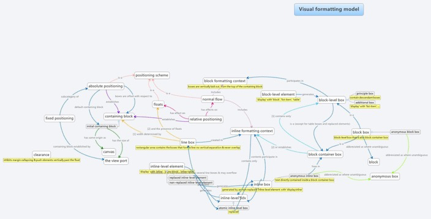 \
    CSS IS AWESOME！
11. 好文分享： \
    introduction-to-parser-combinators

    [https://gist.github.com/yelouafi/556e5159e869952335e01f6b473c4ec1](https://gist.github.com/yelouafi/556e5159e869952335e01f6b473c4ec1)

    这篇文章是我最近读到 关于函数式 最好的一篇了。 \
    作者在文章开头，从一个简单的加法解析 Demo 讲解了 parser 的基础概念。 并一步步递进，通过 组合多个 parser 实现更高级的能力。 文章中半部分是全文最精彩的内容，通过一个个 combinator，FP 的优美强大体现得一览无遗，即保证了程序的可读性 又完全与副状态隔离，在数据流映射与转换的过程中，实现了可支持多种计算的解析器。 \
    文章最后给出了 generator 形式的实现，而 generator 历来都是 FP 最基础的特性之一。

    对这篇文章感兴趣的同学，非常建议反复阅读。
12. 分享一个项目： \
    Charts.css

    [https://chartscss.org/](https://chartscss.org/)

    一个 通过 CSS + Table 实现数据可视化的库，这种可视化的打开方式 还是挺新奇的\~

    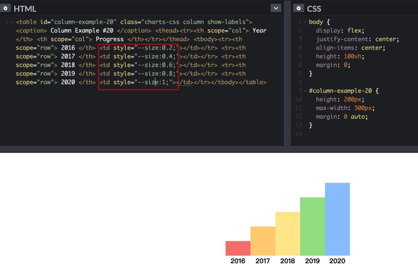
13. 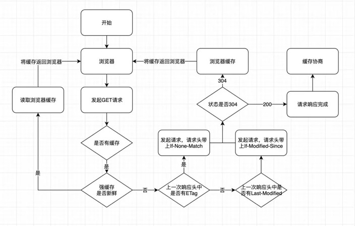

    HTTP 的强缓存与协商缓存 经典图解。
14. 每日一句分享： \
    人生所有的事情之中，后悔是最可怕的。 失败是一种答案，拒绝也是一种答案，但后悔却是永远得不到答案。"要是我当初......"、"如果我那样选了......"、"不知道如果走了那条路会怎样......"，你永远、永远都不会知道答案，而且这些疑问会纠缠你一辈子。

    ——来自《天生有罪》
15. 快餐文分享： \
    Useful Hooks

    [https://react-typescript-cheatsheet.netlify.app/docs/basic/useful-hooks](https://react-typescript-cheatsheet.netlify.app/docs/basic/useful-hooks) \
    文中给出了一些 Hooks 的实现，不过偏少..

    我之前整理过一份 Hooks Recipes，里面有数十个 我觉得优美的 Hooks 实现，感兴趣的同学可以了解下\~

    [https://thinking.tomotoes.com/tags/docs/dig-deep-into-hooks](https://thinking.tomotoes.com/tags/docs/dig-deep-into-hooks)

    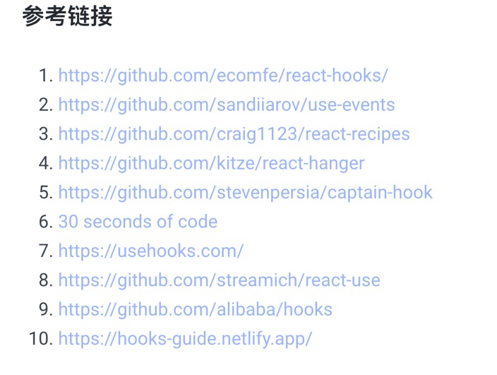

    参考了多个开源仓库 ahook、react-use ... 花费很多时间收集、整理的Hooks 食谱\~
16. 有人将费曼的成长经历总结成了一套学习方法，叫“费曼学习法”。 \
    过程如下: 学习目标→转换讲述→总结疑问→简化理解

    首先你要确定你要学习什么，然后集中精神理解并学习这些知识。 学习结束后，你需要将你学习到的东西通过讲述给别人听，来加深印象，在这个讲述的过程中，你会知道自己理解了什么，学会了什么，也会知道没明白什么，然后记下这些没学会的问题。 \
    最后你在这个转化的讲述的过程中你通过自己组织的语言和理解，已经完成了对所学知识的简化，更便于记忆。

    总结疑问是最重要的一环，一定要对知识 进行深入思考，提取本质，对我来说 思考最有效的方式就是 对当前知识的猜想 why what how，以及与其他知识之间的联系、对比。\
    关于深入思考，这里摘抄《暗时间》中一段给我留下很深印象的文字: 知识的表象细节会迷惑我们的眼睛，阻碍我们对知识的转移运用，因为表面上不相似，而我们的记忆提取又是很大程度上依赖于一些表象上的线索来提取的，因此这些表面不相似性便阻碍了我们在问题之间进行的类比，阻碍了我们将在一个情境下掌握的道理运用到另一个情境下。

    我们常说有些人善于看到事物的本质，这样的人往往就是那些聪明人，因为他们更能够举一反三，将一个地方领悟的道理推广到另一个看上去很不一样的地方。

    而简化理解 指的就是 在更高维护 抽象其本质，去掉泛化、不确定性带来的无关因素。
17. 分享个V社帖子: \
    Rust 它凭啥这么难？学习路线这么陡峭。

    [https://www.v2ex.com/t/763062](https://www.v2ex.com/t/763062)

    好家伙，现场吐槽大会。 \
    里面有条评论把我逗笑了: 用过 C++ 的都说好。 \
    帖子中有些讨论还是挺有价值的。
18. 分享个响应式编程的概念： If the functional programming is the programming with pure functions, the reactive programming would be the programming with observables.

    来自刚刚在 Codewars 刷到的一道题目的前置理论，题目更详细地描述了 What is an observable?

    [https://www.codewars.com/kata/5c8f822533a2b7336aeee2de](https://www.codewars.com/kata/5c8f822533a2b7336aeee2de)

    响应式编程 最经典的案件就是 事件模型了，事件可以抽象成以下的多种场景：

    1. 于终端应用角度，可能是 GUI 上的用户交互
    2. 于服务端角度，可能是某一个打到 服务器 80 端口号上的 HTTP 请求
    3. 于操作系统角度，可能是 terminal 上的一次信号调用。

    而事件模型的本质与响应式强调的 observable 不谋而合。

    那什么是 observable 呢？ \
    结合 题目描述，An observable is a powerful pattern that enables non-deterministic and lazy pull computations.

    简单总结下 observable 的三个特点：

    1. Non-deterministic 数据源不确定性: 体现在 到达的时间不确定，次数不确定。
    2. Lazy 只有在数据源到达之后，才会执行相应逻辑。
    3. Pull Consumer 不必关心 Producer，只需要关心自己的消费流程即可，换句话说，消费者是感知不到数据源的。

    感兴趣的朋友可以刷下上面的题目：

    [https://www.codewars.com/kata/5c8f822533a2b7336aeee2de](https://www.codewars.com/kata/5c8f822533a2b7336aeee2de)

    该系列一共有 5 道题，每到题目都是层层递进的。 \
    前两个题目 是要求实现 基本的 Reactive programming 的 observer。 \
    后面的题目 则是要求 在原有 RP 题解的基础上，实现 多个 Functional programming 的 operator、combinator。 \
    整个系列的目的是 实现一个简易版的 Rxjs\~
19. 其实在 Codewars 上我一直有道题没有解决，每次想到都很遗憾(傲娇求助

    Mine Sweeper

    [https://www.codewars.com/kata/57ff9d3b8f7dda23130015fa](https://www.codewars.com/kata/57ff9d3b8f7dda23130015fa)

    简述: 给一个二维数组, 里面的特定元素代表的是 扫雷游戏中的一些格子, 就比如雷啊.. 或者 数字啊.. 然后你需要做到是 该盘扫雷能否通关.

    这道题 我去年死磕了两天, 最后通过了大部分的 case, 一直卡在一些奇怪的边缘 case, 结果不得不放弃了.. 我当时的解决方案:

    [https://github.com/Tomotoes/Kotlin-Note/blob/master/src/Solution.kt](https://github.com/Tomotoes/Kotlin-Note/blob/master/src/Solution.kt)

    Codewars 上的题目很多都不限制语言，一些难题，或者 Beta 系列题 可能没有题解。 \
    题目质量都很高，并且范围不限于 算法，有很多有关语言特性，编程范式的题目。

    除了Codewars ，还有国人开发的 ScriptOJ，我有幸刷过上面的所有题，SOJ 的题目重心也不只限于算法，有实现简易 vdom，mvvm模型，LINQ JS版本，Brainfuck 解释器等好题。 可惜目前作者不维护，关站了。
20.  \
    B站这直播页的技术栈 全了.. \
    A: 不会是微前端吧 \
    因为业务组之间技术栈没统一，不是微前端 应该是多个模块组合导致的.. \
    技术栈没统一，其实能看出 公司中团队管理的一些信息。 \
    尤其是前端，不同团队 使用不同的技术栈，很难沉淀出 复用组件，这缺点挺明显的。给我的感觉就像是团队之间互不妥协。 \
    如果是服务端还好，各服务之间的调用 可以使用 rpc 网络协议层、服务注册管理或者加个 mesh 等实现解耦。
21. 可以开个话题讨论，之前听一名大佬说过一句话，意思是 中国的科技水平发展很迅猛，并用 BAT 这些头部大厂 以及 微信，抖音这些现象级产品 举例。 \
    关于这一点，国内计算机的科技水平该如何体现呢？真的是世界前列吗？

    对于国内科技水平（计算机）很高，我一直是不以为然。 \
    科技水平这个词很泛化，如果用现象级产品做特例的话，其实与“科技”关系不大。

    与其说是 国内科技水平很高，不如说 国内技术水平很高。 \
    因为科技与技术 本身就不可一并而论。 在我看来 科技注重的是发明创造，技术注重的是应用实践。 显然更合适来说，中国算是技术大国。\
    &#x20;A: 业务大国 \
    B: 科技发展很迅猛，这句话完全认同；不可否认的是，现象级潮流市场造就了大规模产业的发展，相对的给IT行业有了更多的创造空间。关于高与不高如何界定我是不清楚的，还有一个就是，把科学技术，分成发明创造和注重应用实践，这个有点较真儿了，是发明创造不属于技术，还是技术创造不属于科技发明；实现了技术创新，必然要用于实践发展；而不断发展的趋力形势也必将加快技术的创新。 所以从理解方面，我并不赞同你所说的，科技与技术本身就不可一并而论，这句话。 \
    C: 先补充下状语，上面指的科学，技术是有关计算机的 \
    你说的有道理，这两点是相辅相成，互相发展的。 \
    但是很明显，国内计算机学术上的创新 与 技术上应用的量级 差距挺大的。 \
    这和市场经济，教育机制也有挺大关系。
22. 突然想到了 类型系统与语义之间的一种联系。 \
    假如 一门 PL 的类型系统支持自定义类型（无论复合类型还是基础类型），完成可以说明该 PL 有将语义融合进类型的能力。

    举个简单例子： const china:string = 'CHINA'

    type Country = string const america:Country = 'America'

    我觉得这种应用只限于 基础类型 不能枚举的场景。

    复合类型没什么好谈了，本身是基础类型上的自定义构建。 \
    基础类型自定义的话，最好还是使用枚举，不然会破坏类型系统，不要为了可读性去做包装。
23. 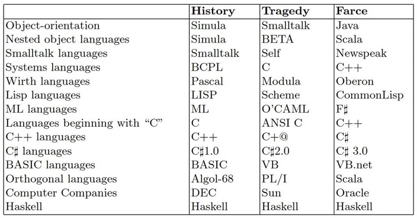

    hah 为什么 Haskell 这么特别，成于 Haskell 败于 Haskell\~ \
    这张图背后折射的现象很明显，学术界 与 市场 之间存在的 Gap\~ \
    当然 Scala 虽然算是一门学术派语言，但这门语言的特性实在是很多，几乎是一门大杂烩，并且在业界也有很多能打的产品，比如 Spark、kafka、flink..
24. 好文分享： \
    10 MOST(LY DEAD) INFLUENTIAL PROGRAMMING LANGUAGES

    [https://www.hillelwayne.com/post/influential-dead-languages/](https://www.hillelwayne.com/post/influential-dead-languages/)

    作者介绍了已死却为后继者奠定基础理论，元思想体系的十门编程语言。 \
    文章按照10个章节分别介绍了 各个语言提出了哪些思想创新，创建的背景是什么，为什么没落的原因。

    读完这篇文章，我脑子里一直回想着垠神曾表达过的一则观点：现代编程语言只不过是一个个理论的组装工。

    总结一下各大语言的创新点：

    1. COBOL: 提出了层级化结构
    2. ALGOL: lexical scoping, structured programming, nested functions, formal language specifications, call-by-name semantics, BNF grammars, block comments…
    3. APL: 矩阵处理 Through this innovation APL lead to R, numpy, pandas, Matlab, etc.
    4. BASIC: runtime interpretation 以及更深远的教育影响
    5. PL/I: 结构化类型(eg: user.name)，指针，常量定义，函数重载
    6. SIMULA 67: 子类，虚方法，类中保护级别字段，对 oop 正确的建模影响
    7. Pascal: 没有语法上的创新，更多聚焦于编程思想
    8. CLU: 迭代器，抽象数据类型，泛型，异常检查
    9. ML: 类型推导，代数类型，模型，fp with type (ML 的影响是非常大的)
    10. Smalltalk: OOP, 不同单元之间的消息传递，影响了 Actor 通信模型。

    除了文中提到的这影响深远的十大语言，我想补充下其他 在我看来同样具有很高影响力的语言：

    1. Self: 原型链，语言虚拟机概念，支持 GUI...
    2. Lisp: Lambda 演算的映射，元编程，宏...
    3. Fortran: 第一种高级语言
25. 快餐文分享： \
    Synchronous generators (advanced)

    [https://exploringjs.com/impatient-js/ch\_sync-generators.html](https://exploringjs.com/impatient-js/ch\_sync-generators.html)

    文章简介了 ES6 提供 Generator 特性，并给出了一些简单 Demo，感兴趣的同学可以刷下。
26. 分享个有趣的帖子： \
    WHY DOES TIME GO FASTER AS WE GET OLDER?

    [https://ubiquity.acm.org/article.cfm?id=1455706](https://ubiquity.acm.org/article.cfm?id=1455706)

    为什么随着年龄增长 时间流逝得越快？ 帖子中有很多有趣的观点。摘抄自 其中一条的观点（很赞同）: Great post. I think there are three reasons why there is a general consensus that time seems to be moving faster as we age. Firstly, novelty tends to slow down our perception of things. When we are young so many things are novel that it seems like so much more actually happened in the time span. Secondly, its the relativity thing, where as we age, we have more years under the belt, so each that passes seems like that much less. Thirdly, technology is speeding all sorts of things up. I think the information overload of modern day life is enough to make things seem like they are happening faster. The older you are, the more you pick up on this, especially as your ability to adapt may not be that which you had when you are younger.
27. 我发现了个让我不能理解的点。 为什么国内的知网、acm、IEEE 这些知名的顶会期刊库网站， 读论文需要花钱啊..

    知识与钱绑定在一起... 呃... 是我理想化了？我不能理解...

    这些数字库 不应该站在人类知识分享的角度去出发嘛... 互联网精神呢...

    让我回想起 之前在阮一峰老师《前方的路》读过的一篇文章： \
    论文的版权属于谁？

    [http://www.ruanyifeng.com/blog/2011/08/copyright\_of\_academic\_papers.html](http://www.ruanyifeng.com/blog/2011/08/copyright\_of\_academic\_papers.html)

    摘要： 论文不是消费品，而是知识；消费品越用越少，知识越用越多。知识的自由传播是造福全人类的事情，限制论文流通是以牺牲人类福利为代价的，换来的只是一些垄断机构的利润。废除论文版权，不会抑制创新，只会推动创新。

    之前看过一句话，在学术界 最关键得指标就是论文的引用次数。 今晚根据接触到的信息，真是大开眼界（一定是我找到的资源不对..
28. 分享篇文章： \
    如何收集和整理论文（面向CS专业）

    [https://ying-zhang.github.io/misc/2016/we-love-paper/](https://ying-zhang.github.io/misc/2016/we-love-paper/)

    文章内有挺多干货的，内容如题。
29. 分享个网站: \
    展示 CSS 中所有命名的颜色

    [https://enes.in/sorted-colors/](https://enes.in/sorted-colors/) \
    A tool to sort the named CSS colors in a way that it shows related colors together
30. 每日一句分享: \
    人活在世上需要什么呀？ 食物、空气、水和思想。 \
    A: 需要满足，精神和生理满足
31. 好文分享:

    浅谈国内高校编程语言教育摘要

    [https://zhuanlan.zhihu.com/p/43914842](https://zhuanlan.zhihu.com/p/43914842)

    这篇文章从“写作动机”开始，先后针对“为什么我国不重视编程语言教育”，“好的编程语言教育会对个人和社会带来什么好处”，“应当如何讲授编程语言课程”几个问题逐一阐述了作者的个人观点。

    文章内有一些引发我思考的话: 对于个人，受到更好的编程语言教育意味着可以更好的理解从语言本身到构建出的复杂软件系统，对于问题的“势”和通过编程手段解决问题的“器”也都会有更好的把握。
32. 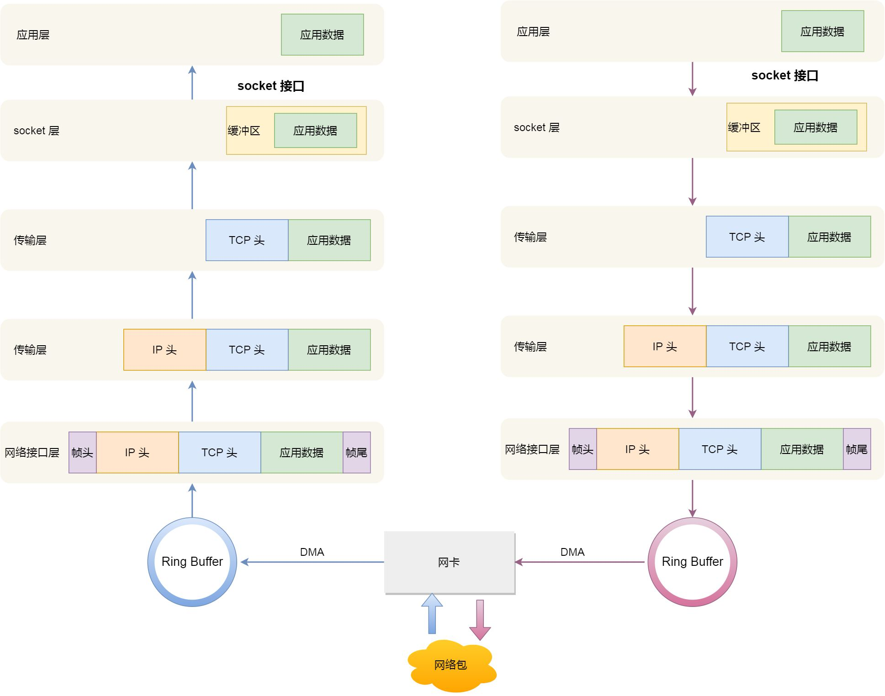 \
    图片来自小林的这篇文章。 你不好奇 Linux 是如何收发网络包的？

    [https://zhuanlan.zhihu.com/p/339698383](https://zhuanlan.zhihu.com/p/339698383)
33. Podcast 分享:

    [https://moon.fm/share/episode/4539/](https://moon.fm/share/episode/4539/) \
    🎙Prolog---王四哥

    延伸阅读: Prolog 语言入门教程

    [https://www.ruanyifeng.com/blog/2019/01/prolog.html](https://www.ruanyifeng.com/blog/2019/01/prolog.html) \
    Prolog 一门专注于逻辑推理的编程语言。
34. 快餐文分享: \
    Scaling webapps for newbs & non-techies \
    [https://arcentry.com/blog/scaling-webapps-for-newbs-and-non-techies/](https://arcentry.com/blog/scaling-webapps-for-newbs-and-non-techies/)

    文章讲解了 服务端扩容演变的过程。 \
    从最开始的单 server 单 db 架构，一步步通过各种中间件，架构划分，多层负载均衡，针对耗时 IO 问题的解决方案，演化成一个三高(并发，可用，性能)的系统架构。

    文章整体偏基础，感兴趣的同学可以刷一下。
35. 分布式系统有两大难题：一是消息的excactly once delivery, 二是消息的保序，一是消息的excactly once delivery.
36. 如何评价编译器技术「前端不过是小打小闹，后端才是真正的难」这一观点？ - Guannan Wei的回答 - 知乎

    [https://www.zhihu.com/question/429304366/answer/1595607429](https://www.zhihu.com/question/429304366/answer/1595607429) \
    分享个关于 compiler 的精彩回答，作者先是介绍了编译器的前中后端概念，又给出了复杂度的论证，最后提出了很多值得思考的问题。
37. primes = sieve \[2..] \
    sieve (p:xs) = p : sieve \[x| x <- xs , mod x p /=0 ]

    Haskell 两行实现素数筛，太优美了... 简直是在写诗...

    这两行代码 值得反复咀嚼... 除了蕴含的 Haskell 语法外，它给我了一种启发： 它是在编写思想 而不是在编写代码，程序应该是如此的。 \
    或者说 思想的表达过程中 是不应该存在语法噪音，并且要清晰直观，没有奇淫技巧，不存在未定义的破坏行为。 现代的编程语言中 能做到这点的太少了。
38. 词汇分享： \
    entropy - 熵

    Entropy is a scientific concept, as well as a measurable physical property that is most commonly associated with a state of disorder, randomness, or uncertainty. The term and the concept are used in diverse fields, from classical thermodynamics, where it was first recognized, to the microscopic description of nature in statistical physics, and to the principles of information theory.
39. 
40. 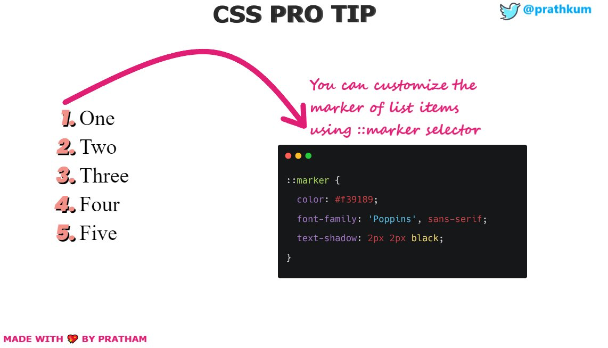
41. 每日一句分享: \
    只有能够改变你行动的信息才是知识。 \
    像这种绝对、没有场景的话，总觉得有点不妥，但确实引起了共鸣.. \
    可能想强调对重要知识的掌握与运用吧..
42. 快餐文分享: \
    Combinator Recipes for Working With Objects in JavaScript

    [https://raganwald.com/2012/12/01/combinators-in-js.html](https://raganwald.com/2012/12/01/combinators-in-js.html) \
    主要介绍了 combinator 在 js 中的基本使用，文章比较基础，但其中有句话说得很精妙，值得回味:

    If Objects are nouns and Methods are verbs, Combinators are the adverbs of programming. \
    combinator 对于函数来说，是个组装工，副词的定位不是特别准确..
43. 分享篇36氪短文: \
    字节跳动收购沐瞳科技，一家有2个全球爆款的游戏公司

    [https://www.36kr.com/p/1149142567748740](https://www.36kr.com/p/1149142567748740) \
    读完文章，有些感受:

    1. 竞业协议 是会限制个人职业发展，签署之前要小心。
    2. 运营得好并且商业模式不错的游戏，是暴利行业。一款 moba 月流水 上亿。
    3. 腾讯阿里 是家投资公司，之前分享过一篇虎嗅好文，深入剖析了 这些资本巨头的投资布局。
    4. 相对于游戏 玩法而言，游戏IP的塑造更重要，可以扩充玩法，进入更广的互娱领域。
44. 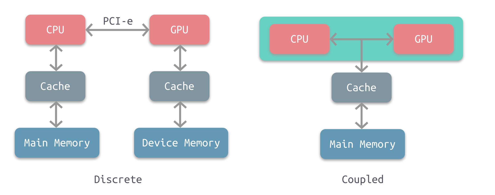

    上图左是分离式架构，CPU和GPU各自有独立的缓存和内存，它们通过PCI-e等总线通讯。\
    这种结构的缺点在于 PCI-e 相对于两者具有低带宽和高延迟，数据的传输成了其中的性能瓶颈。目前使用非常广泛，如PC、智能手机等。

    上图右是耦合式架构，CPU 和 GPU 共享内存和缓存。AMD 的 APU 采用的就是这种结构，目前主要使用在游戏主机中，如 PS4。

    摘抄自 深入GPU硬件架构及运行机制

    [https://www.cnblogs.com/timlly/p/11471507.html](https://www.cnblogs.com/timlly/p/11471507.html)
45. 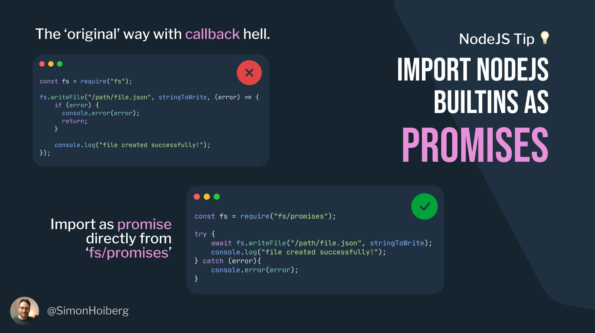

    NodeJS 10 以上支持了 promisify callback func，好耶\~ 再也不用包一层了。
46. 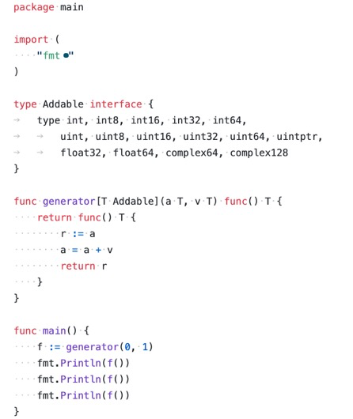

    Go 泛型的一则例子。 \
    为什么编程语言的设计者 总是倾向于 把变量与类型放在一起表示呢？ 如果能找到一种分开表示的方法，代码可读性会不会更好呢？

    type Add = (a:number, b:number) => number \
    const add:Add = (a,b) => a + b

    就像是函数签名与函数，或者是 动态重载 免去类型。 \
    我的理解是 类型只是个上下文推理标注，代码是 逻辑思维的抽象，标注与思维不应该混为一起，这不是最佳实践。
47. 快餐文分享: \
    这次答应我，一举拿下 I/O 多路复用！

    [https://zhuanlan.zhihu.com/p/358208161](https://zhuanlan.zhihu.com/p/358208161) \
    文章简单易懂，先从Socket模型讲起，涉及了建立连接的基本步骤，每个步骤背后 操作系统做的事情。再到经典IO模型: 多线程，多进程，多路复用(epoll poll select)，并分别描述了 各自的原理 以及 优缺点。 \
    作者小林，我关注很久了，每篇文章都很清晰易懂，推荐一下。

    总结了下，epoll 优于 select poll的三点:

    1. 连接状态检查增量化，减少用户态与内核态的内存分配与数据拷贝
    2. 连接状态检查算法的优化，从线性结构到红黑树
    3. 连接状态通知解藕化，通过 epoll\_wait + 边缘触发(NIO) 或者 水平触发(BIO)，简单来说，异步场景 IO也要异步化，不然没有意义，还会造成阻塞。

    增量化，解藕化 这些思想是计算机科学，软件工程中最基本的本质。 \
    它们适用的场景无处不在，不要被上述 IO 模型的表面迷惑，要提取本质。

    这样每个知识节点之间才能建立连接，打通整个思想体系
48. A safer default for navigation: HTTPS

    [https://blog.chromium.org/2021/03/a-safer-default-for-navigation-https.html?m=1](https://blog.chromium.org/2021/03/a-safer-default-for-navigation-https.html?m=1) \
    分享个短文，Chrome 90 默认优先使用 HTTPS 连接，HTTPS 连接失败后会转向HTTP。 \
    很有意义的一次更新，不但提升安全又在可以大部分场景减少一次302。
49. 每日一句分享: 流量是没有价值观的。 (下一句是黑粉也是粉...
50. 分享个 API： Navigator.sendBeacon() \
    [https://developer.mozilla.org/zh-CN/docs/Web/API/Navigator/sendBeacon](https://developer.mozilla.org/zh-CN/docs/Web/API/Navigator/sendBeacon) \
    这个方法主要用于满足统计和诊断代码的需要，这些代码通常尝试在卸载（unload）文档之前向web服务器发送数据。

    简单来说 主要用于埋点信息的处理。
51. 快餐文分享

    美团点评前端无痕埋点实践

    [https://zhuanlan.zhihu.com/p/26211623](https://zhuanlan.zhihu.com/p/26211623) \
    文章先是讲解了常见埋点的三种类别:代码埋点（最常见）、可视化埋点（GUI化 埋点过程，适用于 不需要研发，主要面向 DA 同学）、无痕埋点（统计上传 用户的所有信息行为，常见的有 GA谷歌分析）。 \
    又讨论了如何在实践中最到最小侵入性: 从工程出发 编译模板，或者借助一些逻辑注入语法(就比如 修饰器，它的学名叫 面向切面编程AOP，逃) \
    最后给出了 无痕埋点的设计方案(显然很理想，看不出什么价值)
52. Unreal Engine 4 has a Game Thread and a Render Thread as main, and then a few others for things such as helpers, audio, or loading. The Game Thread in Unreal Engine runs all of the gameplay logic that developers write in Blueprints and Cpp, and at the end of each frame, it will synchronize the positions and state of the objects in the world with the Render Thread, which will do all of the rendering logic and make sure to display them.

    哇哦，虚幻4 与 浏览器渲染帧的机制很像，都有专门与GPU 协商的线程。
53. 一本关于HTTP的恋爱日记

    [https://mp.weixin.qq.com/s/o-OEwacY7-YeqqHa6M6pdQ](https://mp.weixin.qq.com/s/o-OEwacY7-YeqqHa6M6pdQ) \
    分享篇文章，写的很有趣，看到下面段话，我笑了..

    另外一个很尴尬的问题就是，她觉得我不太持久，每个Tcp链接只能发送一个请求，发送数据就关闭，这让我很苦恼，所以有些浏览器在请求时，用了一个非标准的Connection字段。

    感觉文中的 client server 是对渣男渣女，每次连接时都需要带礼物(cookie 曲奇饼)，才能认出对方。\
    并且 双方都可以与其他 客户端或服务端 随意谈恋爱..
54. 快餐文分享： \
    Advanced programming languages

    [http://matt.might.net/articles/best-programming-languages/](http://matt.might.net/articles/best-programming-languages/)

    摘要：If, on the other hand, you're interested in enlightenment, academic research or a start-up, the criterion by which you should choose your next language is not employability, but expressiveness（手动加粗）.

    作者在文中列举出了他最喜欢的4种语言：Haskell，Scala，SML/OCaml和Scheme，并介绍了各自的特点与相关的学习资源。
55. 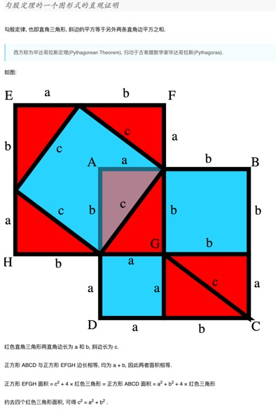 \
    A: 我也证明过！我给你写一下我的思路\
    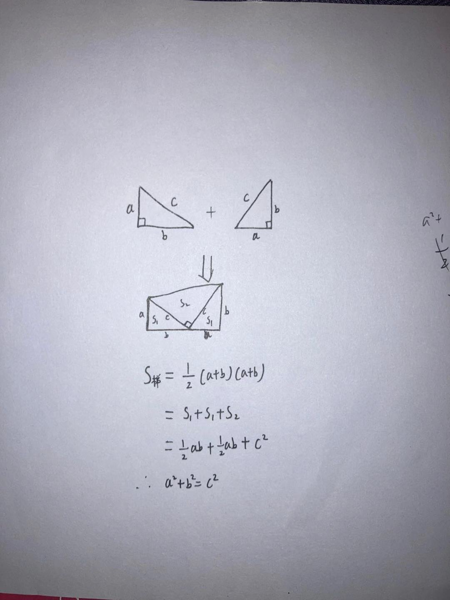 \
    B: 当代带数学家 我刚刚用勾股定理证明了，是对的
56. 每日一句分享： \
    “There are only two industries that refer to their customers as 'users': illegal drugs and software. " — Edward Tufte

    只有两个行业把客户称为‘用户’：一个是计算机设计（computer design），另一个是毒品交易（drug dealing）。
57. 分享篇文章： \
    Epigrams on Programming

    [http://pu.inf.uni-tuebingen.de/users/klaeren/epigrams.html](http://pu.inf.uni-tuebingen.de/users/klaeren/epigrams.html)

    关于编程的130条警句。 \
    总结下我觉得其中 有价值的一些句子：

    1. Every program is a part of some other program and rarely fits.
    2. Wherever there is modularity there is the potential for misunderstanding: Hiding information implies a need to check communication.
    3. Re graphics: A picture is worth 10K words - but only those to describe the picture. Hardly any sets of 10K words can be adequately described with pictures.
    4. Every program has (at least) two purposes: the one for which it was written and another for which it wasn't.
    5. A language that doesn't affect the way you think about programming, is not worth knowing.
    6. A programming language is low level when its programs require attention to the irrelevant.

    hah 真是应了那句 Just for fun.
58. 快餐文分享: \
    Clean APIs in React with TypeScript

    [https://javascript.plainenglish.io/a-cleaner-api-for-react-ts-components-47d0704a508c](https://javascript.plainenglish.io/a-cleaner-api-for-react-ts-components-47d0704a508c)

    文章阐述了 React 应用导出 Props 的问题，并给出了两种方法，一是提取共同 props，二是利用 infer 类型匹配获取。个人倾向于后者。

    ```
    export type GetComponentProps<T> = T extends
    | React.ComponentType<infer P>
    | React.Component<infer P>
    ? P
    : never;
    ```

    如果项目中使用 css-in-js 的话，这种场景是挺常见的。 \
    当需要传递 props 给 styled component 时，就可以使用上述 类型方法。
59. 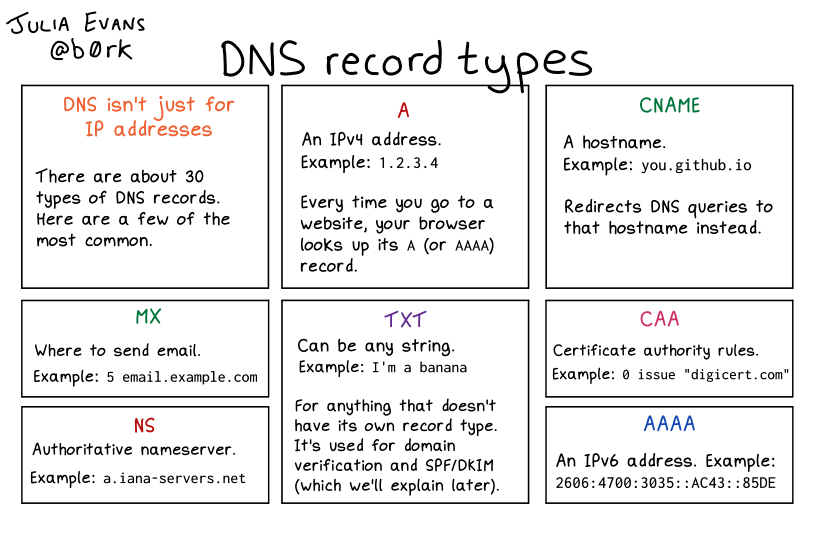
60. 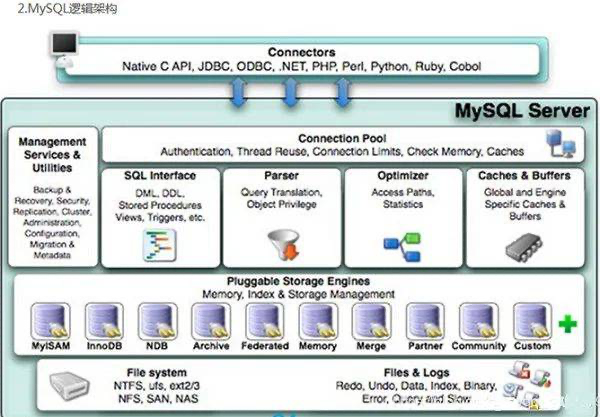
61. MySQL 深入学习总结

    [https://mp.weixin.qq.com/s/sRFmW57KUY3yyyRkyw0L4A](https://mp.weixin.qq.com/s/sRFmW57KUY3yyyRkyw0L4A)

    快餐文分享，正如标题所言，整篇文章像是学习笔记，涉及到了很多点 :MySQL 的架构，实践规范，范式，执行命令机制，通过分库分表解决性能瓶颈，分布式数据库的概念。 但都浅入浅出，意义不大。
62. 我偏爱的技术文章主要有两大类。\
    一种是所谓综述的文章。它能把一个事物的历史，前因后果，各种影响，优点缺点全都尽量客观的用一条主线串下来。这样的文章可以让我们思考，并帮助我们在遇到类似场景时做决策。比如“SQL是怎么来的，历史上若干SQL和NoSQL存储都是怎样的，优缺点都有什么“。

    另外一种是针对一个具体的问题/场景，可以比较明确的建立判别的框架，因此也就可以比较明确的对比出来怎样做是更好的。比如“在实现外卖的地理位置信息索引查询时，MySQL、Postgres、Mongo等的空间索引还是自己手工撸一个，用哪个方案最好“就是值得讨论的好问题。

    如果我们空泛的去讨论一个非常复杂的东西，又没有思维框架让我们清晰的梳理讨论本身，对实际落地又没啥帮助。我们为啥要花功夫去讨论这种问题呢？刷刷抖音看看小姐姐不好吗？

    摘抄自 大宽宽老师的一则评论。
63. 你真的理解userAgent了吗

    [https://mp.weixin.qq.com/s/8ZCyZnvUq\_nkDvU1gaaaUw](https://mp.weixin.qq.com/s/8ZCyZnvUq\_nkDvU1gaaaUw) \
    快餐文分享，文章讲解了 UA 之所以这么混乱的历史原因(商业竞争导致)，并给出了 如何在不同平台解析 ua。
64. Question: 为什么函数式编程 利用高并发场景？ \
    Answer: 函数式编程没有副作用，所以 临界区场景很少，不存在“锁”线程。 \
    想到一个问题，如果数据修改(补充场景)在CPU执行时是原子操作，是不是完全可以杜绝 锁 的出现。\
    A: 锁不是还有什么一致性 可见性 \
    锁是可以保证这些内存性质的。 \
    想到了一点，如果数据都是 immutable，想要修改只能 copy on write，就像函数式倡导的那样，那么每次读取数据时 都会保证最终一致性，这也是 fp 利于 并发场景的一点。

    当然 fp 的缺点很多，最明显的:

    1. 如果 compiler 不支持尾递归优化，会有大量函数栈帧
    2. 每次 cow，会造成大量 gc 操作

    少了一点，还是需要保证数据修改原子性，不然只能保证最终一致性，实时读取数据的一致性无法保证。\
    我发现之前的猜想是不现实的，原子性只能通过硬件来保证。\
    假设一个64位的数据放到32位的机器上，必然是要读两次的。
65. 分享一则帖子: \
    Scheme vs Haskell for an Introduction to Functional Programming?

    [https://softwareengineering.stackexchange.com/questions/69697/scheme-vs-haskell-for-an-introduction-to-functional-programming](https://softwareengineering.stackexchange.com/questions/69697/scheme-vs-haskell-for-an-introduction-to-functional-programming) \
    讨论很精彩。 \
    摘要: the main basis of modern¹ functional programmings are higher-order functions, a static type system, and algebraic datatypes and pattern matching.

    从帖子可以看出现代 fp 的发展趋势，各个分支的不同。
66. 如何通过 BFS、DFS 方式遍历DOM Tree。 \
    我的解法：

    
67. 离开字节跳动的人

    [https://mp.weixin.qq.com/s/qqwQhU6Gy8z0sOuJrajtNg](https://mp.weixin.qq.com/s/qqwQhU6Gy8z0sOuJrajtNg) \
    快餐文分享，文中拜访了多名内部同学，提供了一种审查的视角🤫
68. 每日一句分享: 影响编程效率最大的因素，不是使用何种编程语言，而是昨晚你的睡眠是否充足。
69. 快餐文分享: \
    SQLite is not a toy database

    [https://antonz.org/sqlite-is-not-a-toy-database/](https://antonz.org/sqlite-is-not-a-toy-database/) \
    文章主要讲解了 SQLite 的特性。 \
    摘要:

    1. SQLite is the most common DBMS in the world, shipped with all popular operating systems.
    2. SQLite is serverless.
    3. For developers, SQLite is embedded directly into the app.
    4. For everyone else, there is a convenient database console (REPL), provided as a single file (sqlite3.exe on Windows, sqlite3 on Linux / macOS).
70. 好文分享: \
    A gentle introduction to multithreading

    [https://www.internalpointers.com/post/gentle-introduction-multithreading](https://www.internalpointers.com/post/gentle-introduction-multithreading)

    很久之前读过一次这篇文章，该系列一共有四篇，每篇文章都是以综述的口吻进行描述。 \
    该篇文章先是讲解线程，进程的基础模型，历史知识。\
    后面说明了 各种模型所导致不可避免的问题 和 各自的优点缺点。 \
    各个子主题全都客观的用一条线 串了下来，非常推荐阅读，能产生思考\~
71. 前后端分离架构 且遵循 RESTFUL 通信规范的产品中，后端同学算不算得上 面向前端同学的前端工程师呢？

    需要设计各种接口，而接口、API 从更高维度的视角上来看是另一种形式的用户(programmer)界面。 越想越有趣.. 抽象思维 会导致看一个点的不同视角
72. A: promise有哪些缺点啊？ \
    B: 好问题，想不到什么明显的缺点.. \
    Promise 的缺点，如果硬要说的话，可能是函数染色吧(想不到什么明显缺点，函数染色应该是 异步环境无法避免的问题) \
    Promise 只是一种更好的控制异步场景的方案，本身并没有异步能力。 \
    找到了一些点，但我觉得算不上缺点。
    1. 可以使用 Timeout + Promise.race 解决
    2. 可以全局监听 Promise error
    3. 没必要支持那么多细粒化状态，想不到场景..
    4. emm，这也行
73. A: 大公司接口是不是都是前端写啊？ \
    B: 看项目场景吧。 如果是传统 RESTFUL 接口是后端提供，当然也可以 BFF 包一层，如果是 Graphql 那就只需要 后端配置了。 \
    也分项目的用户，如果是TO B的，影响不大 pv 不大，可以前端 + serverless
74. 游戏“头号玩家”：像做游戏一样做Web开发

    [https://mp.weixin.qq.com/s/-CJbjSa5r1qRJJnGNz30Wg](https://mp.weixin.qq.com/s/-CJbjSa5r1qRJJnGNz30Wg) \
    分享篇文章，采访 字节-杨扬，文中有很多杨学片段..
75. .png>)

    想到一些问题:

    1. 为什么已经有了内核态 可以保证系统权限，还要提出 TrustZone 特权级？
    2. TrustZone 是如何负责安全世界的切换？

    第一个问题很显然，内核态的意义在于保证操作系统的权限与安全。而 TrustZone 是为了应用程序的数据安全，而提出的硬件隔离机制。

    第二个问题查了下，是在硬件级别做到环境隔离，可以看下分享的文章。 \
    简述ARM TrustZone - [https://zhuanlan.zhihu.com/p/101486119](https://zhuanlan.zhihu.com/p/101486119)
76. Linux 内核 0.01版本 仅有 8102 行代码。而到了 5.7 版本代码量为 2870 0000行..
77. Question: \
    Android 应用的主要开发语言是 Java，那么 Java 编写的应用是如何在 Android 上运行的呢？也是通过 JVM 吗？

    A: android肯定是dvm啊 java程序运行在dalvik vm java程序编译成.class文件，打包到jar包里，sdk提供的工具转化成.dex文件，然后dalvik读取指令和数据集 \
    B: 基础面试题: 为什么不继续采用 jvm 呢，dvm 在哪方面优于 jvm

    A: 其中应该和内存有关吧 IO操作 java编译多个.class

    而.dex是对.class的整合，减少文件IO操作，查询类的速度也快了 dvm其实基于寄存器的架构的 主要其实还是dvm的特性适合移动端

    B: 了解.. DVM 更适合Android(ARM 指令集)这种不需要考虑跨平台的场景。 \
    查到一个回答，把刚刚你提到的点延伸了下。 \
    Dalvik 虚拟机和 Sun JVM 在架构和执行方面有什么本质区别？ - 天光的回答 - 知乎 [https://www.zhihu.com/question/20207106/answer/14654536](https://www.zhihu.com/question/20207106/answer/14654536)
78. 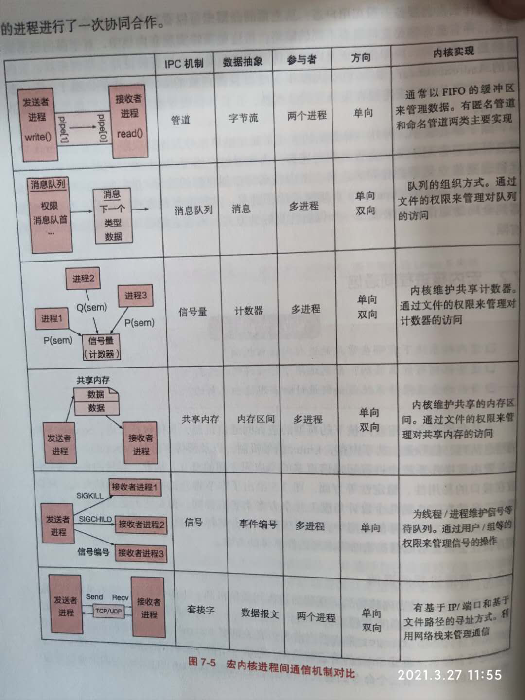
79. 每日一句分享: 真理属于人类，谬误属于时代。 \
    A: 毒鸡汤来一套 - 荒缪是常态，而真理是变化态
80. 分享个工具: \
    Figma to React Convert Figma designs to React code (React Native and Next.js)

    [https://figma-to-react.vercel.app/](https://figma-to-react.vercel.app/) \
    可以谈谈前端智能化 目前在业界的实现。

    一般业界有两种方案。 一是通过CV 识别设计图，在体通过神经网络 分析设计图，然后生成代码。 \
    难度较大，但不限于设计工具。 例子: 微软的Sketch2code

    二是通过设计工具提供的API，分析设计稿背后的数据，然后生成代码。 \
    难度较小，但受限于设计工具。 例子: 阿里的imgcook
81. 于地球的移动来说，我们从出生起 没有一秒钟在原地停留过，我们每一分钟都距离前一分钟几十万公里以上。

    摘抄自 《天才在左 疯子在右》
82. 为 JS 数组实现 slice 特性\
    &#x20;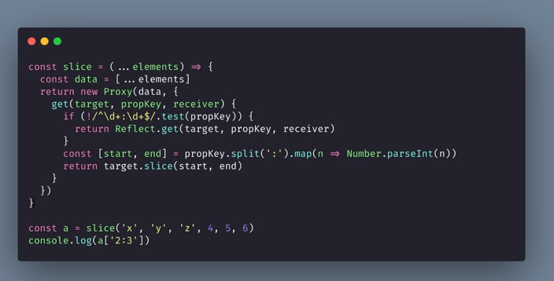

    一直想改成更 friendly 的方式，不需要借助函数： const arr = \[1,2,3,4,5] arr\['1:2']

    但发现 js 的 native array constructor 根本无法拦截..

    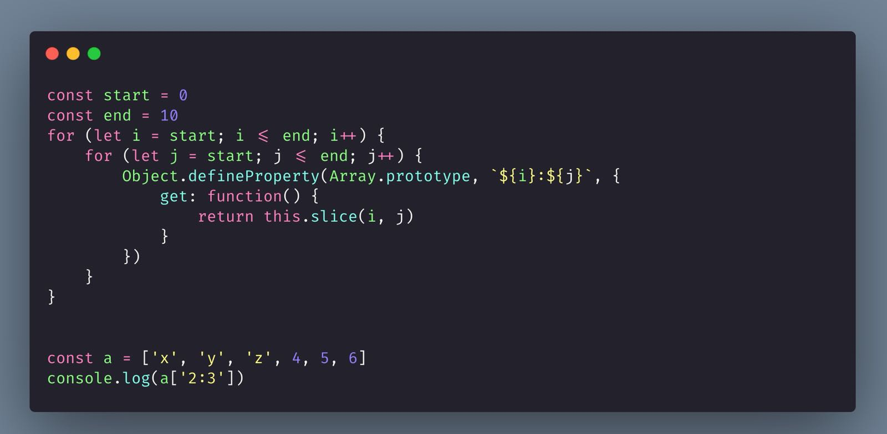

    这种可以达到想要的效果，但是很明显 start end，应该是任意数值才对。
83. 一日囚 - [https://weibo.com/ttarticle/x/m/show/id/2309404593036926518013?\_wb\_client\_=1](https://weibo.com/ttarticle/x/m/show/id/2309404593036926518013?\_wb\_client\_=1) \
    分享篇科幻小说，设计构思都很有趣\~
84. 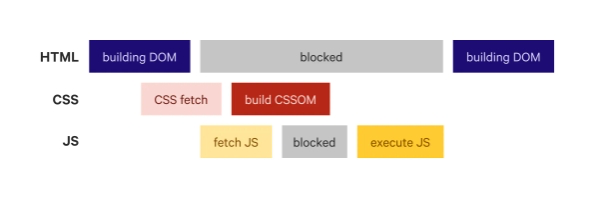
85. 好文分享: \
    How to Improve CSS Performance

    [https://calibreapp.com/blog/css-performance](https://calibreapp.com/blog/css-performance) \
    文章介绍了多种优化 CSS 影响页面性能的方法。 简单总结下:

    1. 因为 CSS 会阻塞 HTML 解析，而 JS 又会阻塞 CSS 解析，所以 要小心翼翼安排资源的顺序。
    2. 通过压缩CSS文件，移除未使用的代码，(补充:抽离原子类技术) 减少 文件尺寸。
    3. 将一些关键样式，内联到页面，减少请求，很快地渲染。
    4. 加载不必要的 CSS，异步化请求。
    5. `<link rel="stylesheet" href="non-critical.css" media="print" onload="this.media='all'">`
    6. preload(不推荐)
    7. 避免 @import 引用文件，不会并发加载，只能顺序从而影响性能。
    8. 编写 animation 时，尽量使用 只会引发重绘的属性，减少页面重排。
    9. 使用 contain 属性，控制页面中组件渲染，不影响到整体(渲染力度细粒化)
    10. 使用 font-display: swap 在加载字体的时候，显示文本，以免显示空白。
    11. 使用 @font-size 加载字体(常用方案了)
    12. 不要把时间精力 放到优化 selector 上面，它已经足够快了，不是瓶颈。

    异步化加载 CSS 文件倒是第一次听说，偏 trick.. \
    “Print” media type defines the stylesheet rules for when the user tries to print the page, and the browser will load such stylesheet without delaying page rendering. Applying that stylesheet to all media (namely screens and not just print) uses the onload attribute to set the media to all when the stylesheet finishes loading.

    再补充几条:

    1. will-change 使用 gpu 去渲染 所在声明的元素，使用时要小心，注意场景(建议 动画元素，全屏 shift 元素)，有层爆炸的风险。
    2. content-visibility，按照窗口显示条件 避免渲染 不在窗口内的元素。
    3. Link with media，将 css 文件根据屏幕分辨率加载。
86. 快餐文分享: \
    How I bought a business for $0

    [https://every.to/superorganizers/how-i-bought-a-business-for-0](https://every.to/superorganizers/how-i-bought-a-business-for-0)

    文章介绍了作者 如何通过技巧，花费 0元 买到的一个 SaaS 应用(符合他的各项条件)，获得成功的故事(年收益 百万刀)。

    摘要:

    1. Where revenue is less than $20K per month, many of the businesses you’re looking at aren’t businesses at all: they’re jobs.
    2. it often pays to approach deals in a certain way: “my price, your terms OR your price, my terms.”

    阅读后，整篇故事其中最为关键的两点:

    1. 挖掘商品潜力的能力
    2. 执行力，联系作者，约谈收购，完成签约 不超过一月
    3. 包装推销商品的能力(文中未主动体现)，不过看结果可以想象到。

    文中记录了这位风险投资家的 mentor 观点: my price, your terms OR your price, my terms. 感觉实现起来有漏洞，万一对方全都要呢..
87. 快餐文分享: \
    How I use the Speech Synthesis API on my blog

    [https://jlelse.blog/dev/speech-synthesis](https://jlelse.blog/dev/speech-synthesis) \
    如何用短短十行代码为页面增加 语音播放内容 功能。 利用了 experimental SpeechSynthesis API..

    可以为网站加一个播放功能\~ 也算是无障碍功能的一种设计。
88. 分享个有趣的观点: \
    a pure function of only Constants can also be treated as a Constant!

    摘抄自 Three Types of Data

    [https://www.brandonsmith.ninja/blog/three-types-of-data](https://www.brandonsmith.ninja/blog/three-types-of-data)

    文中提到的三种数据类型，与 React 中的 useState、useMemo、immutable 的概念 不谋而合..
89. 每日一句分享: \
    The main cost of abstraction is in separating the implementation from the specification, or, to put it in a different way, the letter of the function from the spirit of the function. The former being what the function does, the latter being what everybody believes it should do.

    要么就简单得没有缺陷，要么就复杂得足够简单。

    hah 居然逻辑自洽了\~

    我想表达的是，不管项目中如何管理复杂性，最重要的一点就是不要有明显的缺陷\~
90. 好文分享: 有道云笔记新版编辑器架构设计

    [https://zhuanlan.zhihu.com/p/345895871](https://zhuanlan.zhihu.com/p/345895871)

    [https://zhuanlan.zhihu.com/p/347415991](https://zhuanlan.zhihu.com/p/347415991)

    第一篇文章讲解了 现代在线编辑器的模型，以及实现模型的不同方式，可以看出关键的能力都受限于 浏览器环境，文中有句话存在歧义: Word 和 WPS 可以说将桌面客户端中的富文本编辑器做到了极致。 latex:？？？

    第二篇文章从宏观视角讲解了 实现在线编辑的机制，并给出了一些细节问题的方法。
91. 快餐文分享: \
    6年从华人首富到破产，这可能是史上最惨的接班案例

    [https://www.36kr.com/p/1152742179947654](https://www.36kr.com/p/1152742179947654)

    一代华人商界领域 王安的故事。 从一代神童，到哈佛物理博士，然后车库 技术起家(为什么又是车库..) 布局小型计算机、软件办公，再上市身家暴涨 成为华人首富。 \
    没落的原因 从文中看，一是商业战略出了问题，傲慢忽视 IBM 与 PC 机；二是不顾大局 选择子女作为继承人。
92. 快餐文分享: \
    The evolution of a Scheme programmer

    [https://erkin.party/blog/200715/evolution/](https://erkin.party/blog/200715/evolution/) \
    茴香豆的“茴”字到底有几种写法？

    中间 Y 组合子 方式看傻了..

    我喜欢这种方式\~

    ```
    fac n = result (for init next done)
            where init = (0,1)
                  next   (i,m) = (i+1, m * (i+1))
                  done   (i,_) = i==n
                  result (_,m) = m
    ​
    for i n d = until d n i
    ```
93. 好文分享。

    张一鸣最新内部演讲：我只是个平常人，平常人也能做非常事

    [https://mp.weixin.qq.com/s/fp\_q7JcfdZuCHc\_jAN\_AJA](https://mp.weixin.qq.com/s/fp\_q7JcfdZuCHc\_jAN\_AJA) \
    整篇文章读下来，能感受到 满满的字节范: 坦诚清晰，务实敢为，开放谦逊。 建议全文背诵。
