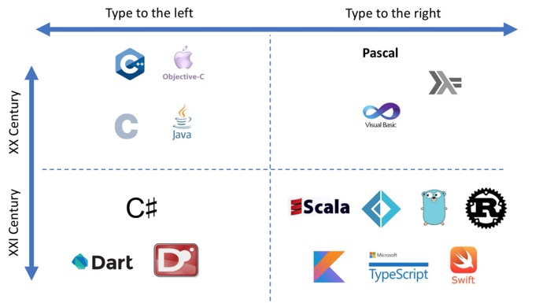
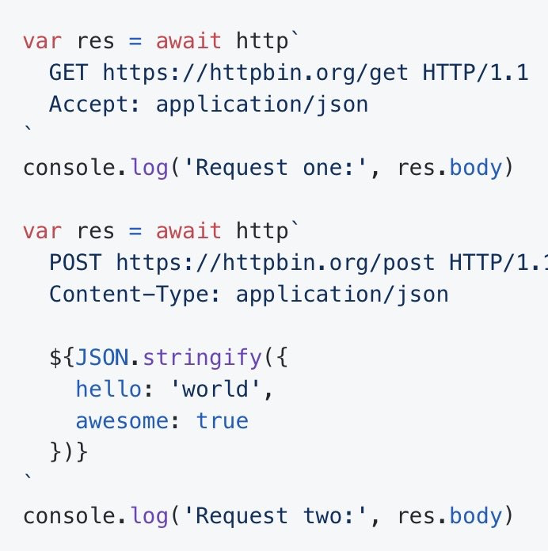
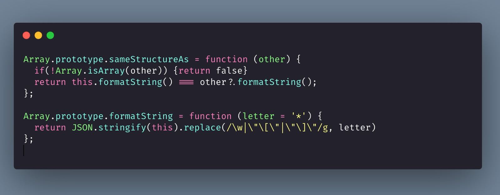
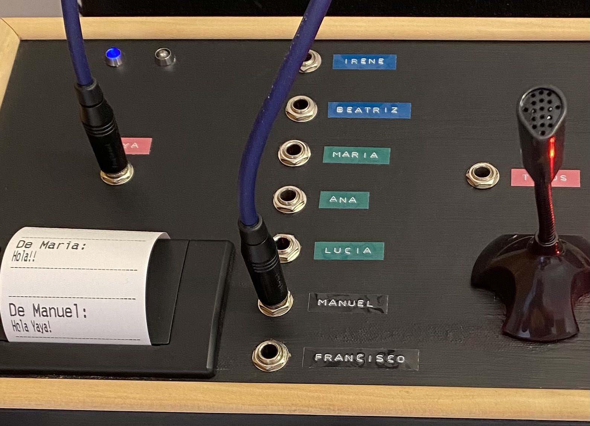

# 15-30

1.  4 月 1 - 14 日 汇总分享，共产出 57 条，暂未分类： [https://thinking.tomotoes.com/archives/2021/4/1-14](https://thinking.tomotoes.com/archives/2021/4/1-14)\
    惊讶系列 2 篇： \
    1\. Making Facebook 2x Faster \
    [https://m.facebook.com/nt/screen/?params=%7B%22note\_id%22%3A10158791326312200%7D\&path=%2Fnotes%2Fnote%2F\&refsrc=https%3A%2F%2Fm.facebook.com%2F&\_rdr](https://m.facebook.com/nt/screen/?params=%7B%22note\_id%22%3A10158791326312200%7D\&path=%2Fnotes%2Fnote%2F\&refsrc=https%3A%2F%2Fm.facebook.com%2F&\_rdr)

    2\. BigPipe: Pipelining web pages for high performance

    [https://m.facebook.com/nt/screen/?params=%7B%22note\_id%22%3A10158791368532200%7D\&path=%2Fnotes%2Fnote%2F\&refsrc=http%3A%2F%2Fsegmentfault.com%2F&\_rdr](https://m.facebook.com/nt/screen/?params=%7B%22note\_id%22%3A10158791368532200%7D\&path=%2Fnotes%2Fnote%2F\&refsrc=http%3A%2F%2Fsegmentfault.com%2F&\_rdr)\
    好文系列 5 篇： \
    1\. 移动端 JS 引擎哪家强？ \
    [https://mp.weixin.qq.com/s/2cxe1L9\_vyB8oNg2jr2rkg](https://mp.weixin.qq.com/s/2cxe1L9\_vyB8oNg2jr2rkg)

    2\. CPU 和 GPU - 异构计算的演进与发展 \
    [https://draveness.me//heterogeneous-computing](https://draveness.me/heterogeneous-computing)

    3\. 透过 Rust 探索系统的本原：编程语言 \
    [https://mp.weixin.qq.com/s/ZA-\_BARVAWe0Q4eM0lYgwg](https://mp.weixin.qq.com/s/ZA-\_BARVAWe0Q4eM0lYgwg)

    4\. 沅有芷兮：类型系统的数学之美 \
    [https://mp.weixin.qq.com/s/ieEewizkN7H-11z-PexkGw](https://mp.weixin.qq.com/s/ieEewizkN7H-11z-PexkGw)\
    5\. 竞争与垄断：几段概念史 \
    [https://mp.weixin.qq.com/s/0dsoNUDDTtIZwE5d2TsAcA](https://mp.weixin.qq.com/s/0dsoNUDDTtIZwE5d2TsAcA)

    快餐文 10 篇。
2. 每日一句分享: \
   国家需要劳动力时，年轻人被要求卖力劳动；国家需要消费者时，年轻人被要求大方购物；当国家需要下一代劳动力和消费者时，年轻人被要求婚育。 ——日本新世代社会学家古市宪寿
3.  快餐文分享: \
    My simple Github project went Viral \
    [https://gourav.io/blog/my-simple-github-project-went-viral](https://gourav.io/blog/my-simple-github-project-went-viral)

    文章的作者是 前几天trending上的clone-wars项目的作者，介绍了这个项目的动机，如何实现的过程，给自己带来的收益。

    这种收集汇总的项目，只要花点精力，写好文档，就能有很多 star.. 我愿称之为 markdown 工程师..
4.  好文分享: \
    WHY DOES "=" MEAN ASSIGNMENT? \
    [https://www.hillelwayne.com/equals-as-assignment/](https://www.hillelwayne.com/equals-as-assignment/) \
    文章介绍了，现代编程语言中 使用 = 做赋值，== 做等于的历史背景。

    从60年代的4大编程语言(COBOL, FORTRAN II, ALGOL-60, and LISP)中，FORTRAN2 首次使用 = 号做初始化与重复赋值。 之后的 ALGOL 60 分支演变出来的语言 CPL,BCPL,B 都沿用了 := 赋值的语法，以及 ML, Ada 都受其影响。 而由于 肯汤姆森(B,GO,UNIX,UTF-8,PLAN-9 等的开发者) 受当时机器内存的限制，提出使用 == 作为判断，减少代码所占内存。

    回到问题，为什么 = 赋值，== 相等判断 成主流呢？因为 C 采用了这些历史设计，并且 C 火了。

    A: 还记得第一次上 C 语言课，我看到 = 赋值，== 判断 的命令式，很不能接受，这与一直以来 数学中符号表达的方式 很相违背。

    B: 当时学 C 语言有很多次因为赋值 与 判错写错的情况

    A: 是的，我人生中的第一个 bug 就是这样来的。

    B: 但现在感觉好像主流编程语言都是使用 == 进行赋值判断 就像最开始学习 vim 不习惯 hjkl

    A: 是的，都是当时历史下的选择.. 从现在的角度去批判，无视过去的现实场景，没有太大意义..
5. 每日一句分享: \
   思考某事和讲述某事是不同的事情。我们思考事物的方式很复杂，有时甚至是不连贯的，而且经常是矛盾的。但是讲述时，我们必须把某事表达得很清晰，可以在很短的时间内说得出来。
6.  程序的 CPU 执行时间 = 时钟周期数 \* 时钟周期时间

    时钟周期时间，在摩尔定律早已放缓的今天，已经很难提高了，除非物理界出现新的突破。

    所以想要程序跑得更快，应该把重点放在 时钟周期数 这一指标。

    时钟周期数 = 每条指令的平均周期数 \* 指令数。

    指令数 依赖于程序以及编译器的优化。

    每条指令的平均周期 因为现在的CPU 执行粒度(原子指令)都相同，取码 解码 执行 写回，所以这一指标可视为常量。

    时钟周期时间 就是 CPU 的主频了，开始超频技术后，会更快一点，但功耗 散热也会更大，可视为常量。

    所以想要程序跑得更快，优化重点就是 减少指令数，这过程离不开 程序设计 以及 编译器优化程度。

    时钟周期 是 CPU 规范的 GHz 指标。 以拯救者 Y9KK为例，CPU 4.1 GHz，这意味着 1 秒 会产生 4.1 G 脉冲信号，即 高低电平转换，也是 时钟周期。

    所以说，现在个人设备 算力早就过剩了。

    而现在的程序员(指应用层) 已经很难接触到底层的魔法了。 领域细分严重，每个人都变成了一个螺丝钉。

    我一直自诩为 吃了互联网红利的一代人，其实这并不是妄自菲薄，我连计算机中基本的数字电路都不了解，怎么敢称之为工程师。只会基本的门电路。
7. 驱动智能硬件(领域专用架构-DSA)的三个重要定律: \
   1\. 摩尔定律 集成电路上可以容纳的晶体管数目在大约每经过18个月便会增加一倍。 \
   2\. 贝尔定律 计算机每10年产生新一代，其设备或用户数增加10倍。 \
   3\. 牧本定律 性能功耗，开发效率 很难同时满足。专用结构 性能功耗优先，通用结构 开发效率优先。
8.  好文分享:

    多核之后，CPU 的发展方向是什么？ - 包云岗的回答 - 知乎 \
    [https://www.zhihu.com/question/20809971/answer/1678502542](https://www.zhihu.com/question/20809971/answer/1678502542)

    讲解了 CPU 优化演进的历程，从多核时代迈向领域专用架构中 业界的实践。

    文章很有价值，讲解得非常棒，值得阅读。
9.  每日一句分享: \
    眼睛看不到视网膜，舌头不知道自己的味道，大脑不清楚自己时如何思考…… 这个世界仿佛在尽力杜绝自省的可能性。 一旦自省的递归被触发，就像当年第一个可自我复制的核酸分子那样…… 谁也不知道下一章讲的是什么故事。

    来自 Aurora 一则灵感。
10. 分享期Podcast: \
    Ep-27.-gRPC-and-Python \
    [https://moon.fm/share/episode/5158/](https://moon.fm/share/episode/5158/)

    本期播客从 gRPC-Python 开发者视角 讨论了 gRPC 的相关问题。 简单总结下，感兴趣的同学可以听下: gRPC 名字的由来。为什么 采用 over http2。protobuf 是什么，如何与 gRPC 结合。gRPC 下一步进展是什么。py-grpc async await 的实现机制。为什么会从更好的load balancer是服务发现。商业开源的讨论。开源的趣事。Py 的性能。

    根据 protobuf 配置文件，生成相关代码，关于代码生成 feature，KiteX(字节开源的rpc框架) 也是支持的。
11. 快餐文分享：\
    String Hashing \
    [https://jorgechavez.dev/2020/11/12/string-hashing/](https://jorgechavez.dev/2020/11/12/string-hashing/)

    文中介绍了计算 字符串 hash 的一种方式，并给出了 JS 实现。

    

    文中有一处很有趣的结论... String Hashing is a technique where we can convert our strings into an Integer which will act as a hash number. Therefore, we will be comparing two hashes hash(A) == hash(B) this will be considered O(1). That’s the best option we can have for comparing two strings.

    哈哈，为了迎合传统时间复杂度的计算方式，忽视 算法实际的花费时间。

    大O计数法就是屑，不要被毒害了..
12. 突然想到一个点，好像 sum type 无处不在...

    Java 中的臭名昭著的 NPE(null pointer exception) 问题, JS 无处不在的 undefinded，Golang 中最常见的 err != nil ... 等等

    从类型系统上审视，假设 null，undefinded, interface{}, 可以赋值为一个具有类型的变量 且不会造成程序 crash。 那么可不可以说，这些十亿美金的错误设计 已经成为了 类型系统中最底层的 sum type 之一\~

    举个最简单的例子，以 Java 为例，很多语言都有类似的场景： String str = "Hello World"; String str = null;

    这两种写法在 Java 中都是合法的，为什么可以把 null 赋值给 String 呢？

    如果把 null 假设成一个类型为 None 的值，从类型上推演的话 String 或者其他的类 更严格的定义如下： String = Optional{ None, java.lang.String }

    或者更彻底一点，Java 中的类 实际类型为：Optional{None, Object}.

    这就造成了 为什么 NPE 问题无法得到优雅处理的问题，哪怕 JDK9 推出了 Optional 类，打算从 sum type 的方式去解决，但效率低下。
13. 

    Types are moving to the right
14. 每日一句分享： \
    对生命你不妨大胆一点，因为我们始终要失去它。— 尼采
15. 分享期播客: \
    [https://moon.fm/share/episode/5179/](https://moon.fm/share/episode/5179/) \
    🎙和-PingCAP-CTO-畅谈数据库和编程语言

    时长两个半小时，可以着重听下前半部分，介绍了 pingcap 的创建故事，没错 又是因为 google 的发表论文
16. A: 有没有一些计算机领域的中文播客啊？ \
    B: 我听的比较多的有 捕蛇者说 teahour(已不更新) 内核恐慌 软件那些事
17. 
18. 快餐文分享：

    分布式基础（一）：CAP 的理解 \
    [https://www.qtmuniao.com/2020/02/08/CAP/](https://www.qtmuniao.com/2020/02/08/CAP/)

    文章介绍了 CAP 原理的背景故事，并针对 CAP 的定义 逐个解释每条原理的性质，各条性质之间的联系，最后探讨了在设计分布式系统时 如何根据网络环境和业务需求 对 CAP 做取舍。

    摘要：原则是理想情况下的断言，而实践是实际场景下的取舍。
19. 分享篇轻小说： \
    调 bug 的小女孩 \
    [http://liyaos.com/blog/the-little-bug-girl/](http://liyaos.com/blog/the-little-bug-girl/)

    摘要：但小女孩知道，她所做的是也许世界上最执着于消灭单调的工作。在那方寸代码间的世界里，每天面临的都是一场全新的挑战，而每场挑战都如一次华美的旅行——数据与函数层层抽象，有若蒙德里安的风格画；多线程任务交相辉映，好似巴赫的赋格曲。

    作者文笔很好，虽然文章引用了很多典例名言，但都很恰到好处，与上下文很相溶，丝毫没卖弄文藻的感觉。
20. 

    这种 fetch api 的抽象设计 可太有趣了\~ 直接写原生报文..

    github repo -> [https://github.com/pfrazee/http-template-literal](https://github.com/pfrazee/http-template-literal)
21. "海森堡 bug"（heisenbug）指的是在调试时会消失或更改行为的 bug。这个词来自海森堡不确定性原理，当你想精确测量粒子的位置时，它变得不确定了。
22. 好文分享: \
    虚拟内存精粹 \
    [https://strikefreedom.top/memory-management--virtual-memory](https://strikefreedom.top/memory-management--virtual-memory)

    潘少最新一期的文章，由浅入深地介绍了虚拟内存。 \
    为了满足容量，速度，价格这些特性，现代计算机存储架构不得不进行取舍，设计了一套从上而下的机制: 存储器，三级缓存，RAM，外部持久化IO。 而虚拟内存的提出 就是为了应对主存不够的场景。 文章从宏观视角介绍了 虚拟内存的实现，如何通过引入 页表(虚拟内存映射物理内存的函数)，MMU(翻译虚拟地址)，缺页中断处理等抽象 来完成 内存映射。 \
    后面着重介绍了 利用 TLB(针对虚拟内存的缓存)，多级页表，倒排页表来加速翻译，尽可能地抹平 读取数据的速度差异。
23. 每日一句分享: \
    原则是理想情况下的断言，而实践是实际场景下的取舍。
24. 快餐文分享: \
    [https://brendaneich.com/2008/04/](https://brendaneich.com/2008/04/)

    Brendan eich(JS 创始人)介绍了 发明 JS 时的一些背景故事。 进入网景的原因，为什么做成了创立这种语言 而没有选择 java，受商业决策(like java) 不得不引入了 Date 包装对象这些不良的设计，script 标签对安全的取舍等。

    有个文章外的历史，现在的 ecmascript 的规范由来，是网景先找到了 ecma 组织，ecma 成立了 tc39 委员会负责 JS 规范，而第一份规范却是微软 JScript 提给 tc39的。
25. 每日一句分享: \
    我们对幸福过分的渴求毁了生活中的一切，我们渴望的程度就决定了毁坏的程度。如果一个人抛弃了过分的期待，在自己拥有的东西之外不再渴望更多，那么他就能平安顺利地生活下去。 摘抄自《梅克通讯录》

    A: 表达的思想可以概括为:降低欲望，不付出期望。没有任何人，任何事值得过分关心。

    B: 是“不以物喜，不以己悲”吗 \
    C: 降低期望确实会比之前提升很多幸福感 \
    A: 我个人理解是 不要去追求幸福(幸福暗藏着不幸与痛苦)，而是去选择避免痛苦。不付出期望就是避免痛苦的很好实践。 \
    D: 知足常乐就完事了呗 \
    A: 没错，乐观主义些，容易满足的人获取幸福更轻松。 \
    B: 逃避痛苦是非常明智的选择，把痛苦排除了，剩下的就是幸福
26. 好文分享: \
    What’s the “sync.Cond” \
    [https://dtyler.io/articles/2021/04/13/sync\_cond/](https://dtyler.io/articles/2021/04/13/sync\_cond/)

    一篇讲解临界区 条件变量的好文。 \
    文章先是介绍了 条件变量的定义，与锁、信号量的差别，条件变量的使用场景是什么，以及 使用锁去实现 条件变量 与 语言中提供的 lib 差别(一个是 push，一个是 pull，性能可想而知)。 文中给出了一个 并发队列容器的例子，从最开始的锁实现条件变量到使用 sync.Cond ，以及如何使用 双重 sync.Cond 优化边界场景，一步步了解 条件变量的深层含义。 文中最后简单讨论了 Spurious Wakeups，在我看来这算是 实现的问题，简单了解下即可。

    一句话来说，条件变量 就是操作 临界资源的一种特例，把操作方式抽象出来了，加上了通知结果 push 唤醒 handler。

    总觉得 关于临界区条件变量的操作，这种使用 mutex 的方式不是很推荐，会增加太多复杂性(因为本身就隐藏了很多操作)。 \
    在 go 中，可以把资源放到 channel，外部 for + select 放到一个 goruntine 接收就好了..
27. [https://github.com/miao-lang/miao-lang](https://github.com/miao-lang/miao-lang) \
    喵语翻译：将人类语言翻译为喵语言。 喵‍‍‍‍‍‍‍‍‌‌‍‌‌‌‍‌‌‌‌‌‌‌‌‌‌‍‍‍‍‍‍‌‌‍喵‌‌‌‌‌‌‌‌‍‌‌‌‍‌‌‌‌‌‌‌‌‌‌‍‌‍‍‍‌‌‍‌‌‍‌‌喵‍‌‌‍‌‌‍‍‍‌‍‌‍‌‌‌‌‍‍‌‌‍‍‍‌‌‌‍‍‍‌‌‌‌‌喵‍‍‌‌‍‌‍‍‌‌‌‌‍‌‌‌‍‌‌‌‌‌‌‌‌‌‌‍‍‍‍‌‌‌‍喵‌‌‌‌‌‍‌‌‌‌‍‍‌‍‍‌‌‍‌‌‌‌‌‌‌‌‍‌‌‌‍‌‌‌‌‌‌喵‌‌‌‌‍‌‍‍‍‍‍‍‌‌‌‍‌‍‌‌‌‌‌‍‍‍‍‍‍‍‍‌‌‍‌喵‌‌‍‌‌‌‌‌‌‌‌‌‌‍‍‍‍‌‌‌‍‌‌‌‌‌‍‌‌‌‌‍‍‌‍‌喵‍‌‌‍‌‌‌‌‍‌‌‌喵。
28. 

    A: 然后 360 把 java 卸载了 \
    B: 因为垃圾分类的标准不同。Java把垃圾分为干垃圾、湿垃圾、可回收垃圾和有害垃圾；360则认为在座 的都是垃圾。 \
    C: 哈哈哈哈，底下的回答是认真的嘛.. 程序员的黑色幽默。

    还记得大一 在机房电脑上写.net winform 程序，每次一运行，360就提示病毒软件直接干点。 现在懂了，原来是360在执行垃圾回收，而且没有采用染色标记法，没有生代分区，系统都没有 freeze，直接清除。
29. 快餐文分享: \
    Cache API 101 \
    [https://bitsofco.de/cache-api-101/](https://bitsofco.de/cache-api-101/)

    Cache api 一个实验性的API，可用于在客户端缓存网络请求，一般与sw(service worker)搭配使用，在 sw 检测到页面请求时 则可过滤一遍 cache api\~ 目前只有 Chrome 与 Firefox 支持。

    建议使用 workbox(google 的一个开源lib) 实现站点 sw 配置，比手写 cache 方便灵活得多。
30. 快餐文分享: \
    Node.js 16 available now \
    [https://nodejs.medium.com/node-js-16-available-now-7f5099a97e70](https://nodejs.medium.com/node-js-16-available-now-7f5099a97e70)

    Nodejs 16 发布，简单总结下文章涉及到的更新: \
    1\. V8 升级到 9.0 版本 \
    2\. 支持 Timer Promise API(不用再写 sleep 函数了) \
    3\. 关于 web api 的一些稳定实现: crypto(加密)，fetch 中断机制等。

    快进到 nvm install 16 吧。
31. 分享个有趣的问题: \
    Why does Python return \[15] for \[0xfor x in (1, 2, 3)]? \
    [https://stackoverflow.com/questions/67083039/why-does-python-return-15-for-0xfor-x-in-1-2-3](https://stackoverflow.com/questions/67083039/why-does-python-return-15-for-0xfor-x-in-1-2-3)

    高赞第一回答，详细解释了发生的原理。 \
    1\. 因为词法分析，会将0xfor 解析成 0xf or. \
    2\. Or 的短路特性，使得后面不会被执行，所以返回了 0xf 常量。

    有趣的是，lua perl ruby 支持 or keyword 的语言都中招了..
32. 快餐文分享: \
    Easier Node.js streams via async iteration \
    [https://2ality.com/2019/11/nodejs-streams-async-iteration.html](https://2ality.com/2019/11/nodejs-streams-async-iteration.html)

    文章介绍了通过 async gen 函数与 Nodejs stream 结合，如何更好地处理 pipe 数据。
33. 快餐文分享: \
    OS Exceptions OS Wiki\
    [https://wiki.osdev.org/Exceptions](https://wiki.osdev.org/Exceptions)\
    文章总结了操作系统发生错误的类型(Faults 可恢复错误，Traps 执行修复错误指令时的错误，Aborts 不可恢复的错误)。 并列举了常见的错误类型。

    我简单挑几个常见的错误 梳理下。 \
    1\. Page Fault: 程序访问了一个未被映射的页表时，或者 写入一个只读的页表时 会发生，缺页错误 很常见，属于remapping 内存的一种特殊入口，详细可见之前分享的虚拟内存精髓好文。 \
    2\. Invalid Opcode: 一般是程序 编译后的指令集不兼容当前 CPU 造成，就比如新的 sse 指令集运行老的 cpu 上。 \
    3\. General Protection Fault: 一般出现在指令特权级访问的场景，比如在用户态执行内核态指令。 \
    4\. Double Fault: 修复错误指令时发生的错误 \
    5\. Triple Fault: 修复错误指令的错误处理指令发生的错误，OS无法处理这种异常，一般会重启系统。
34. 每日一句分享: \
    我们不肯探索自己本身的价值，我过分看重别人在自己生命中的参与。 于是，孤独不再美好，失去了他人，我们惶恐不安。 --三毛
35. 好文分享: \
    Reflecting on My Failure to Build a Billion-Dollar Company \
    [https://mp.weixin.qq.com/s/Q2IKg77XUxKc6rVMwRdBhQ](https://mp.weixin.qq.com/s/Q2IKg77XUxKc6rVMwRdBhQ)

    摘要: 本文来自 Gumroad 创始人 Sahil Lavingia，Gumroad 是一个可以帮助创作者直接面向付费客户的线上平台，刚通过股权众筹的方式完成了一轮估值 1 亿美金的融资。在本文中他主要分享了他创立 Gumroad 期间经历的各种起起落落，以及感悟与收获。

    这篇文章给我印象最深的是，很多时候的成功，绝大部分是市场本身的功劳，和人有一定的关系，但很多时候关系并没有那么大，也就是我们所说的顺势而为。同样，对于成功的定义，除了金钱，应该还有一些其它的方式。

    当一个产品 开始关注造成的影响 大于 其收益时，在我看来 这是为人类创造价值的行为，不管结果如何，都值得尊敬。

    产品影响越大，在社会的生态位就越稳，商业模式的选择会更多，而盈利也是迟早的事情。
36. 基于 Flutter 的 Web 渲染引擎「北海」正式开源 - 阿里云云栖号的文章 - 知乎 [https://zhuanlan.zhihu.com/p/367623268](https://zhuanlan.zhihu.com/p/367623268) \
    Kraken 项目愿景挺赞的，一个 better webview over flutter。

    还可以定制化现在 web 的能力，通过 flutter plugin 从渲染引擎层面打破 开发的局限，比如文章提到的定义 css rule，event。
37. 好文分享: \
    The suspend modifier — under the hood \
    [https://medium.com/androiddevelopers/the-suspend-modifier-under-the-hood-b7ce46af624f](https://medium.com/androiddevelopers/the-suspend-modifier-under-the-hood-b7ce46af624f)

    文章介绍了 Kotlin 是如何在编译层 基于 CPS 变换 实现了 coruntine。 实现机制很精妙，让我一度想起 tj 写的 co 函数。 不借助 任何并发原语 只通过FSM(有限状态机) 加 管理流程的 Context 参数 实现 yield 与 resume。

    而且如果 suspend func 没有其他 suspend func，则不会生成额外的字节码。 这在我看来 Kotlin 的 suspend func 比现在的 feature promise async awit 等异步机制，写起来更简洁，心智成本更小，还不会造成函数染色的问题。

    文章介绍得很详细，感兴趣的同学可以刷一下。

    一句话解释 Kotlin suspend func ： 一个 automate await 的 async func，且返回 值 sum type，可以更好地handle exception.
38. 每日一句分享： \
    如果有人在电话里说有害的言论，你不会让电话公司负责。我们也应该这样对待网站。

    \-- 扎克伯格
39. 快餐文分享： \
    Tiny Container Challenge: Building a 6kB Containerized HTTP Server! \
    [https://devopsdirective.com/posts/2021/04/tiny-container-image](https://devopsdirective.com/posts/2021/04/tiny-container-image) \
    文章介绍了如何从943mb的Nodejs 服务器容器一步步简化成6.34kb 汇编服务器容器。
40. 分享期视频： \
    从神秘发家、买壳上市、三夺首富，到身陷囹圄，深挖黄光裕二十年商海旧事 \
    [https://www.youtube.com/watch?v=62u7EUCWoeo](https://www.youtube.com/watch?v=62u7EUCWoeo)

    该系列一共3集，时长50分钟。 介绍了 黄是如何从一个穷小子起家，国美是如何从一个小作坊一步步做起来的？ 以及 黄在资本市场的一系列运作，如何从中国首富神坛跌落到囚犯的？ 期间黄家与国美职业经理人之间的战争，资本视角下的道德与利益权衡介绍地很精彩。

    摘要：时代不负有心人、时代不等任何人。

    如果黄家没有赢得 企业控制权，资本继续站边陈晓，现在的国美会不会发展得更好呢？ 很早 陈晓就为国美布局了电商，而黄显然没有重视 或者 认清所处的时代红利是什么？

    这期视频也只是从商业角度去挖掘了黄与国美生涯的一些重要转折、发展阶段，而真正的故事应该是什么样，就不为人知了。

    时代的弄潮儿就算再耀眼，可终究还是要 服从大海的意志。
41. 分享期播客：\
    [https://moon.fm/share/episode/5337/](https://moon.fm/share/episode/5337/) \
    🎙#73.-分布式文件系统

    讨论了文件系统的历史， raid 冗余磁盘阵列的诞生故事，现代分布式文件系统与 Google 的渊源，GFS/Hadoop 与 raid 的相似之处。 整体过程 涉及了一些文件存储专门领域知识，最后着重讲了 对象存储。
42. 

    A: 没想到 刷番剧还能碰到使用 cookie session 做会话管理的场景..

    不过这个Session ID 生成看起来是有问题的.. 没有借助中间件，靠 sdk 提供的伪随机数 + while true 判断重复.. 不提倡.. \
    B: 哪部番

    A: 小林家的龙女仆，真正的驯龙高手，B站有，敲治愈～

    A: 有空可以讨论下 生成 全局UUID(比如上面的 session id) 的常见实践～ \
    C: 全局？我直接上一手uuid api。雪花算法和uuid算法比较常见吧。数据库自增id也可。分布式也没啥问题 \
    A: 数据库自增id 可以保证唯一性，就是性能一般\~ 毕竟与外部io交互..Redis 保证 id 唯一性也可以\~

    C: 我觉得基本上uuid算法就够了，概率上来说 冲突的可能性还是太小了 \
    A: 是这样的，但是如果 session id 出现重复那就麻烦了.. 雪花算法 看起来是一种方案，时间维度 + 同一时间机器id，冲突概率会非常低..
43. 快餐文分享： \
    Use Google like a pro \
    [https://markodenic.com/use-google-like-a-pro/](https://markodenic.com/use-google-like-a-pro/)

    文章介绍了 Google 时一些常见技巧，简单总结下： \
    1\. "Content" 准确搜索 \
    2\. AND(both match), OR(匹配其中一个),\* (any match ) - (exclude) \
    3\. site: 在搜索 特定网站的爬取链接，filetype 指定文件类型 \
    4\. 2016..2018 特定年份 after:2018，before:2018 有点像 git log 的 filter\~
44. Question: 实现图片热区(在图片的某个范围上增加点击事件)的最佳实践是什么？

    答案是 HTML `<area>` Tag [https://www.w3schools.com/tags/tag\_area.asp](https://www.w3schools.com/tags/tag\_area.asp)
45. 快餐文分享： \
    How to Leverage the Fullscreen API… and Style It \
    [https://css-tricks.com/how-to-leverage-the-fullscreen-api-and-style-it/](https://css-tricks.com/how-to-leverage-the-fullscreen-api-and-style-it/)

    文章介绍了有关 full screen 的 API。 如何做全屏 toggle，如何定义全屏样式。
46. 每日一句分享： \
    我认为，对人工智能的恐惧，大多数情况下，就是对资本主义的恐惧。我们担心资本主义将如何通过技术来利用我们。

    现在，技术与资本主义息息相关，已经很难区分两者了。
47. The problem with object-oriented languages is they’ve got all this implicit environment that they carry around with them. You wanted a banana but what you got was a gorilla holding the banana and the entire jungle.

    \-- Erlang 发明者 Joe Armstrong 谈 OOP.

    还记得之前读《Java 编程思想》 开篇有一段话给我留下很深的印象: Java 的定位是从大型组织有序的包和模块中获益的编程语言。

    不是快速完成功能的脚本语言。

    而现在国内普通高校中常见的编程语言就是 Java，这对最开始编程思想的养成 不是一个最好的选择。 上来就学OOP的三大特性，而三大特性本身就是不正确的。

    封装是个常见的概念，一个函数就是一个封装。 继承最开始也不是OOP的设计宗旨，更好的选择应该是组合 与 mixin。 多态只是类型系统的向下转型，或者遵守 contract (接口) 规范。

    真正的 OOP 特性应该是 万物皆 model 的概念 以及 消息传递的特性。
48. 快餐文分享： \
    The BFF Pattern (Backend for Frontend): An Introduction \
    [https://blog.bitsrc.io/bff-pattern-backend-for-frontend-an-introduction-e4fa965128bf](https://blog.bitsrc.io/bff-pattern-backend-for-frontend-an-introduction-e4fa965128bf)

    文章介绍了 BFF 的使用场景，提出的意义，相比与传统通信 其优势是什么，其模式的最佳实践探讨。 感觉使用场景很局限，一是为了更好地 combine、filter 数据，二是 为了抹平 微服务 过度模块化带来的影响，提出了这一中间层模式。 \
    在我看来，BFF 更像是 为了服务端架构设计不合理的妥协。 \
    或许过于复杂的项目，设计时总会有不合理的地方，毕竟需要考虑的地方很多。
49. 快餐文分享： \
    An Introduction to WebRTC App Development \
    [https://hackernoon.com/an-introduction-to-webrtc-app-development-3t1m23lr](https://hackernoon.com/an-introduction-to-webrtc-app-development-3t1m23lr) \
    文章简单介绍了 WebRTC 是什么，STUN TURN 的作用(这两个重要的infra 文章说的很少，我补充下: STUN 服务是为了 exchange 握手信息，做为一个中继者的角色，如果 P2P 打通 则双端正常通信，而因为 NAT 或者 Firewall 无法通信时，TURN 则会作为 中转流量服务器 让双端间接通信，可以见得 很吃服务器的带宽 性能，这也是为什么 WebRTC PaaS 这么贵的原因)。

    文章主要的精彩之处，在于介绍 WebRTC 对于 media data 的压缩方法(VP9 的算法原理)，针对每一帧与前一帧做 diff，传递 diff 信息而不是 whole state，这带来的后果是 丢一帧则会影响下一帧。

    而文章后续水得一批... 还打了个软广..
50. Question: Git commit 保存的是 diff 还是 snapshot？

    A: diff？ \
    B: 我之前也是这么想的\~ 直到前不久我看到了一篇文章.. \
    Commits are snapshots, not diffs \
    [https://github.blog/2020-12-17-commits-are-snapshots-not-diffs/](https://github.blog/2020-12-17-commits-are-snapshots-not-diffs/)
51. 每日一句分享: \
    对于软件中的缺陷，不同阶段被发现会导致非常不同的解决时间：
    1. 不要引入任何缺陷（可惜我们是人，不是神，这不现实）—— 无需解决时间
    2. 当敲下代码的那一刻，有缺陷的地方就能够被捕获到（很多语言的 language server 已经在做这样的事情了）—— 秒级
    3. 在编译时被捕获到 —— 秒级到分钟级
    4. 在 UT 时被捕获到 —— 分钟级
    5. 在 CI 时被捕获到 —— 分钟级到小时级
    6. 在 code review 时被捕获到 —— 分钟级到天级
    7. 在 End-to-End test / QA 时被捕获到 —— 小时级到天级
    8. 在部署后被捕获到 —— 若干小时，若干天，甚至若干月之后
    9. 部署后被用户捕获到 —— 若干天，若干月，甚至若干年之后（也许永远无法解决 —— 很难复现）
52. 分享道题目： \
    Nesting Structure Comparison [https://www.codewars.com/kata/520446778469526ec0000001/train/javascript](https://www.codewars.com/kata/520446778469526ec0000001/train/javascript)

    判断两个数组是否结构相同，你想到最快的方案是什么？

    // should return true \[ 1, \[ 1, 1 ] ].sameStructureAs( \[ 2, \[ 2, 2 ] ] );

    // should return false \[ \[ \[ ], \[ ] ] ].sameStructureAs( \[ \[ 1, 1 ] ] ); \
    A: 先转化成字符串，从左到右的比较 \
    B: 我也是这个想法\~ \
    
53. 分享道之前刷过的一题，属于印象较深刻的：

    Evaluate mathematical expression [https://www.codewars.com/kata/52a78825cdfc2cfc87000005/train/javascript](https://www.codewars.com/kata/52a78825cdfc2cfc87000005/train/javascript)

    实现一个 针对数学表达式的计算程序，不能使用 eval or new Function 表达式中 可以有无限 括号嵌套，负数，浮点数。

    一个 case： except('2 / (2 + 3) \* 4.33 - -6', 7.732 )
54. 每日一句分享: \
    无数渺小的思考 填满了人的一生。
55. 快餐文分享: \
    CSS Tips \
    [https://markodenic.com/css-tips/](https://markodenic.com/css-tips/)

    文章介绍了一些不常见的现代 CSS Rule 与 一些常见组件使用 CSS 实现的技巧。
56. 突然发现 @babel/plugin-transform-regenerator (针对于 yield 的 transformer)，生成后的代码 是一个类似于 kotlin suspend 函数编译后的 状态机，异曲同工..

    [https://babeljs.io/docs/en/babel-plugin-transform-regenerator](https://babeljs.io/docs/en/babel-plugin-transform-regenerator)
57. 好文分享: \
    图解 Functor, Applicative 和 Monad \
    [http://blog.forec.cn/2017/03/02/translation-adit-faamip/](http://blog.forec.cn/2017/03/02/translation-adit-faamip/)

    经典老文了，介绍了 Functor, Applicative,Monad，深入读过一遍 收获很多。

    Functor 将一个普通函数应用到被封装的值上，可以理解为 Box 类型 或者 可 Mapable 数组，函数复合。

    Applicative 将一个封装的函数应用到封装值上。 可以理解为 Box(fn).apply(Box(value))，属于一种更强大的 functor，可以让 函数接受多个参数，类似于被包裹的 curry 机制。 Functor 实质上就是 map 一次的 Aplicative。

    Monad 将一个 “接受一个普通值并回传一个被封装的值” 的函数应用到一个被封装的值上。

    用一个例子理解:

    ```javascript
    const arr1 = [1, 2, 3, 4]; 
    arr1.flatMap(x => [x * 2]); 
    // [2, 4, 6, 8]
    ```

    实现了 flatMap 或者 chain 的类型，可以更好地处理函数链中传递的context.
58. 快餐文分享: \
    A Brief, Incomplete, and Mostly Wrong History of Programming Languages \
    [http://james-iry.blogspot.com/2009/05/brief-incomplete-and-mostly-wrong.html](http://james-iry.blogspot.com/2009/05/brief-incomplete-and-mostly-wrong.html)

    文章介绍了各种编程语言诞生 设计 流行的梗，太搞了..

    关于 Haskell 如下(中文翻译后): 一个单子（Monad）说白了不过就是自函子范畴上的一个幺半群而已，这有什么难以理解的？
59. 快餐文分享: \
    My current HTML boilerplate \
    [https://www.matuzo.at/blog/html-boilerplate/](https://www.matuzo.at/blog/html-boilerplate/)

    文章逐行介绍了作者使用的 HTML 模板，包括 Docs 声明，常见的 meta 标签等。
60. 快餐文分享: \
    Scala Syntax for Java Developers \
    [https://itnext.io/scala-syntax-for-java-developers-69734ce17cdf](https://itnext.io/scala-syntax-for-java-developers-69734ce17cdf)

    文章介绍了 Scala 与 Java 通用语法的异同。 Scala 调用方法时，the parenthesis can be omitted. 真是好蠢的设计..
61. 想到了有趣的点，关于传统前端开发 与 MVC 架构。

    假设 DOM 是 Model，浏览器视窗是 View，JS 是 Controller。

    当用户从 View fires event，Controller 处理，更改 Model，rerender View。

    有趣的一点是在传统前端开发中， View 即是 Model 的 输出，又是 Controller 的输入。

    那么传统前端开发 与现代前端框架 MVVM 架构，比如御三家(Vue React Angular) 又有什么差别呢？

    最显然的差别就是去掉了 Controller，也就是去掉了上面提到的 Controller 接收 View 发出的 instruction，然后修改 Model 的流程。

    而去掉这一流程，MVVM 做了哪些工作，又做出了哪些提升。

    最重要的是，关于 Model 抽象概念的提升，Model 不再是 DOM，而是 应用中的 State。这一点很重要。

    State 更新则会 DOM 更新。

    State 的定位不仅是简单的 Model，而是可以 发出 DataChange 的 Model。

    既 Controller 接收指令 渲染 Model 的工作放到了 全新的 State Model 中。

    从更深远的角度考虑，MVVM 是 GUI 应用开发 一种意义非凡的架构。

    那么问题来了，MVVM 缺点是什么？

    最显然的就是违背了 软件工程提倡的单一原则(这种原则 没有根据场景就提出，都是屑)

    其他缺点就是关于 DataChange 的实现机制了，Vue 与 React 采用了两种不同的方式，之前有讨论过。

    还有 Svelte ，属于三种不同的实现机制。
62. Question: 流量调度 可以在哪些层实现？

    1. 基础设施层，DNS
    2. 网络层，比如 LVS
    3. 应用层，比如 Nginx

    A: Lvs是转换mac地址吗还是网络地址啊 \
    B: Mac 地址
63. 分享篇文章: \
    职业选手和业余选手 \
    [https://yinwang1.wordpress.com/2021/04/29/professional-amateur/](https://yinwang1.wordpress.com/2021/04/29/professional-amateur/)

    垠神最近的一篇文章。 \
    摘要: Mac 地址 对于我来说，“专业”或者“职业”（professional）这个词不再意味着水平高，而只是意味着你要以这个事情为生。也就是说，你得靠它挣钱，不做这个事情你就活不了。进一步的意思就是说，作为一个“职业选手”，你可能会为了钱而去做你不喜欢的事情，而不是只做你喜欢的事情。
64. 「直播回放」Go语言并发调度器和网络模型解析 - 腾讯技术工程的视频 - 知乎 [https://www.zhihu.com/zvideo/1371214468270071808](https://www.zhihu.com/zvideo/1371214468270071808)

    分享期视频，内容包括 Go GMP 调度机制，如何更好地榨干系统资源； Go 网络 IO 模型，如何基于 多路复用 在用户态完成 connection 分发；以及 Go 的网络优化(软广部分)。 \
    视频很干，干货很多。
65. 分享则推： \
    [https://twitter.com/mrcatacroquer/status/1386318806411325440?s=05](https://twitter.com/mrcatacroquer/status/1386318806411325440?s=05) \
    近日一国外小伙，使用树莓派发明了个名为 Yayagram 老人关爱机，可通过 telegram 将文字，语音发送到 对方，该推 介绍了其特性与工作机制。

    

    看起来还是挺实用的。

    之前也做过一些智能硬件(Arduino)项目，通过天气、设定条件 自动调节 各种小灯，屏幕 啥的.. 与其相比，愿景差远了。
66. 每日一句分享： \
    在泰国工作的人，都说那是一个很糟糕的地方；在泰国休假的人，都说那个地方好极了。
67. 一家创业公司推出了数字画框。挂在墙上，它会自动将精选的艺术品推送到显示屏，定时更新。

    来自阮一峰老师最新的周刊。

    

    感觉这数字画框有一定商业价值啊。
68. 快餐文分享： \
    前端性能优化：当页面渲染遇上边缘计算 \
    [https://segmentfault.com/a/1190000022762247](https://segmentfault.com/a/1190000022762247)

    文章介绍了 如何通过CDN 边缘计算的能力，让动态页面更快地渲染。 可理解为将最基本的 Docs 请求，在连接时做解析，获取页面中 外部资源，并拉取，返回页面时 又分为整个页面返回(ssr)，或类似于脸书 bigpipe 技术的动态返回。 文中将其称为了 瀑布流式 与 嵌入式。
