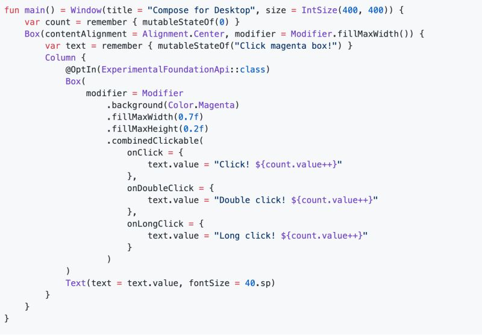
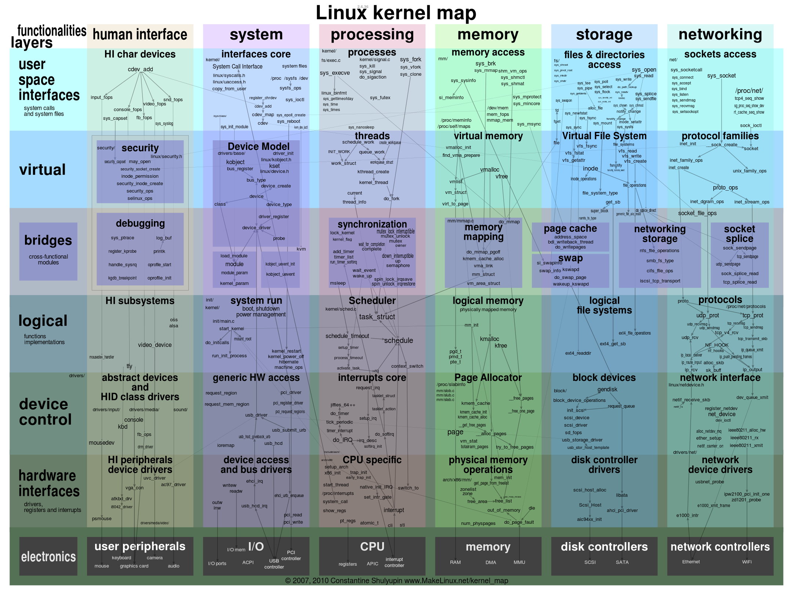
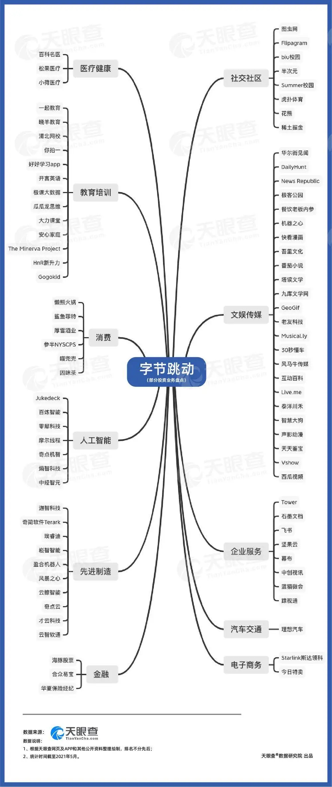
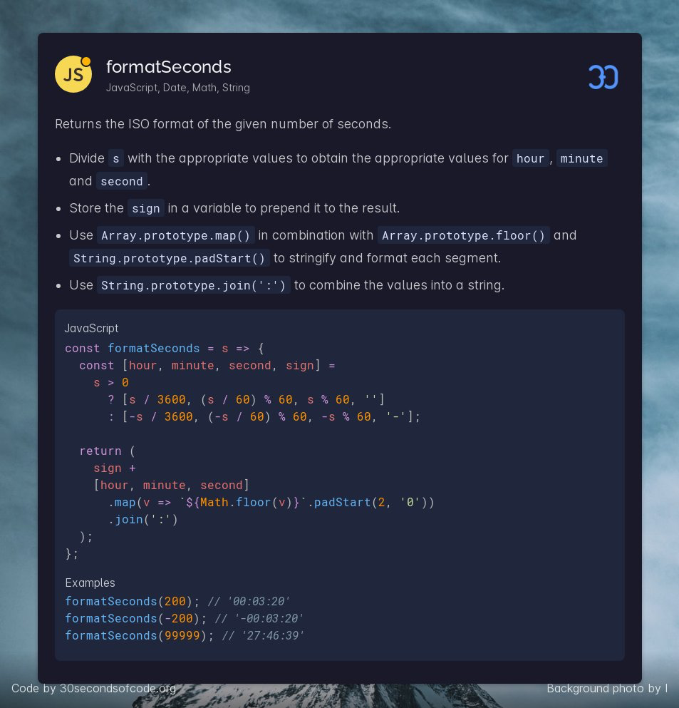

# 6

1.  把最近开发的毕设上线了一版, 项目的定位是语音社交平台.

    有空的同学可以体验下, 提提意见\~

    [https://github.com/Tomotoes/ITalking](https://github.com/Tomotoes/ITalking)

    [https://italking.tomotoes.com](https://italking.tomotoes.com)

    服务器是 香港的, 速度一般..
2.  快餐文分享:

    Stack Overflow Sold to Tech Giant Prosus for $1.8 Billion

    [https://www.zdnet.com/article/stack-overflow-sold-to-europes-prosus-for-1-8bn/](https://www.zdnet.com/article/stack-overflow-sold-to-europes-prosus-for-1-8bn/)

    Stack Overflow 被 Prosus 收购，成交价 18亿刀，收购方是著名投资机构，也是 腾讯的大股东之一。
3.  最近开发时遇到了一个问题，感觉 开发 React 应用太自由了，稍不注意 逻辑代码就会很分散。

    我指的 逻辑代码差不多是这几方面:

    1. 控制 UI 逻辑
    2. 副作用，网络 IO 逻辑
    3. 状态管理逻辑
    4. 数据转换逻辑
    5. 领域相关逻辑
    6. 埋点逻辑

    这些逻辑的承载地方 有组件内部，HOC 组件，各种 Hooks，State 的 Effect，各种 unity。

    因为 React 应用的搭建方式是 不同组件的组合。 所以把上面提到的逻辑承载 再分散不同层级的组件后，难免会出现不规范的问题。

    并且业界一直提倡 UI 组件与 业务组件分离维护的原则，在实际场景下 其实很难实践，分开的场景有局限性。

    当出现这种情况时，不得不单独抽离出一个 意义为 Provider 的 Wrapper 组件来包裹大部分逻辑..

    只能说，逻辑承载的地方太多，且每个地方能做的事又太广..
4.  每日一句分享:

    每一次统一的努力，都最终变成新的分裂。
5.  CodeByExample 系列分享：

    [https://kimh.github.io/clojure-by-example](https://kimh.github.io/clojure-by-example)

    对 Clojure 编程语言感兴趣的同学可以刷一下
6.  快餐文分享：

    Object Oriented Programming Concepts in Rust

    [https://blog.knoldus.com/object-oriented-programming-concepts-in-rust/](https://blog.knoldus.com/object-oriented-programming-concepts-in-rust/)

    文章介绍了常见 OOP 概念在 Rust 的体现。 文中最后给了一个 扩展基类的例子。 扩展基类 可以看成，官方暴露了 自定义实现 sdk 的入口。 像常见支持该特性的语言也有很多，比如 JS、Ruby、Kotlin..

    而与该特性类似（改变 native 行为）的有 运算符重载、定义魔法函数。 在我看来，能支持其一的语言都称得上是 "自由"的语言..
7.  每日一句分享：

    架构就是业务的正交分解。每个模块都有它自己的业务。
8.  JetBrains 前不久推出了 compose-jb 一种新的编写 GUI 的方式。

    [https://github.com/JetBrains/compose-jb](https://github.com/JetBrains/compose-jb)

    把样式、行为、结构全结合到一个组件内维护.. 这种设计和 Dart 好像.. 
9.  bloom filter: False is always false. True is maybe true.

    布隆过滤器，时间换空间的经典实践。只需存储小范围内的数据，通过多重 hash 则可判断大范围数据是否命中。

    具体原理是 既然一维存在冲突，那就使用多维交叉确认的方式，多维交叉确认可以有效地降低因冲突导致的误判。

    但只是降低误判的概率，并不能完全避免冲突
10. 想到一个点，https tls 1.0 版本的握手过程: 先用非对称加密传输 random key，后续再用 random key 做对称加密，以保证传输的安全性。

    为什么不设计成 双层非对称加密呢？ 我指的是: 先用 自己私钥加密，然后 使用对方公钥加密； 对方收到后用自己私钥解密，再用对方公钥解密，便可以拿到信息。

    我猜测没有设计的原因 一是为了更快 (很显然)；二是更安全 不需要双方都知道互相的公钥，暴露的信息更少。 在现在 如果要使用一个站点的公钥，需要先安装站点签名的机构证书，再用机构的公钥检查。
11. 快餐文分享:

    LEVERAGING GOLANG FOR GAME DEVELOPMENT AND OPERATIONS

    [https://technology.riotgames.com/news/leveraging-golang-game-development-and-operations](https://technology.riotgames.com/news/leveraging-golang-game-development-and-operations)

    拳头公司使用 Golang 作为服务端语言的开发实践，文章聚合了多个不同部门工程师的经历。 整体偏软文 不客观(连 duck type 都能舔)，没有什么可以产生思考的线索(可看文章前部分，团队老大的任务罢了..
12. 突然联想到一点。

    关于语言内扩展基类(自定义 sdk) 在操作系统层面上也有相同的概念。

    内核通过中断表的形式向外暴露了基础能力。 而操作系统可以通过动态库的方式扩展。 比如 windows 下的 dll,linux 下的 so 等。 现代编程语言的 library 也是基于 操作系统内置的动态库的上层抽象。

    另外一个关联点是(很主观，可能有误)。

    进程发起中断，系统调度，执行这一过程是在 ring 0 内核态进行的。 众所周知 进程是在 ring 3 用户态执行的。

    其中的关键点在于 每一个进程都可以通过中断 进入内核态执行指令。

    是不是可以理解为 内核被所有进程 shared，或者 内核 是处于 global scope，使用时需要遵守特殊的 中断协议，而一过程中像极了事件回调。
13. 每日一句分享:

    现在获取知识唯一的困难，是知识被淹没在每天不断产生的娱乐、体育、新闻、带节奏、造舆论等信息海洋中，缺少目标、定力和执行力的人会被分散注意力，从而耽于逸乐，主动放弃了学习和自我提升，在物竞天择中失败，选择彻底躺平，那就彻底浪费了这一次人世间的修行了。
14. 分享个工具：

    [https://github.com/banga/git-split-diffs](https://github.com/banga/git-split-diffs)

    GitHub style split diffs in your terminal
15. 每日一句分享:

    React hooks 发布以后，同事们很想重写公司 App 的大部分代码，只是因为现在有了新的 API。
16. 想到一个有趣的点，可以讨论下。

    服务端架构上的演进，这些年业界摸索出的路线是: 从单体应用 到 亚马逊 大刀阔斧 以ESB(企业服务总线) SOA 架构再到近些年很热闹的微服务(去中心化，去掉总线，以 API 网关、服务治理来管理，且每个服务 组件化...)。

    而服务端演进的每一阶段 如果映射到操作系统上， 我的理解是 从最开始的裸内核(单体应用)到现在传统的事件总线(SOA架构)，连接每一设备，降低设备之间的耦合，系统设计总体的复杂性。

    为什么操作系统没有演进到微服务的阶段呢？既每个设备硬件抽象成独立的服务，之间相互调用。 如果演化成这种类微服务架构，操作系统会发生呢？

    我的猜想是， 为每个硬件设备 添加计算单元，且之间的通信 按照 设计好的标准协议进行。 就像现在 Mesh 服务网格那样\~

    如果是这样的话，可以理解为 冯诺依曼架构的一种变体吧..

    总线模式可以扩展下，它是一种思想，代码层面可以是种设计模式(举个例子，vue 的 状态传递的 bus)，架构层面是服务之间通信的约束.. 思想嘛，可以到处体现的\~
17. 每日一句分享:

    解决单点问题(同一运行时，同一虚拟机，同一物理机，同一机架，同一机房，同一数据中心，同一光纤线路) 最安全的方案是物理层面的异地多活。
18. 

    [https://makelinux.github.io/kernel/map/](https://makelinux.github.io/kernel/map/)

    Linux 内核全景图

    Linux 是传统的宏内核架构，图中多个模块之间相互调用，复杂性不言而喻..
19. 每日一句分享: 兴趣只是开始，而能让人不断投入时间和精力的则是正反馈，是成就感。
20. 好文分享:

    Efficient data transfer through zero copy

    [https://developer.ibm.com/articles/j-zerocopy/](https://developer.ibm.com/articles/j-zerocopy/)

    文章介绍了 Web 应用的场景下，传统的文件传输与使用零拷贝技术传输的性能差异。

    从 4 次 DMA 传输，优化了 零拷贝的 2 次 DMA 传输。 每一次 DMA 传输意味着 用户/内核态切换，数据拷贝。

    最终文章给出的通过零拷贝技术，传输时间提高 65%，提高了系统的吞吐量。

    零拷贝性能提升的关键在于，省去了在数据传输不需要 CPU 参与。

    文中的两行代码给了很好思考的视角。 File.read(fileDesc, buf, len); Socket.send(socket, buf, len);

    在此过程中一共发生了 4 次数据传输，文中有很详细的解释，感兴趣的同学可以读一下。
21. 知识图谱分享：

    Javascript on one sheet. (and one for algorithms)

    [https://github.com/mechaniac/Map-of-Javascript](https://github.com/mechaniac/Map-of-Javascript)
22. 快餐文分享：

    How to Implement a Video Conference with WebRTC and Node

    [https://acidtango.com/thelemoncrunch/how-to-implement-a-video-conference-with-webrtc-and-node/](https://acidtango.com/thelemoncrunch/how-to-implement-a-video-conference-with-webrtc-and-node/)

    文章前半部分介绍了 WebRTC 建立 P2P 的过程，双端连接时需先交换 SDP 的信息，后续通过 ICE 机制建立通信频道，流程梳理得比较清楚。 后面给出了一个 语音房的 NodeJS 简单实现。
23. 快餐文分享：

    京东商城活动页面构建系统——通天塔

    [https://blog.csdn.net/zl1zl2zl3/article/details/84661421](https://blog.csdn.net/zl1zl2zl3/article/details/84661421)

    摘要： 通天塔是京东商城内部提供给运营，用以快速搭建活动页面的平台，自2015年第一版上线以来，已历经多个618和双十一的考验。

    关于 京东 low code 平台通天塔的一次简要介绍，涉及了一些技术设计。
24. 每日一句分享：

    callback 的编程方式破坏了屏幕上的顺序和时间顺序的直接映射关系。
25. 突然想到一点，函数式强调的 数据不变性 没有副作用、无状态特征 其实算得上，是 遏制熵增 的最佳实践之一。
26. 分享个项目：

    [https://vivirenremoto.github.io/doomcaptcha/](https://vivirenremoto.github.io/doomcaptcha/)

    极具创新的新一代验证码形式，在 客户端 完成小游戏 才能通过验证。 虽然具有安全风险，但这创意 实在太棒了。
27. Generic programming centers around the idea of abstracting from concrete, efficient algorithms to obtain generic algorithms that can be combined with different data representations to produce a wide variety of useful software. — Musser, David R.; Stepanov, Alexander A., Generic Programming

    泛型最显而易见的好处就是让数据更通用，底层的本质 抹平了操作 不同内存布局的数据 差异。
28. 快餐文分享：

    官方揭秘！你的颜色是这样算出来的……

    [https://musicfe.dev/color-quiz/](https://musicfe.dev/color-quiz/)

    文章介绍了 网易云团队开发上周爆品 “主导色” 活动所使用的动效技术，canvas、WebGL、物理引擎，以及 计算主导色的公式（上当了
29. 快餐文分享:

    An Intuition for Lisp Syntax

    [https://stopa.io/post/265?repost=true](https://stopa.io/post/265?repost=true)

    文章以一种远程绘画的场景为引，一步步实现了 根据远程指令传输来的指令(内部DSL)，实现绘画(组合)出不同效果的功能，结尾给出了 lisp 的等效语法。
30. 每日一句分享:&#x20;

    分治算法要求分割成的子问题，不能有重复子问题，而动态规划正好相反，动态规划之所以高效，就是因为回溯算法实现中存在大量的重复子问题。
31. 快餐文分享：

    从可逆计算看声明式编程

    [https://zhuanlan.zhihu.com/p/85492497](https://zhuanlan.zhihu.com/p/85492497)

    文章整体偏学术风格，读起来云雾缭绕.. 术语很多.. (想表达的观点实在是撑不住...
32. 阿姆达尔定律（Amdahl’s Law），程序并行化 计算收益定理:

    优化后的执行时间 = 受优化影响的执行时间 / 加速倍数 + 不受影响的执行时间
33. 著名的失败预测定理，比尔·盖茨在上世纪 80 年代说的“640K ought to be enough for anyone”。
34. 每日一句分享:&#x20;

    想一个自己从未深入思考的问题是危险的，我们读书是别人替我们思考，我们不过是在重复作者的精神过程而已。所以一个人如果整日读书，他将逐渐失去思考能力。 ——叔本华
35. 为什么 JS Runtime 中除了宏任务还要增加微任务？

    因为宏任务 运行时间的不可控性，提出了微任务，主要是用来满足粒度更小的异步。

    而 Vue 的 nextTick 运行机制是微任务，这与 Vue 的 render 本质不谋而合。

    A: 宏任务一开始是不是只为哪些时间相关的 settimexxx之类的设计的 目前似乎也是这样？ B: 不是吧，宏任务对应的概念是函数栈的创建，全局执行 context 也是宏任务执行中的一环。 通俗来讲，除了那些微任务，所有的代码都可理解为宏任务，比如 setTimout，执行 script 等。

    针对第一句，举个例子: function foo() { setTimeout(foo, 0) }

    是不会爆栈的，因为 每次宏任务的创建都会清空函数栈。

    function foo() { return Promise.resolve().then(foo) } 问题来了，该函数会爆栈吗？

    可以理解成 微任务递归自身..

    C：貌似就是foo函数永远会被放入微任务队列，然后一直执行这个foo。 那应该会爆栈吧，微任务队列的特性就是微任务执行过程中产生的微任务会立即被执行，这样就卡在这个函数这了。

    B: 不会爆栈，会页面假死。 因为会源源不断地产生 新的微任务，然后任务队列一直在当前宏任务执行，既 主线程(UI 线程)无法执行下一宏任务，所以页面假死了。

    卡死与暴栈 关键的差异在于，后者会在内存中保留栈帧，卡死(如果是上面的例子) 会不停地在任务队列中添加新的微任务.. 执行一个添加一个.. 微任务不会保留栈帧，会退出之前的调用栈。
36. 快餐文分享:

    V8 是怎么跑起来的 —— V8 中的对象表示

    [https://www.cnblogs.com/chargeworld/p/12236848.html](https://www.cnblogs.com/chargeworld/p/12236848.html)

    文章介绍了 V8中对象的结构设计，分为隐藏类(对象的结构)，Property(命名属性)，Element(索性属性)。 而命令属性的存储方式又分为 内属性、快属性、慢属性。

    当索性属性设置成稀疏数组时会自动转换为哈希存储。

    结构相同的对象，为了节省内存，隐藏类是一致的。

    文章探讨了当 CRUD 属性后对象内存的变化，文章整体排版有些乱。 而内属性，快属性，慢属性的设计 与 Java 中 Hashmap 结构 当冲突过多时，由 链表转换为红黑树的思想有些类似。

    都是为了 performance 与 memory 之间的 决策。
37. 衍生阅读:

    Fast properties in V8

    [https://v8.dev/blog/fast-properties](https://v8.dev/blog/fast-properties)
38. HTTP2 因为支持了 TCP 链接多路复用，在浏览器端 已经没有同一域名 同时最多 6 个请求的限制。
39. 快餐文分享：

    Code Health: To Comment or Not to Comment?

    [https://testing.googleblog.com/2017/07/code-health-to-comment-or-not-to-comment.html](https://testing.googleblog.com/2017/07/code-health-to-comment-or-not-to-comment.html)

    Google 介绍声明注释时的一篇短文，列举了什么时候适合，什么时候不适合。
40. 每日一句分享：&#x20;

    训练一个大型 AI 模型会排放近30吨二氧化碳，相当于5辆小汽车终身的二氧化碳排放量（包含制造期间的二氧化碳）。
41. 

    数据单位：byte - kb - mb - gb - tb - pb - eb - zb
42. 
43. 快餐文分享：

    Bookmarklets

    [https://www.ph-uhl.com/0010-Bookmarklets/](https://www.ph-uhl.com/0010-Bookmarklets/)

    文章介绍了 常见的 bookmarklet，使用书签控制视频播放速度，存档网页等。
44. 每日一句分享:&#x20;

    "To be a programmer is to develop a carefully managed relationship with error." — Ellen Ullman
45. 快餐文分享:

    一觉醒来，竟发现自己看不懂 JS 了？

    [https://mp.weixin.qq.com/s/hsJGjo1j7fBMwcJLMVnSlg](https://mp.weixin.qq.com/s/hsJGjo1j7fBMwcJLMVnSlg)

    列举了一些很有趣的 JS 提案。
46. 快餐文分享:

    State of the Windows: How many layers of UI inconsistencies are in Windows 10?

    [https://ntdotdev.wordpress.com/2021/02/06/state-of-the-windows-how-many-layers-of-ui-inconsistencies-are-in-windows-10/](https://ntdotdev.wordpress.com/2021/02/06/state-of-the-windows-how-many-layers-of-ui-inconsistencies-are-in-windows-10/)

    现在的 Windows 系统 融合了 Win10、8、7、XP、2000、95、DOS 各个版本的设计风格。 文章主要剖析了不同系统设计风格的体现。
47. 快餐文分享:

    What Every Programmer Should Know About SSDs

    [https://databasearchitects.blogspot.com/2021/06/what-every-programmer-should-know-about.html](https://databasearchitects.blogspot.com/2021/06/what-every-programmer-should-know-about.html)

    文章介绍了 SSD 的写入，读取数据时的一些特性。
48. 每日一句分享:

    函数式组件的名称存在很强的误导性。 在程序中，函数往往代表了一个封装好的执行单元，依据命令去执行。 而函数式组件却是一个有限状态机，在 React 的运行时中存在，会依据不同的指令 渲染不同的状态。

    Finite State Machines: Old State + Input = New State
49. 快餐文分享:

    Everything New In React 18

    [https://dev.to/push9828/everything-new-in-react-18-2mlf](https://dev.to/push9828/everything-new-in-react-18-2mlf)

    文章梳理了一下 React 18 的新特性，我简单总结下:

    1. root.render(\<App />) 可以使用 新的 render api 来获得 18 的新功能，包括 concurrent 特性。
    2. 所有 render 自动批处理
    3. startTransition 对于不紧急或重的 UI 更新可以使用该方法
    4. SuspenseList 组件，Suspense 的父组件
    5. useDeferredValue hooks 可以理解为 useBounce
50. 快餐文分享:

    Drawing Graphics with the CSS Paint API

    [https://tympanus.net/codrops/2021/06/18/drawing-graphics-with-the-css-paint-api/](https://tympanus.net/codrops/2021/06/18/drawing-graphics-with-the-css-paint-api/)

    介绍 CSS Houdini 技术的一篇文章，文中给出了一个 Demo，借助 canvas 作为底层渲染来 实现自定义的 CSS 属性。 CSS Houdini 提出了很多年了，到现在 业界也没多少声音..
51. Question:

    渲染网页的过程是发生在 下载 HTML 文件后，还是下载 HTML 文件时？

    Answer：不是的，全程都是流式
52. 
53. [https://jsisweird.com/](https://jsisweird.com/)

    JavaScript is a great programming language
54. 每日一句分享:

    任何一个产品创意都不会孤立存在，而是都有自己独特的行业定位和上下游资源。
55. 每日一句分享:

    "Code is there to explain the comments to the computer" — Andy Harris

\
