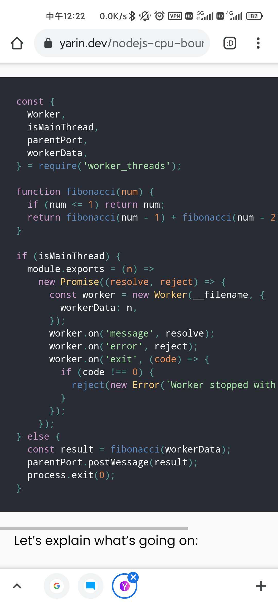
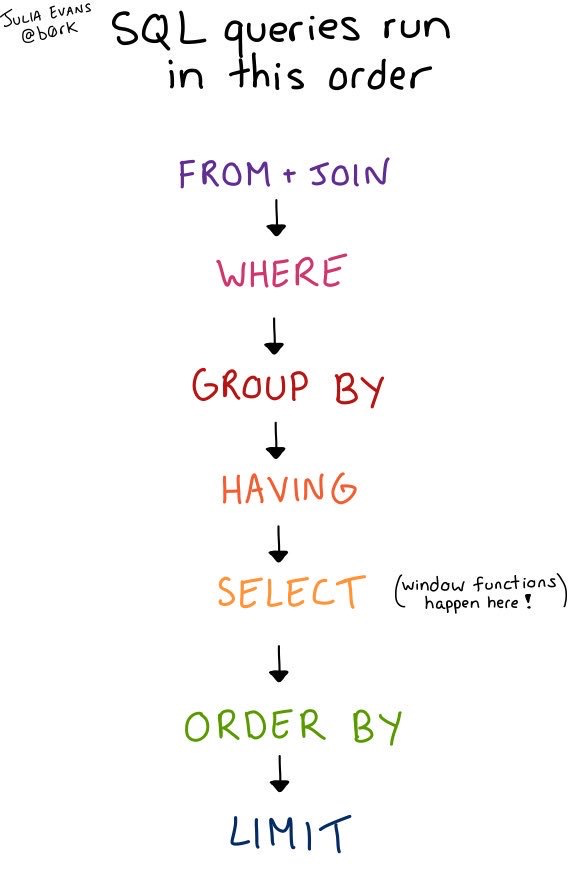
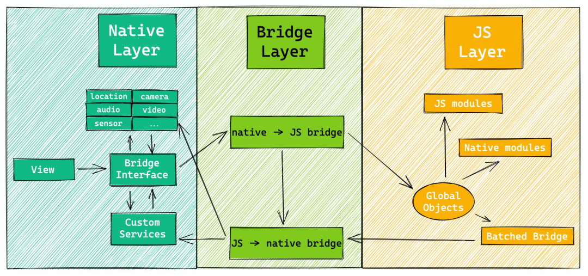
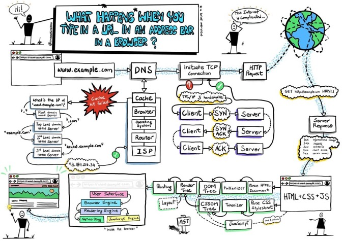

# 8

1.  快餐文分享:

    Generate a fully-working Go CRUD HTTP API with Ent

    [https://entgo.io/blog/2021/07/29/generate-a-fully-working-go-crud-http-api-with-ent/](https://entgo.io/blog/2021/07/29/generate-a-fully-working-go-crud-http-api-with-ent/)

    Ent 是 facebook 开源的图数据库 ORM 框架，底层兼容各种传统型数据库。 文章介绍了一种与 elk(web framework) 结合使用的方式，定义一套 scheme(Ent 提供的规范，属于一种内部 DSL)，执行一次命令，即可生成 CRUD Api (elk cover)与 SQL Command(Ent cover)。 之前的项目中深度用过 Ent，这种根据 DSL 吐出代码的 ORM，比传统的 gorm, xorm 体验增强很多。 因为使用传统 gorm 时，还需要经常接触 SQL 的概念，甚至有时候还需要手写 SQL，这种程度的封装 应该称之为 ORM Lite...

    要么就简单得没有缺陷，要么就复杂得足够简单。
2.  

    调用该文件默认导出函数后，该文件在不同线程中会运行两次，一个是主线程等待结果，一 个是子线程做计算。

    用事件做消息通信，符合 NodeJS Event-Loop 思想模型，有趣。
3.  好文分享:

    Running CPU-Bound Tasks in Node.js: Introduction to Worker Threads

    [https://yarin.dev/nodejs-cpu-bound-tasks-worker-threads/](https://yarin.dev/nodejs-cpu-bound-tasks-worker-threads/)

    文章很长，主要围绕以下三个问题展开:

    1. 什么是 CPU 密集型应用
    2. 为什么 NodeJS 不能胜任 CPU 密集型场景
    3. NodeJS 该如何克服 CPU 密集型额的场景

    文中涉及了很多概念，问题背后的理念讲得非常清楚，属于综述类文章。 这样的文章可以让我们思考，并帮助我们在遇到类似场景时做决策。
4.  每日一句分享:

    "When I see a door with a push sign, I pull first to avoid conflicts" - anonymous
5.  快餐文分享:

    New in Git: switch and restore

    [https://www.banterly.net/2021/07/31/new-in-git-switch-and-restore/](https://www.banterly.net/2021/07/31/new-in-git-switch-and-restore/)

    文章前半部分介绍了 git checkout 的复杂性，既可以 切换分支，指定 commit，也可以用来回滚工作区文件。 高版本 Git 增加了 git switch 与 git restore 来拆解 git checkout 的功能，文中给出了使用 case。
6.  每日一句分享:

    葬礼越多，科学越进步。
7.  快餐文分享:

    电商巨头的好日子到头了？

    [https://mp.weixin.qq.com/s/7bz\_d4h5-eVrlbbxwmHbiQ](https://mp.weixin.qq.com/s/7bz\_d4h5-eVrlbbxwmHbiQ)

    文章根据一些企业的宏观数据去分析国内电商布局与发展战略。
8. 最近在熟悉 VSCode，分享两篇文章：
   1. 微软官方推出的 VSCode 基础技巧 [https://code.visualstudio.com/docs/getstarted/tips-and-tricks#vscode](https://code.visualstudio.com/docs/getstarted/tips-and-tricks#vscode)
   2. VSCode 那些你可能会用到的功能 [https://vscodecandothat.com/](https://vscodecandothat.com)
9.  快餐文分享:

    腾讯企鹅辅导 H5 性能极致优化

    [https://mp.weixin.qq.com/s/zJMM4SF7pc6LZPCsQfWOxw](https://mp.weixin.qq.com/s/zJMM4SF7pc6LZPCsQfWOxw)

    文章梳理了一套 H5 性能优化的思维框架。
10. 七夕了，刷到了 HN 上一篇爱恨情仇的帖子，vim 党 、Emacs 与现代 IDE之间的派别之争：

    [https://news.ycombinator.com/item?id=9713478](https://news.ycombinator.com/item?id=9713478)
11. 好文分享：

    JavaScript needs more helper functions for iteration

    [https://2ality.com/2021/08/iteration-helpers.html](https://2ality.com/2021/08/iteration-helpers.html)

    一篇讨论迭代器特性的好文，文章整体脉络结构很清晰，文章作者也是社区内名气较大的布道者，Deep Javascript 的作者。 文中关于迭代器的解读很有趣，将其使用方式分为生产者与消费者，并用一个个 demo 去论证 helper 函数如何更好地与 customer 结合。

    Deep Javascript 开源电子书：

    [https://exploringjs.com/deep-js/toc.html](https://exploringjs.com/deep-js/toc.html)
12. 快餐文分享：

    Microfrontends With React

    [https://dev.to/kpiteng/microfrontends-with-react-47jb](https://dev.to/kpiteng/microfrontends-with-react-47jb)

    文章主要给出了一种实践，在 React 工程中 微前端的加载子模块的方式，可以看出对 编译层侵入较多。
13. 快餐文分享:

    Let's build a Full-Text Search engine

    [https://artem.krylysov.com/blog/2020/07/28/lets-build-a-full-text-search-engine/](https://artem.krylysov.com/blog/2020/07/28/lets-build-a-full-text-search-engine/)

    文章介绍了 如何使用 Go 一步步 构建一个简易的全文搜索引擎。 大体流程如下:

    1. 文本处理(分词,去掉常用词,token 小写 不同时态替换, nlp...)
    2. 设计分词的数据结构（倒排索引）
    3. 搜索（根据 关键词分词后命中次数排序）
14. 

    上图只是从语义层面的分析, 实际上 SQL 执行顺序不是完全这样,数据库引擎会做很多优化..

    上图来自于这篇文章.

    SQL queries don't start with SELECT

    [https://jvns.ca/blog/2019/10/03/sql-queries-don-t-start-with-select/](https://jvns.ca/blog/2019/10/03/sql-queries-don-t-start-with-select/)
15. 快餐文分享：

    6 Command Line Tools for Productive Programmers

    [https://earthly.dev/blog/command-line-tools/](https://earthly.dev/blog/command-line-tools/)

    一些提高生产力的命令行工具。如果你经常生活在终端，推荐阅读。
16. 今日 HN 热文：

    Imba – I have spent 7 years creating a programming language for the web

    [https://news.ycombinator.com/item?id=28207662](https://news.ycombinator.com/item?id=28207662)

    一栈式 编程语言[https://imba.io/](https://imba.io)，除了语法形式的一致性，还内置了一些社区中知名的库，没什么有吸引力的特性。
17. 

    跨端中常见的终端通信机制。
18. 分享个问题:

    因为渲染机制的差异，在大部分场景下 canvas 渲染的性能是高于传统 dom 渲染的，那么问题来了，里面的回答考虑的很全面。

    Does it make sense to create canvas-based UI components?

    [https://stackoverflow.com/questions/6856953/does-it-make-sense-to-create-canvas-based-ui-components](https://stackoverflow.com/questions/6856953/does-it-make-sense-to-create-canvas-based-ui-components)
19. 每日一句分享：

    华尔街的投资家使用各种方法，希望比他人更早获得内部信息。他们向卫星公司购买图片，专门监视美国67,000家大型商场门口的停车场，通过车辆的数量判断商场的生意。据估计，他们使用这种方法，每个季度的收益率可以达到4％至5％，转化成年率就会非常可观。
20. 快餐文分享：

    Practical Uses of CSS Math Functions: calc, clamp, min, max

    [https://moderncss.dev/practical-uses-of-css-math-functions-calc-clamp-min-max/](https://moderncss.dev/practical-uses-of-css-math-functions-calc-clamp-min-max/)

    文中介绍了 CSS 中 4 个计算函数，并给出了常见的使用场景，总结得很详细。
21. 快餐文分享:

    今日头条品质优化 - 图文详情页秒开实践

    [https://mp.weixin.qq.com/s/Xqr6rQBbx7XPoBESEFuXJw](https://mp.weixin.qq.com/s/Xqr6rQBbx7XPoBESEFuXJw)

    针对 Webview 场景的性能优化方案。 文章从客户端视角出发，在固定页面结构的情况下(只需考虑数据拉取、注入、渲染)如何应用一系列手段做到体验极致。
22. 快餐文分享：

    How Did Vim Become So Popular

    [https://pragmaticpineapple.com/how-did-vim-become-so-popular/](https://pragmaticpineapple.com/how-did-vim-become-so-popular/)

    文章概述了 Vim 的历史演进，从上世纪 70 年代的 QED 到 Ed（editor） 再到 Bill Joy 开发的 Ex（Extend ED），然后可视化浪潮的兴起，EX 摇身一变成为了 Vi(Visual)，随后慢慢出现了很多 Vi 变体，其中 Vi Improved 受众最高 且 完全兼容之前的 Vi，也就是现在被人民所选择的 Vim。
23. 快餐文分享：

    Announcing TypeScript 4.4 RC

    [https://devblogs.microsoft.com/typescript/announcing-typescript-4-4-rc/](https://devblogs.microsoft.com/typescript/announcing-typescript-4-4-rc/)

    TS 4.4 发布，除了一些类型分析，性能上的优化，语法上新增了 static block(like Java)，编译器层面增加了 内联提示(like kotlin)，node\_modules 导入路径优化。
24. HN 今日热帖：

    [https://how-i-experience-web-today.com](https://how-i-experience-web-today.com)

    现代 Web 站点是什么样子呢？(太过真实)
25. 快餐文分享：

    NodeJS Performance Optimization with Clustering

    [https://blog.bitsrc.io/nodejs-performance-optimization-with-clustering-b52915054cc2](https://blog.bitsrc.io/nodejs-performance-optimization-with-clustering-b52915054cc2)

    NodeJS 通过使用 cluster 来处理网络请求，提高性能的简易教程。
26. 分享篇文章：

    canistilluse.com

    [https://blog.jim-nielsen.com/2021/canistilluse.com/](https://blog.jim-nielsen.com/2021/canistilluse.com/)

    相对于 Web 兼容性查询站点 caniuse ，canistilluse 是什么？为什么会有该产品，浏览器厂商实现标准时 有哪些不合理之处，文章着重介绍了这些事情，透露着一股用户对产品的无奈。
27. 
28. 快餐文分享:

    Pnpm: 最先进的包管理工具

    [https://juejin.cn/post/7001794162970361892](https://juejin.cn/post/7001794162970361892)

    文章介绍了，Pnpm 安装复用依赖的机制，又是如何通过系统的 软硬链接 做到 performant npm。 可以看出 前端的包管理器还处于刀耕火种的时代..
29. 快餐文分享:

    The underutilized usefulness of sync.Once

    [https://blog.chuie.io/posts/synconce/](https://blog.chuie.io/posts/synconce/)

    文章介绍了 Sync.once 的的含义与数据竞争场景下的使用 case，且还给出了一种用 channel 模拟 once 的 demo。

    Once 在数据竞态下如何保持原子性，就离不开 Go 的 atomic library 了，里面有很多底层指令，汇编代码。
30. 每日一句分享:

    You cannot reduce the complexity of your problem by increasing the complexity of your language.
31. 每日一句分享:

    Somewhere between Objective-C and Swift1-5 you ended up with one framework from the past, one framework from the future, and one tangled mess in the present.

\
