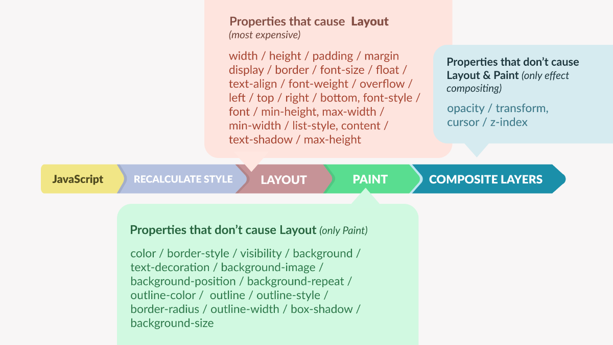

# 3

1.  每日一句分享：

    Objects are data with functions. Closures are functions with data.
2.  快餐文分享：

    Solid.js feels like what I always wanted React to be

    [https://typeofnan.dev/solid-js-feels-like-what-i-always-wanted-react-to-be/](https://typeofnan.dev/solid-js-feels-like-what-i-always-wanted-react-to-be/)

    一篇介绍 Solid.js 的软文。

    作者直击 React 开发时的复杂度：React 并不是 Reactive 的，Runtime 的概念会让 代码不好维护、造成性能影响，说的都非常有道理。后面引出了 Solid.js，一个真正形式上的 Reactive 框架，没有 runtime，没有显示标记依赖等。
3.  快餐文分享：

    Early peek at C# 11 features

    [https://devblogs.microsoft.com/dotnet/early-peek-at-csharp-11-features/](https://devblogs.microsoft.com/dotnet/early-peek-at-csharp-11-features/)

    宇宙第一甜的语言 C# 近期发布了 11 版本，文章梳理了其中的一些语法特性。

    1. 字符串内计算能力增强
    2. 列表模式匹配，不但支持数据还支持切片，看起来非常的甜
    3. 非空参数断言，感觉不如设置关键词来代替，符号太多 阅读代码时会解析困难。
4.  分享一个有学习价值的库，可以快速用来熟悉语言。

    A Lodash-style Go library based on Go 1.18+ Generics

    [https://github.com/samber/lo](https://github.com/samber/lo)

    再补充另一个 质量很高的 sdk 扩展

    [https://github.com/bradenaw/juniper](https://github.com/bradenaw/juniper)
5.  快餐文分享：

    It's always been you, Canvas2D

    [https://developer.chrome.com/blog/canvas2d/](https://developer.chrome.com/blog/canvas2d/)

    文章从多个方面介绍了 Canvas 的新特性与现有能力，其中值得一提的是 文字绘制能力基本追平了 CSS.
6.  每日一句分析：

    要么是用户控制程序，要么是程序控制用户。
7.  好文分享：

    Why Static Languages Suffer From Complexity

    [https://hirrolot.github.io/posts/why-static-languages-suffer-from-complexity](https://hirrolot.github.io/posts/why-static-languages-suffer-from-complexity)

    一篇介绍 设计静态语言时复杂度不可控的论述文。

    文章篇幅比较长，章节较多，整体一直是围绕着 静态语言的不足展开。静态语言中最重要的就是类型系统，类型系统虽然可以让语言表现的更有张力，为程序赋予了编译时的检查能力，但如果过度重视会语言的不完整性，造成了运行时的二义性。作者引用了很多例子说明这一点，就不展开了。

    程序的复杂度除了来源于问题的本身领域，更多由 追求完整性的表现造成的，摘录：

    Combining statics and dynamics in a single working solution is also complicated since you cannot invoke dynamics in a static context.

    Programming languages ought to be rethought.
8.  项目分享：

    [https://github.com/neurocollective/go\_chainable](https://github.com/neurocollective/go_chainable)

    With generics, allowing chainable .Map(func(...)).Reduce(func(...)) syntax in go

    一个实现通用方法 链式调用的库。

    库源码很简单，定义了两个接收泛型的复合类型 wrapper，实现都是样板代码。仔细读下来 库中存在明显的问题，链式方法不支持类型转换，这其实反映了语言类型系统的缺失。
9.  每日一句分享：

    战争之后，所有的相机都到别的战场去了。
10. 快餐文分享：

    巨亏 55 亿，你的「三连」救不了 B 站

    [https://mp.weixin.qq.com/s/oYx2Y\_85hmhGvolzhOwyBQ](https://mp.weixin.qq.com/s/oYx2Y_85hmhGvolzhOwyBQ)

    一篇围绕 B站 21年报 对内容消费产品商业模式的分析文章。

    从文中可以看出，B 站目前的窘态，对于内容消费的产品来说，营收是产品商业模式重要的外在表现，它与用户增长其实是相辅相承的，用户增长带来流量，不可避免的会带来营收，而营收也会反哺这个闭环，从而做更多的用户增长。

    为什么 B 站月日活 4 亿，存在一定流量还是亏损呢？我猜测原因有二，一是产品变现出了问题二是用户价值不高。

    文中对于 B 站变现的动作说了很多，总结来说是 没有投入正确的方向。用户价值不高指的是用户与变现的动作不 match，就比如我看 B 站经常刷到一些乱七八糟的作者商单，自然没有消费心理，而这些商单理应是根据用户画像准确推送的。
11. 快餐文分享：

    Introduction to GPUs with OpenGL

    [https://engineering.monstar-lab.com/en/post/2022/03/01/Introduction-To-GPUs-With-OpenGL/](https://engineering.monstar-lab.com/en/post/2022/03/01/Introduction-To-GPUs-With-OpenGL/)

    一篇介绍 OpenGL 与 GLSL 基础概念的文章。

    文中用一个画矩形的过程，引出了 OpenGL 中相关概念，其中涉及了很多 GLSL 上的对 drawing 的建模思想，整体而言很偏领域性。
12. 每日一句分享：

    These walls are funny.First you hate them,then you get used to them;Enough time passes,gets so you depend on them.That’s institutionalized.
13. 好文分享：

    低代码平台边界探索：多技术栈支持及高低代码混合开发

    [https://mp.weixin.qq.com/s/5h2K8ektFD1ZNilCxrRbXA](https://mp.weixin.qq.com/s/5h2K8ektFD1ZNilCxrRbXA)

    一篇从多个维度介绍 Low Code 平台的好文。

    文章虽然面向的是华为内部场景，但有很多思想都是搭建领域的通用方案，这种文章可以帮助我们很快建立起特定领域的思维框架。

    我下面随文章脉络，简单梳理下各个部分。

    1. 文章开始引出低代码的定义，指出其缺点，这里是有所偏失的，引用自 Gartner 的定义：“...以牺牲跨平台的可移植性、应用开放性为代价来提高生产效率。”。我并不认同 Gartner 的第一点定义，对于 Low Code 的本质来说，跨平台的差异其实在于物料层，并不在于搭建本身，搭建可以由专门的领域去承载 如 Web，不同平台的物料可以提供 Web 化的形态，所以 Low Code 与跨平台不是同一维度；而第二点作者的解读，我也不认可，作者在文中指的应用开放性是 应用级别的，而应用级别是更加广泛的开放，其实 Gartner 这里指的是物料开放，显然 Low Code 中使用的物料存在或多或少的约束，但我们可以借助中间层 或者 规范收口层 让其物料产物可对接更多的场景。
    2. 文中探讨了一个我非常有同感的话题，Low Code 与 20 年前流行的 Delphi、WinForm 有什么差异，作者说的三个 LowCode 意义价值中，个人认为只有第一个站得住脚，Low Code 面向非研发人员，那么问题延伸到 非研发人员为什么要搭建应用呢？因为一直存在的数字化转型的场景；而至于作者提到的另外两个价值，其实算是 Low Code 领域下出现的新问题..
    3. 文章提到了 Low Code 解决方案，该方案比较常见了，(这里作者使用“区块”封装了 组件的概念，自建名词)，其实这里也算是 LowCode 的价值之一，降本增效。
    4. 作者从技术视角提到了如何在不同前端技术栈中复用组件，作者给出了 web-components 的方案，这里推荐感兴趣的同学了解 微前端，Low Code 领域 与 微前端领域 所面临的问题存在明显的交集，如 技术栈打通、沙盒运行，可执行文件加载运行等。
    5. 文章提到了 Low Code 中非常值得讨论的一个话题，搭建后的产物是如何生成的？常见的有两种方式：运行时渲染、生成源码。作者分别梳理了这两种方式的优劣势，不过整体比较发散，简单来说 运行时渲染的方式 利于平台的扩展性、用户预览的体验，生成源码的方式利于 产物的性能、二次开放的场景。
    6. 关于平台的架构设计，可以看出由上往下 扩展得大而全，有很多抽象的二次封装大一统，算是大厂基建的通病了，不管用户使用体验如何，具体问题是否解决，先把事情搞大..
14. CJS 如何在代码层面快速迁移到 ESM&#x20;

    .png>)
15. 快餐文分享：

    Inspecting Web Views in macOS

    [https://blog.jim-nielsen.com/2022/inspecting-web-views-in-macos/](https://blog.jim-nielsen.com/2022/inspecting-web-views-in-macos/)

    事实证明 因为天然的动态性与强大的跨平台能力，Hybrid 形态的应用无处不在。

    作者在打开 Webview 调试开关后发现，iCloud Native 应用有很多页面已被 Web 技术栈渗透。
16. 最新 TC39 提案:

    ECMAScript proposal: Types as Comments

    [https://github.com/giltayar/proposal-types-as-comments](https://github.com/giltayar/proposal-types-as-comments)

    背景：减少 TypeScript 侵入性，摆脱二次编译，使用注释方式声明类型信息。 提案中的类型标注 严格属于 TypeScript 中的子集，只是移除了部分非 JavaScript 标准的语法。

    提案中的愿景在我看来并不适用于 C 端，就像软件与硬件的发展，高速发展与稳定迭代之间是一直存在 Gap 的，必然会使用某些技术手段抹平，并且方案中提到 类型标注是在 运行时移除，这对文件体积是会有不利影响的。

    方案最后有很多 QA，其中涉及了 TC39 与 TypeScript 之间的发展关系、类型系统未来的演变方向等。
17. 分享一个小巧 REST Client 请求库：

    [https://github.com/johannschopplich/uncreate](https://github.com/johannschopplich/uncreate)

    源码很精炼，只有 60 行代码。主要工作是 通过 Proxy 实现声明式的路径请求，如： `await api.users(userId).get<UserResponse>();`
18. 快餐文分享：

    H.264 is Magic

    [https://sidbala.com/h-264-is-magic/](https://sidbala.com/h-264-is-magic/)

    文章介绍了 H 264 编码中压缩的主要思路。

    分为三个措施：信息熵量化、色彩信息精简、运动补偿机制。 前两个措施是 空间维度上的优化，运动补偿是时间维度上的优化，我简单介绍下这三个措施：

    信息熵量化：是将一帧的数据转换为某种分布规律的数据形式，这个过程属于无损的编码转换，而转换之后的数据可以进一步地做信息密度的量化，从而压缩一帧的图片体积。文章抛硬币的例子很通俗异同，在现实生活中无损编码的例子也比比皆是，如进制的转换。

    色彩信息精简：指的是优化掉人眼无需要的色彩信息。

    运动补偿机制：算是比较经典的视频压缩算法，通俗来说是根据之前帧与当前帧的块级信息的位置差异，来弥补当前帧，从而去掉序列冗余。

    与之前提到的流媒体 VP9 算法，动态补偿机制应该是同一原理。
19. 快餐文分享：

    Browser In The Browser (BITB) Attack

    [https://mrd0x.com/browser-in-the-browser-phishing-attack/](https://mrd0x.com/browser-in-the-browser-phishing-attack/) [https://github.com/mrd0x/BITB](https://github.com/mrd0x/BITB)

    一个脑洞很大的攻击方式。

    使用前端技术栈模拟 弹窗登录，这种方式类似于常见的钓鱼网站，不过 mock 的目标变成了组件，这种方式不仅成本低，并且用户容易忽视。
20. 快餐文分享：

    理解 Language Server Protocol 的工作原理

    [https://juejin.cn/post/7051453384645148680](https://juejin.cn/post/7051453384645148680)

    一篇介绍 LSP 基本概念的文章。

    LSP 重点在于其架构设计，通过引入规范协议将编辑器中的语言服务抽离出来，隔离了具体语言框架与编辑器，算是一个很典型的沙漏模型案例。
21. 快餐文分享：

    Delightful React File/Directory Structure

    [https://www.joshwcomeau.com/react/file-structure/](https://www.joshwcomeau.com/react/file-structure/)

    一篇关于前端项目中 工程结构最佳实践的文章。

    文章针对不同内容场景 输出了一些观点，个人感觉很收益，简单总结下：

    1. 不要存在过多的 index 文件，index 文件应只用于管理 export，实际的逻辑由同名文件承载。该实践最大的好处是 可以加速检索文件的时间。
    2. helpers 不等于 utils，前者应与项目场景相关，后者是通用的逻辑。
    3. 维护 constants 文件，这里我展开一下，如果项目中常量定义过多，建议使用 文件(\*\*.const.js) 或者 复合结构(更推荐) 区分。
    4. 推荐根据文件的定位 而不是 具体逻辑 分类。
22. 项目分享：

    sysend.js - [https://github.com/jcubic/sysend.js](https://github.com/jcubic/sysend.js)

    一个具有学习价值的库，通过 localStorage / BroadcastChannel 实现跨 tab 之间的同域通信。

    虽然项目文件很精简，但整体完整性很高，感兴趣的同学可以看下。
23. 快餐文分享：

    Dependency Injection in Node.js

    [https://blog.risingstack.com/dependency-injection-in-node-js/](https://blog.risingstack.com/dependency-injection-in-node-js/)

    一篇介绍依赖注入基础概念的文章。

    曾几何时，我非常讨厌依赖注入、设计模式这些“故弄玄虚”的概念，认为其只是常见的编程技巧，没有造词的必要。

    但最近有了一些更深的理解，在开发中，经常会对所在域的不同实体进行抽象建模，而不同实体之间 因为责任范围或多或少的存在逻辑交集，逻辑子集，想要垮范围使用其他实体能力，必然涉及到模型之间的组合，这是依赖注入的意义之一，这一点很像函数式中的组合子，将不同的逻辑融合来增强函数。

    依赖注入的另外意义是 管控 实体的输入，这一点很像函数式的偏函数，隔离了不同依赖的出现时机。

    所以综合来看，依赖注入、设计模式在特定的场景下是可以解决问题的。这些模式在我看来更像是某些编程技巧、函数式理论 在 OOP 这个域上的延伸。

    关于 IOC 最佳实践，推荐一个功能全面的库：

    [https://github.com/jeffijoe/awilix](https://github.com/jeffijoe/awilix)
24. 

    CSS properties and their initial step in the pixel pipeline

    图片来源： [https://www.freecodecamp.org/news/web-animation-performance-fundamentals/](https://www.freecodecamp.org/news/web-animation-performance-fundamentals/)
25. 快餐文分享：

    Give me a browser, I’ll give you a Shell

    [https://systemweakness.com/give-me-a-browser-ill-give-you-a-shell-de19811defa0](https://systemweakness.com/give-me-a-browser-ill-give-you-a-shell-de19811defa0)

    如何通过浏览器获取当前环境的 shell，一段有趣的实践。
26. 分享一个检测网页产生碳排放的工具：

    Are my third parties green?

    [https://aremythirdpartiesgreen.com](https://aremythirdpartiesgreen.com)

    以下内容摘要自工具：

    It's estimated that global information and communication technology (ICT) accounts for around 4% of global CO2 emissions. That is about equivalent to Germany's national emissions (the world's 7th largest polluter), and is more polluting than the civil aviation sector.
27. 每日一句分享：

    A broken watch gives the time correctly twice a day – Unknown
28. 快餐文分享：

    Hooks Considered Harmful

    [https://labs.factorialhr.com/posts/hooks-considered-harmful](https://labs.factorialhr.com/posts/hooks-considered-harmful)

    一篇讨论 React Hooks 设计不合理性的文章。

    内容整体比较发散，引起共鸣的点有二，一是 state 管理依赖的方式过于原始，二是 hooks 运行的时机，运行的次数很难把控。

    除了文中提到的观点，hooks 对开发者的心智成本、项目中 state 的管控都有很大影响。本质上 React 是个由 state 驱动的 runtime，如果没有一个很好处理 state 的机制，则开发者就不得不面对带来的复杂度。
29. 项目分享：

    dum - An npm scripts runner written in Rust.

    [https://github.com/egoist/dum](https://github.com/egoist/dum)

    dum 是知名开发者 egoist 的个人作品之一，项目中使用 rust 降低了执行 npm 命令的时间。

    从压测数据中可看出，使用 rust 开启进程 执行 node 脚本，会提升 npm 命令数倍性能，可以看出 npm 命令主要的性能瓶颈在于 node 桥接层。

    项目整体比较精简，是个很好的学习案例。
30. 快餐文分享：

    Please put units in names

    [https://ruudvanasseldonk.com/2022/03/20/please-put-units-in-names](https://ruudvanasseldonk.com/2022/03/20/please-put-units-in-names)

    一篇介绍代码最佳实践的文章。

    文章的关注点聚焦于魔法数字，文中梳理了 一些使魔法数字具有可读性的方案。

    第一种方案可以称为 parameter hint，像一些编程语言在 语法层面存在该特性，如python、kotlin ，现代的 IDE 一般也都具有该功能。

    第二种方案类似于类型别名，该方案就极度依赖语言特性了，并且在运行时 语义大概率会被抹出。

    我经常实践的方案是数字计算，定义一个基本的单位产量，如 Second = 1000，然后魔法数字 foo = n \* Second 这些。这种方式的好处是 可以方便的升级计算公式，且具有很强的语义。
31. 惊讶系列分享：

    A regular expression to check for prime numbers

    [https://www.noulakaz.net/2007/03/18/a-regular-expression-to-check-for-prime-numbers/](https://www.noulakaz.net/2007/03/18/a-regular-expression-to-check-for-prime-numbers/)

    使用正则表达式 判定素数证明 - `/^1?$|^(11+?)\1+$/`

    文中针对原理介绍很详细，感兴趣的同学可以看下。

    延伸来看 正则引擎可以匹配出所有非负的数字公式，这些公式使用正则去描述，两种不同领域之间的表达映射，实在是妙…
32. 好文分享：

    Lisp的永恒之道

    [https://www.cnblogs.com/weidagang2046/archive/2012/06/03/tao\_of\_lisp.html](https://www.cnblogs.com/weidagang2046/archive/2012/06/03/tao_of_lisp.html)

    一篇论证编程语义的好文。

    文章从多个角度介绍了编程语言中 语义的重要性，以 lisp 为主导论证了语义的强大之处。

    从语义的角度出发，业界中常见的编程语言 本质上是基于底层（操作系统、网络模型、持久化这些域）提供的 DSL，或多或少都不太纯洁，比如在 C 系列语言中，用户需要关心 语言的内存管理，在 非 ML 系语言中用户需要留意 递归爆栈..

    用户使用这些编程语言往往解决特定场景下的问题。这些问题是场景所赋与的，比如做电商平台，不同的商品模型是需要不同的建模策略。 理论上，在这些业务域上 使用常见的编程语言去抽象建模是不自然的，创造的思想会被编程语言所限 且 思想的表达会被语言的细枝末节所淹没。

    解决问题的方案会明显，针对业务域的问题 创造专属的 DSL，扩展思想表达的能力，然后 研发编译器去将 业务域的思想 翻译到 底层。 很明显该逻辑已经被反复验证了 (上述的问题换成计算 DSL 换成 编程语言)。

    那么问题是 DSL 表达能力如此强，为什么业界没有广泛应用呢？我猜测原因有两点：一是 人(需要强有力的技术专家推动)，二是 问题量级。

    延伸阅读：

    王垠 - DSL 的误区 - [https://www.yinwang.org/blog-cn/2017/05/25/dsl](https://www.yinwang.org/blog-cn/2017/05/25/dsl)

    从文中可看出 垠神对 DSL 持反对态度，其实不难理解 文中提到的 DSL 算是 常见编程语言的能力 子集..

    我认为 DSL 所在的意义可看之前的一条分享。
33. 每日一句分享：

    We talk a lot about “passive income,” but not as much about “passive social capital” or “passive knowledge gaining” — that’s what you gain if you build an asset that grows over time without intensive constant effort to sustain it. A few examples include starting a company, an angel portfolio, a newsletter, or a podcast.

    摘录自： Build Personal Moats

    [https://eriktorenberg.substack.com/p/build-personal-moats](https://eriktorenberg.substack.com/p/build-personal-moats)

    文章介绍了 个人护城河的重要性，以及如何找到自己的护城河。
34. 快餐文分享：

    Tao of Node - Design, Architecture & Best Practices

    [https://alexkondov.com/tao-of-node/](https://alexkondov.com/tao-of-node/)

    一篇探讨 Node 服务最佳实践的文章。

    文章整体篇幅很长，涉及的方面比较广，主要分为项目结构，应用结构，请求处理，错误处理等等方面，感兴趣的同学可以刷一下。

    对于文中大部分的最佳实践，社区内常见的 Express Koa 框架，因为设计的机制 是需要开发者投入人力的，这里我推荐 一个大而全的成熟解决方案 NestJS。
