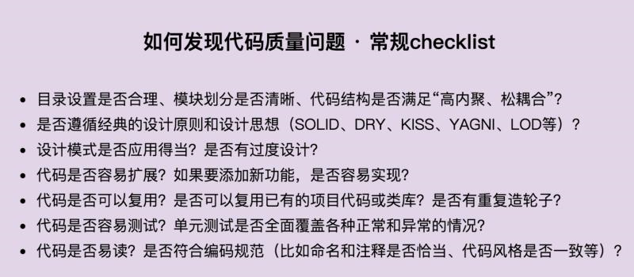

# Coding

1. 最难调试修复的 bug 是怎样的？ - doodlewind的回答 - 知乎 [https://www.zhihu.com/question/21991014/answer/1513267624](https://www.zhihu.com/question/21991014/answer/1513267624)
2. 好文分享:

   clean-code-typescript [https://github.com/labs42io/clean-code-typescript](https://github.com/labs42io/clean-code-typescript)

   教你如何写干净的代码, 文章中的思想,技巧 总结得还是很全面的. 另: 学习不要被编程语言限制, 要有个做科学家的心.

3. 
4. 函数式编程是否适用于超大型项目？ - 灵剑的回答 - 知乎 [https://www.zhihu.com/question/340251796/answer/791560176](https://www.zhihu.com/question/340251796/answer/791560176)
5. 快餐文分享：

   每个开发者都应该知道的 SOLID 原则

   [https://mp.weixin.qq.com/s?\_\_biz=MjM5MTA1MjAxMQ==&mid=2651241242&idx=1&sn=e51b1519bf59ad6793567f5d81b915f7](https://mp.weixin.qq.com/s?__biz=MjM5MTA1MjAxMQ==&mid=2651241242&idx=1&sn=e51b1519bf59ad6793567f5d81b915f7)

   1. 单一职责原则
   2. 开闭原则
   3. 里氏替换原则
   4. 接口隔离原则
   5. 依赖倒置原则

6. 编程究竟难在哪？ - 大宽宽的回答 - 知乎 [https://www.zhihu.com/question/311432227/answer/681616817](https://www.zhihu.com/question/311432227/answer/681616817)
7. 函数式编程（Functional Programming）相比面向对象编程（Object-oriented Programming）有哪些优缺点？ - 大宽宽的回答 - 知乎 [https://www.zhihu.com/question/19732025/answer/530161703](https://www.zhihu.com/question/19732025/answer/530161703)
8. 怎么深刻理解面向切面编程？ - invalid s的回答 - 知乎 [https://www.zhihu.com/question/61441658/answer/1603120111](https://www.zhihu.com/question/61441658/answer/1603120111)
9. 分享一个代码优化技巧：

   如何将优化双分支的代码？ 

   `condition ? A : B` 在大多数弱类型语言中可转换为 `[A, B][condition]`

   ```text
   // 后来又 get 了一种
   switch (true) {
     case this.status === 0 && data.type === 1:
     case (this.status === 2 || this.status === 3) && data.status === 2:
       this.nextBtnIsOk = true
       break;
   ​
     default:
       break;
   }
   ​
   if (
     (this.status === 0 && data.type === 1) ||
     ((this.status === 2 || this.status === 3) && data.status === 2)
   ) {
     this.nextBtnIsOk = true;
   }
   ```

10. 程序员基础掌握得好学新东西真的就快么？ - invalid s的回答 - 知乎 [https://www.zhihu.com/question/332732069/answer/737894772](https://www.zhihu.com/question/332732069/answer/737894772)
11. [漫画 \| 程序员必须要小心的7个潜规则](https://mp.weixin.qq.com/s/ubzCmQTL7wt9GEoSqueicw)
12. I think there's fundamentally 3 architypes of programmers, divided by which ideals we hold in highest esteem:

    1. You are a poet and a mathematician. Programming is your poetry
    2. You are a hacker. You make hardware dance to your tune
    3. You are a maker. You build things for people to use

    这个opinion 是我最近听到最感同身受的一个了.. 很幸福, 这3种分类 我都有体验过~

13. 好文分享: 3 tribes of programming [https://josephg.com/blog/3-tribes/](https://josephg.com/blog/3-tribes/)

    文章介绍了 编程语言的三种阵营, 也正对开发者的不同方向.

    1. Programming as applied mathematics 学术界的代表: Haskell, FP理论
    2. Programming as hardware hacking 注重性能的底层语言: C系列, 汇编
    3. Programming as a tool to make things 开发应用的语言: 前端..

    Ultimately code is code. Even though we have different reasons for writing software, what we write is \(usually\) compatible. And even when its not \(looking at you, Haskell\) - there's always a lot of ideas we can learn from and steal. 作者的主要思想: crosses multiple tribal lines

14. 我突然想到了一个点, coding 时有一个问题一直无法绕过.. 就是命名了..

    命名变量的时候, 用名词堆叠 再符合个命名规范就可以了

    但函数命名时, 在大部分场景下 其实是有一定规律的

    变量: 名词堆叠 函数: 动词+名词堆叠

    而这个动词 完全可以把它枚举出来, 这样大部分场景下, 都可以拿来就用..

    ```text
    addBalance
    getAccount
    filterActivityList
    patchEmail
    deleteUserById
    removeItem
    generateTagList
    fillTableHeader
    createFolder
    forEachFileList
    parseNodeTree
    updateUserInfo
    extractUserInfo
    showTable
    hideIframe
    useDebounce
    toBase64
    isSuccess
    canWrite
    requestModule
    loadScript
    fetchGalleryData
    setLanguage
    sendMessage
    querySelector
    findElement
    combineList
    importResource
    searchService
    renderComponent
    readFile
    onChange
    handleInput
    verifyFormData
    changeSettings
    cloneJSON
    appendSlice
    insertColumn
    saveConfig
    execCommand
    unloadPage
    destoryConnection
    openProgram
    ​
    单个动词, 一般都是 名词.动词 , 就比如 AST.parse()
    make
    do
    run
    walk
    enable
    disable
    parse
    build
    notify
    compare
    ​
    还有一些特定场景下的:
    downloadPage
    promisify
    expect
    box / pipe / then 链式调用
    ```

    A: 暂时想了这么多, 然后也借鉴了下之前的实践 与 通用 API

    B: 妙啊 我也是老起名困难了

    A: 我起名有个毛病.. 我经常 const filtererPageList = filterPageList\(\)

    每次coding 代码都好长..

    B: 没懂 这个命名是就多了个er吗

    A: 多了个过去式.. 已过滤的列表 = 过滤列表\(original list\)

    B: 我觉得长得太像了 容易看错

    A: 哈哈 没办法短.. pageList 被用了 只能 filtererPageList 了..

    我经常闹这种情况..

    B: 我喜欢前面加个new， newPageList

15. Question: 如何在编程角度复用资源？

    A: 单例与池化

16. 分享篇文章:

    圣杯与银弹 · 没用的设计模式

    [https://mp.weixin.qq.com/s/3TbunRkouM7PtCQrC52brQ](https://mp.weixin.qq.com/s/3TbunRkouM7PtCQrC52brQ)

17. 【分享】：如何发现代码质量问题

    

    

18. 题目：假如给你一个新产品，你将从哪些方面来保障它的质量？

    参考答案： 可以从代码开发、测试保障、线上质量三个方面来保障。 在代码开发阶段，有单元测试、代码Review、静态代码扫描等； 测试保障阶段，有功能测试、性能测试、高可用测试、稳定性测试、兼容性测试等； 在线上质量方面，有灰度发布、紧急回滚、故障演练、线上监控和巡检等。

19. 分享篇文章：

    You-Dont-Need-Loops   
    [https://github.com/you-dont-need/You-Dont-Need-Loops](https://github.com/you-dont-need/You-Dont-Need-Loops)

    文章讲述使用 函数式范式来处理数据的例子， 非常建议阅读，会培养你的编程思维。

    文章外的讨论： 使用 for 循环 必然要引入 其他状态，且还会隐藏意图，这通常不是一种很好的实践。

    但函数式也是有明显的问题， 如果编译器没有自动尾调用优化， 很容易造成调用栈溢出的问题，

    我记得之前和一朋友讨论过一个场景， 就是数组求和。

    通常情况下，如果没有接触函数式编程的同学，很可能写出面条式的代码：

    ```text
    let total = 0
    ​
    for(cont el of list){
      total += el
    }
    ```

    上面的代码， 就引入 total 这个完全没必要的状态， 所以的意图都藏在了 for 循环中。

    而建议的场景是 list.reduce\(\(t,o\)=&gt;t+o\)

    可以在拓展下， pointfree 编程原则。

    之前不知道各位还记得 聊 js 初始数组的时候，我提到过一次。

    在纯 FP 的语言中，是不存在赋值语句的，FP 是非常排斥 无关上下文状态的出现。

    如果想遵循 pointfree ，那最好有很多可以组合映射数据流的工具，也就是FP中的Functor。

    举个例子:

    ```text
    const getLongestWordLength = R.pipe(
      R.split(' '),
      R.map(R.length),
      R.reduce(R.max, 0)
    );
    ```

    A: pointfree 的 point 是什么

    没必要的状态，就是上文中的 total

20. 好文分享:   
    Software development topics I've changed my mind on after 6 years in the industry   
    [https://chriskiehl.com/article/thoughts-after-6-years](https://chriskiehl.com/article/thoughts-after-6-years)

    很多观点都很犀利, 我喜欢.

    So called "best practices" are contextual and not broadly applicable. Blindly following them makes you an idiot

