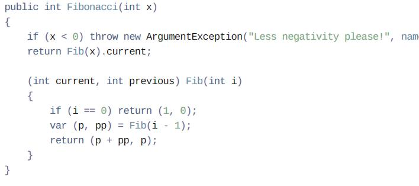
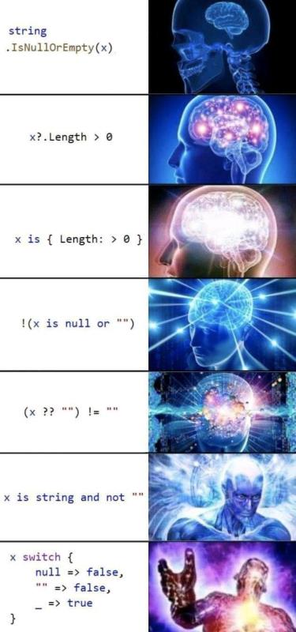

# CSharp

1. 

   C\# 求 斐波那契数列

   多返回值的设计很好, 但 为什么还要支持 返回键名引用..

   我猜测 多返回值 在内部的类型就是一个数据类....

   甜得齁得慌..

   我最欣赏的两门语言 Go, Kotlin, 在我看来他们的设计者才真正的懂语言..

   其他语言 就像是各种特性的缝合怪..

2. 

   C\# 判断一个字符串为空的写法...

3. 快餐文分享:

   C\# Updates for the Absent C\# Developer \(C\# 6.0 and newer overview\)

   [https://gamlor.info/posts-output/2020-12-05-csharp-for-the-absent/en/](https://gamlor.info/posts-output/2020-12-05-csharp-for-the-absent/en/)

   摘要: It has been a while since I actively developed in C\#. I mostly worked with C\# and .NET during the 3.0 to 4.5 days and I did async/await work very early on, so I skip over that as well. After a job change, I didn’t touch C\# for actual work. I mostly just watched the development from the sidelines via news. Today, I take a short look at some features. I will skip a lot and just add some of my highlights tour.

   文章介绍了 C\# 6.0 以来的新特性语法。

