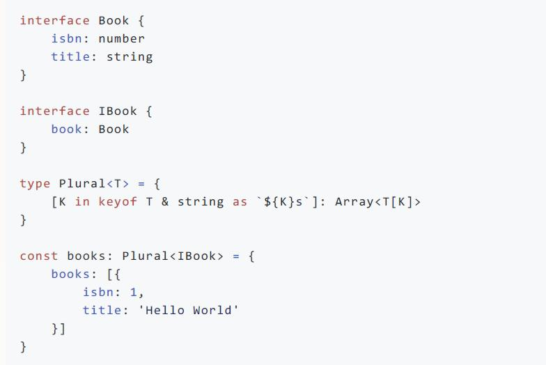
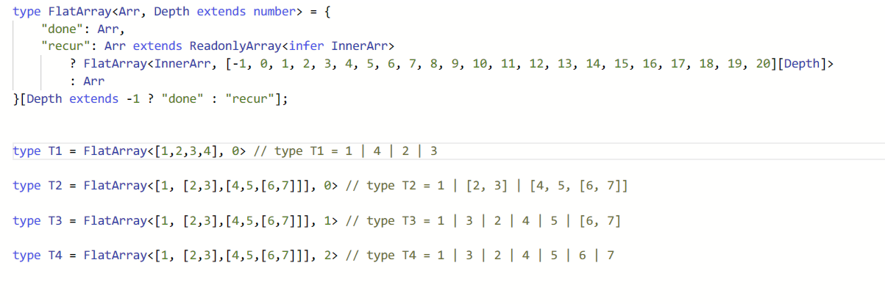
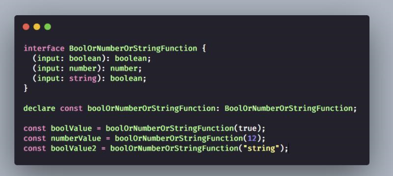
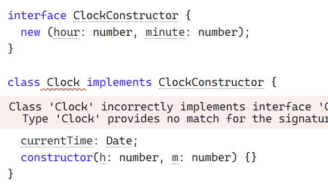
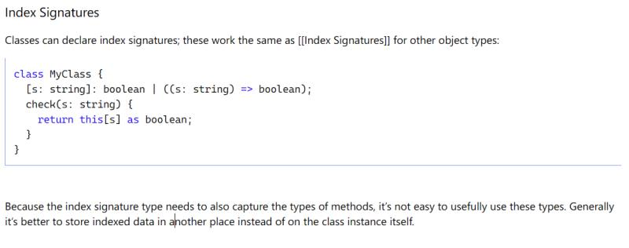

# TypeScript

1. 进来看看，TypeScript居然还能这么玩 - 晓黑板前端技术的文章 - 知乎 [https://zhuanlan.zhihu.com/p/296277982](https://zhuanlan.zhihu.com/p/296277982)
2. 深入理解 Typescript 高级用法 [https://github.com/hannq/ppt-share/blob/master/courseware/ts-advance-usage/README.md](https://github.com/hannq/ppt-share/blob/master/courseware/ts-advance-usage/README.md)

   摘要: 有人说 Typescript = Type + Javascript，那么抛开 Javascript 不谈，这里的 Type 是一门完备的编程语言吗？

   文章用多个案例, 展示了 TS 面向 Type 编程的特性.. 目前 TypeScript 不只是 带有 Type 的 JS 了.. 其类型系统 已经演化得十分强大... 所有编程语言都远不及..

   但是这样这么强大的类型系统, 真的有必要吗? Type 只是一种重要的上下文信息, 在 coding 时, 应该追求简单明了的类型建模, 而不应为了 Type 增加心智负担, 照这样下去, 免不了要 debug Type... 那就多少有点魔幻了..

   现在 TS 的发展已经趋向于是两种语言的融合: 一种是 JavaScript, 另一种是 &lt;加粗&gt;Type&lt;加粗&gt;Script...

   

3. 好文分享:

   clean-code-typescript [https://github.com/labs42io/clean-code-typescript](https://github.com/labs42io/clean-code-typescript)

   教你如何写干净的代码, 文章中的思想,技巧 总结得还是很全面的. 另: 学习不要被编程语言限制, 要有个做科学家的心.

4. TypeScript 设计中的最大槽点就是支持鸭子类型。

   

   每次看到具有该特性的代码, 都令我无法忍受.

   在我看来 这种设计只有坏处:

   1. 上下文更难以分析, 数据会无意间具有另一个身份（Type）
   2. 更难以追踪接口, 只能借助编辑器
   3. 与静态类型的原则相违背

5. 快餐文分享：

   1.2W字 \| 了不起的 TypeScript 入门教程

   [https://juejin.cn/post/6844904182843965453](https://juejin.cn/post/6844904182843965453)

   基础的语法，知识点都有提到。

   一份不可多得的 TS 学习指南（1.8W字） [https://juejin.cn/post/6872111128135073806](https://juejin.cn/post/6872111128135073806)

6. 快餐文分享:

   TypeScript 高级技巧

   [https://juejin.cn/post/6844903863791648782](https://juejin.cn/post/6844903863791648782)

   文中的 demo 都挺有趣的。

7. 日常分享 TS 代码片段:

   ```typescript
   type Whitespace = ' ' | '\n' | '\r' | '\t'

   type TrimStart<S extends string, P extends string = Whitespace> =
     S extends `${P}${infer R}` ? TrimStart<R, P> : S
   ```

8. 分享一道面试题：

   ```typescript
   interface Logger {
     time: number;
     asyncLog:(msg: string) => Promise<string>;
     syncLog:(msg: string) => number;
   }

   type Translate<T> = /** 你需要实现的部分 **/;

   // 要求 Translate
   //  1. 提取出为函数类型的属性，丢弃掉其它类型的属性
   //  2. 将函数返回类型调整为形参类型(假定有且只有一个参数)

   // 实现效果如下:
   type T0 = Translate<Logger>;

   // 等价于
   type T0 = {
       // 其它属性被丢弃
       asyncLog: (arg: string) => string; 
       // return 类型被调整为跟 arg 保持一致
       syncLog: (arg: string) => string; 
       // return 类型被调整为跟 arg 保持一致
   }

   const result: T0 = {
       asyncLog(msg: string) { return msg }
   };
   ```

   1. 先实现一个类型可以提取出指定类型，用来筛选出所有为函数类型的属性

   ```typescript
   type FilterTypes<T, U> = {
       [Key in keyof T]: T[Key] extends U ? Key : never
   };

   // 看看阶段性成果
   type T = FilterTypes<Logger, Function>;
   // type T = {
   //     time: never;
   //     syncLog: "syncLog";
   //     asyncLog: "asyncLog";
   // }
   ```

   1. 在 1 的基础上剔除 `never`，取出所有 key

   ```typescript
   type FilterKeys<T, U> = FilterTypes<T, U>[keyof T];

   // 看看阶段性成果
   type T = FilterKeys<Logger, Function>;
   // type T = "syncLog" | "asyncLog"
   ```

   1. 在 2 的基础上我们可以使用 `Pick` 提取出子类型

   ```typescript
   type SubType<T, U> = Pick<T, FilterKeys<T, U>>;

   // 看看阶段性成果，此时我们已经成功提取出了所有类型为函数的属性，满足要求
   type T = SubType<Logger, Function>;
   // type T = {
   //     syncLog: (msg: string) => number;
   //     asyncLog: (msg: string) => Promise<string>;
   // }
   ```

   1. 在 3 的基础上我们再使用 `infer` 将函数的返回类型改为形参类型

   ```typescript
   // 将参数类型作为返回类型
   type ArgAsReturn<T> = {
       [K in keyof T]: T[K] extends ((arg: infer U) => any) ? ((arg: U) => U): never;
   }

   // 我们最终得到了 Translate
   type Translate = ArgAsReturn<SubType<Logger, Function>>;

   // 看看最后效果，满足要求
   type T = Translate<Logger>;

   // type T0 = {
   //     asyncLog: (arg: string) => string;
   //     syncLog: (arg: string) => string;
   // }
   ```

   文中部分示例来自[TypeScript 官网 - 高级类型](https://www.typescriptlang.org/docs/handbook/advanced-types.html)，面试题灵感来自[中国 LeetCode](https://github.com/LeetCode-OpenSource/hire/blob/master/typescript_zh.md?rgh-link-date=2020-04-13T15%3A04%3A56Z)，原题太绕且有 Redux 倾向，因此做了简单改造，基本思路一致甚至更全面。

9. 快餐文分享:

   深入typescript类型系统\(二\): 泛型和类型元编程

   [https://zhuanlan.zhihu.com/p/96046788](https://zhuanlan.zhihu.com/p/96046788)

   摘要: 本文主要讨论Typescript的泛型设计和类型元编程能力。泛型和子类型几乎是正交的两个概念，当然两者也可以配合使用\(Bounded Polymorphism\)。

   文章 Demo 质量都挺高的，建议刷下。

10. 日常分享 TypeScript 代码片段：

    ```typescript
    type Split<S extends string, D extends string> =
        string extends S ? string[] :
        S extends '' ? [] :
        S extends `${infer T}${D}${infer U}` ? [T, ...Split<U, D>] :
        [S];

    type T40 = Split<'foo', '.'>;  // ['foo']
    type T41 = Split<'foo.bar.baz', '.'>;  // ['foo', 'bar', 'baz']
    type T42 = Split<'foo.bar', ''>;  // ['f', 'o', 'o', '.', 'b', 'a', 'r']
    type T43 = Split<any, '.'>;  // string[]
    ```

11. 

    最近 我真的是被 TS 迷住了...

    ```text
    [-1, 0, 1, 2, 3, 4, 5, 6, 7, 8, 9, 10, 11, 12, 13, 14, 15, 16, 17, 18, 19, 20][Depth] , 做 递归下降

    Depth extends -1 ? "done" : "recur"  , hash做终止条件

    Arr extends ReadonlyArray<infer InnerArr> 做模式匹配..
    ```

    太酷了.. 打表去做递减, 真是第一次见到 这种用法...

12. A: 我想用 数组的 length 生成一个 union type，比如 length = 4 -&gt; type N = 0 \| 1 \| 2 \| 3，这样有可能吗？

    B: 我有一个绝妙的想法 吃完饭验证一下

    A: 哈哈哈好！

    C: 我看看..

    D: **我也想看哈哈**

    B:

    ```typescript
    type Rua<Arr> = Exclude<keyof Arr, keyof (typeof [])>

    type A = Rua<[1,2,3]>
    ```

    能生成 字符串的union

    A: `type ArrIndex<Arr> = Exclude<keyof Arr, keyof any[]>;`

    C: 受教了~ 这个思路 牛批~

13. 文章分享:

    [https://github.com/microsoft/TypeScript/wiki/Performance](https://github.com/microsoft/TypeScript/wiki/Performance)

    文章汇总了一些能提高 Typescript 编译性能的使用方法和配置技巧。

14. 分享一个项目： [https://github.com/type-challenges/type-challenges](https://github.com/type-challenges/type-challenges) Collection of TypeScript type challenges with online judge

    可做 TS 体操

15. 分享个 TS snippet 助助兴

    

16. 函数重载的另一种方式.. 除此之外还有:

    func\(签名1\); func\(签名2\); ... func\(签名3\) {}

     

17. \(type as any\) as targetType 可以将 任意 type 转换成 targetType..
18. TypeScript 官方提供了一种注解的元编程库.. TypeScript 在 编译成 JS 的这一层 可以增加好多抽象哇..

    [https://jkchao.github.io/typescript-book-chinese/tips/metadata.html](https://jkchao.github.io/typescript-book-chinese/tips/metadata.html)

19. 怎么过滤 Type Model/Object 中的不需要的 Key

    `type filter<T extends object> = { [K in keyof T]: condition ? ... : never }[keyof T]`

    关键在于 最后一行, 它其实隐含了两点:

    1. `[keyof T] keyof T => key1 | key2 | key3 ...`

    `[key1 | key2 | key3 ...]` 可以看成 `[Literal type]` 而 `[literal type]` 会执行 "遍历 每一个可成立的字面量"的...

       2. `{k1:nerver, k2: value}['k1'|'k2]` 此类型返回值是 value 也就是说 会自动过滤掉 `never`

    

    B: 可以当分配律来理解`A[x|y]=A[x]|A[y]`

    `T|never=T T&never=never`

    A: 这个受教了 是的, 就应该是理解的

20. 第一次见到泛型组件的用法.. 有趣..

    

     `<Component<Generic Type> attributes... />`

21. 快餐文分享: 10++ TypeScript Pro tips/patterns with \(or without\) React [https://medium.com/@martin\_hotell/10-typescript-pro-tips-patterns-with-or-without-react-5799488d6680](https://medium.com/@martin_hotell/10-typescript-pro-tips-patterns-with-or-without-react-5799488d6680)

    使用 TS 开发 React 项目时需要注意的一些点, 这篇文章是 2018 年写的, 在 medium 上有 8.9k 点赞.. 文章有很多 现在看来的 明显的错误...

    就比如 `Don’t use FunctionComponent<P>/FC<P> to define a function component`

    果然发展的快, 沉淀就成了个问题..

22. 利用接口 实现 构造函数约束..

    

23. TS 类本身内部居然也支持 定义限制条件...

    

24. hah 每次看到 + - 修饰符, 都觉得使用这两个符号 类型显得很清晰易懂

    

25. 好文分享:

    Learn Advanced TypeScript Types   
    [https://medium.com/free-code-camp/typescript-curry-ramda-types-f747e99744ab](https://medium.com/free-code-camp/typescript-curry-ramda-types-f747e99744ab)

    摘要: Despite the popularity of currying and the rise of functional programming \(and of TypeScript\), it is still a hassle today to make use of curry and have proper type checks. Even famous libraries like Ramda do not provide generic types for their curry implementations \(but we will\). However, you need no functional programming background to follow this guide. The guide is about currying but it is only a topic of my choice to teach you advanced TypeScript techniques. You just need to have practised a bit with TypeScript’s primitive types. And by the end of this walk-through, you will be a real TS wizard.

    文章主要讲述了, 使用 TypeScript 为 Curry 函数建模的过程

    文章前面花大篇幅讲解了 curry, 与 TS 的基础概念.. 然后借助这个概念 创建了一个个类型工具, 再利用这些工具 达成最后 curry 模型.. 并且最后还增加了 placeholder 支持..

    整篇文章读了3遍.. 耗时半个多小时... 很久没这么耗费心智看一篇文章了...

    PS: 文章中存在一处错误 CurryV3 的递归名词 应该是 CurryV3

    这篇文章真的非常棒, 非常推荐阅读.

    [https://github.com/millsp/ts-toolbelt/blob/master/src/Function/Curry.ts](https://github.com/millsp/ts-toolbelt/blob/master/src/Function/Curry.ts)

    这是文章最终的产出

    哎, 虽然 TS 只提供了 type extends infer 很少的关键字, 但已经做到 类型系统上 图灵完备了..

26. TypeScript 4.2 Beta 发布   
    [https://www.oschina.net/news/126465/typescript-4-2-beta-released](https://www.oschina.net/news/126465/typescript-4-2-beta-released)

    语法新feature

    1. 元祖类型的 Rest 元素支持放置在元组中的任何位置
    2. 模板字面量表达式已具有模板字面量类型

27. TypeScript 中提升幸福感的 10 个高级技巧

    [https://juejin.cn/post/6919478002925453320](https://juejin.cn/post/6919478002925453320)

    快餐文分享，第一条 与 第四条 都是之前没有想过的用法。

