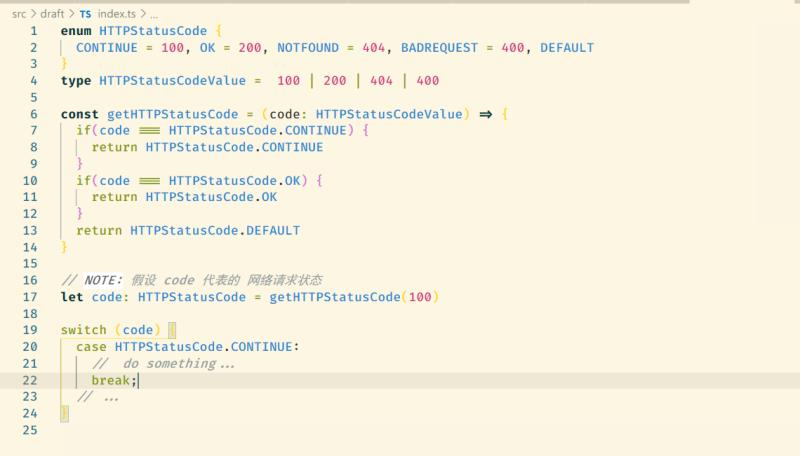

# Talk

1. Q: 好像很多编程语言都有hooks hooks是干啥的啊

   A: 呃，react 的hooks 和你常见的hook 并不是一种概念.

   一个是 事件监听的钩子，就好比 观察者模式； 一个是 生命周期的钩子，就好比 Servlet 中的 destroy 方法。

   钩子这种概念不仅存在于 应用层，像底层的 epoll io机制，事件循环 都有相似的概念。

   说白了 hook 就是暴漏给你的signal

   顾名思义，钩子嘛..

   Q: 他是做什么的呢

   A: 它暴漏给你一些入口， 你把逻辑注入进去， 等到合适时机 执行你的逻辑。时机啊，入口啊 这些设计可是很讲究 抽象能力的。

2. Q: 我看lamda表达式可读性也挺差 是不是不习惯的原因

   A: 其实 lambda 表达式 是最贴近数学函数的表达形式...

   java 中的 lambda 设计的很有趣, 后端的原理 是使用 函数接口 加匿名类, 而前端的改成了 \(parameters\) -&gt; expression..

   颇有 函数第一成员的感觉 但是 实际用起来 还是挺多限制的..

   不过还好了, java 能做出这种转变 已经很不错了..

   我最讨厌的lambda设计 就是python..

3. 刚刚A了一道题, 挺有意思的

   已有方法 rand7 可生成 1 到 7 范围内的均匀随机整数，试写一个方法 rand10 生成 1 到 10 范围内的均匀随机整数。不要使用系统的 Math.random\(\) 方法。

   [https://leetcode-cn.com/problems/implement-rand10-using-rand7/](https://leetcode-cn.com/problems/implement-rand10-using-rand7/)

   我的思路是 实现 rand5 与 rand2..

   rand2 代表的是一种对立布尔状态, rand5 则是 1-5 随机数 如果 rand2 === 1 那么就 返回 rand5, 否则就 5 + rand5

   

4. A:Kotlin 她真的太美了。

   B:\[翻白眼\]kotlin 也能在jvm上跑是不是

   A:当然

   B:java凉了 jvm都凉不了

   A:Kotlin scala groovy都是以jvm为后端的语言

   Jvm 是一个编程语言的后端～

   除了jvm 还有 llvm 都是很强大的工具。

   现在设计一门语言，只需要搞定前端就可以，也就是编程语言的语法特性。后端有太多的选择。

   B:都是用c++写的吗

   A:刚开始都是c系列

   现在jvm应该自举了吧

   我不清楚

   我查下哈

   Java 平台中的 JVM 和 .Net 平台下的 CLR 分别是用什么语言写的？ - RednaxelaFX的回答 - 知乎 [https://www.zhihu.com/question/20163831/answer/18629722](https://www.zhihu.com/question/20163831/answer/18629722)

   Hotspot 是c系列

   其他jvm就不用看了

   我喜欢kotlin与go，看到她们的代码，打心底里兴奋。

   JS ruby c\# 也有jvm的版本，哈哈

5. 无意间刷到了篇垃圾文章, 真是被恶心到了..

   

   如此妖魔化的产物 说成 中国在世界上的科技创新...

   正是因为这些巨头, 这些傻X产物, 让国内的互联网不再互联.

   现在国内的互联网就是一个个孤岛..只知道增强壁垒, 吸引流量, 他们应有的责任义务 早抛掷脑后了..

6. 代码片段分享: JS 利用 Symbol.iterator 实现遍历器

   

   为什么 ES6 要给 JS 添加诸如 Python 那样的魔法函数呢..

   魔法函数: JS obj\[Symbol.属性\] Python `__func__`

   C++ 运算符重载 Kotlin 后缀中缀函数表达式

   诸如此类 可以改变默认行为的特性..

   C++ 和 Kotlin 我倒是可以想象到使用场景, 当实现内部 dsl 时很有用

   但 ES6 中的各种Symbol属性 提供的自定义函数, 真是多此一举了.. 我找了很多资料, 就没发现一个有意义的demo... 都是为了用而用..

   反正 JS 莫名其妙的设计挺多的, 也不缺这一个..

   

   

   JS 完全可以借助 Proxy 实现内部DSL! 太酷了~

   

7. A: 大佬们都是用什么来写博客的，readme？

   B: 

   更新下，现在所以的子项目都是用 react 了。

   我不看重 网站访问速度，日活，SEO权重，所以不一定符合你需求。

8. A: 大佬有在学 haskell 吗？

   C: 哈哈，之前有学过一点

   B: 我发现大佬发的好多梗 知乎上都看过（ 不会关注的都是同一批人吧

   C: 我知乎玩了很多年了，现在关注了近700名前辈\[让我看看\] [https://www.zhihu.com/people/simonma-87](https://www.zhihu.com/people/simonma-87) 这是我的知乎，只吸收 从不输出.. 之前每次想输出时，都会很在意每一个答案 每一个评论，慢慢得变成一种心智负担，索性 不输出了..

   A: 哈哈 关注了！

   A: 我之前也在学，然后去实习就停了。。看的这个教程 [http://learnyouahaskell.com/](http://learnyouahaskell.com/)

   C: 巧了，一样 我看的是纸质的趣学指南~

9. A: ts枚举可以约束值的选项吗？

   B: type Number = 1 \| 2 \| 3 \| 4 ...

   A: 

   可选的不是1，2，3 为啥赋值为5还可以啊?

   B: 你对枚举理解错了 你需要 literal type 去约束值 枚举并不是去约束取值的

   A: 那他是干嘛的呀？

   B: 枚举主要代表的是 状态的集合

   ```typescript
   enum Week {
     Monday 
     Tuesday 
     Wednesday 
     ...
   }
   ```

   就像是这样 我知道你现在的迷惑 我想想怎么解释哈...

   A: 好

   B: 你现在不明白的是 状态 与 值 之间的关系...

   A: 不明白上面那个代码为啥不报错

   B: 呃... 是这样的 我在本地复现了, ts 确实没有检测出来, 之所以没有检测 也情有可原, 枚举没有这么使用的...

   一般都是 变量 = Enum.member 而不是等于一个值常量...

   A: 嗷嗷，这样啊

   B: 因为枚举代表的是 状态的集合, 而每个状态 只要有一个 unique 值就好了...

   就好比 给你一个 HTTPStatusCode 算了 给你写下伪代码吧, 这就是枚举平时的用法

   

10. A: 我想用 数组的 length 生成一个 union type，比如 length = 4 -&gt; type N = 0 \| 1 \| 2 \| 3，这样有可能吗？

    B: 我有一个绝妙的想法 吃完饭验证一下

    A: 哈哈哈好！

    C: 我看看..

    D: **我也想看哈哈**

    B:

    ```typescript
    type Rua<Arr> = Exclude<keyof Arr, keyof (typeof [])>

    type A = Rua<[1,2,3]>
    ```

    能生成 字符串的union

    A: `type ArrIndex<Arr> = Exclude<keyof Arr, keyof any[]>;`

    C: 受教了~ 这个思路 牛批~

11. 发现了个有趣的项目 [https://github.com/itorr/e/blob/master/index.html](https://github.com/itorr/e/blob/master/index.html)

    A: hah 中文编程又前进了一大步

    B: 哈哈哈 我在公司代码还看到了用中文做变量名的 简直惊了

    A: 没有 review 与 规范嘛... 这我不能接受..

    A: 果然 中文编程是未来趋势

    C: 易语言申请出战

    A: 易语言 永远滴神~

    A: 文言文編程語言 [https://github.com/wenyan-lang/wenyan](https://github.com/wenyan-lang/wenyan)

    

    B: woc 好牛逼hhh

    A: 东北方言编程语言 [https://github.com/zhanyong-wan/dongbei](https://github.com/zhanyong-wan/dongbei)

    issue区笑死我了 完犊子了 == throw error

    B: 哈哈哈 不过我觉得这个和我们母语有关，毕竟不是出生就看英文的，还是习惯用中文翻译一遍hhh

12. Question: React fiber 为了在浏览器环境 做到时间分，片机制 增量渲染，底层借助的 API 是什么？

    Answer: 不是 requestAnimationFrame, 也不是 setTimeout, 是 MessageChannel + postMessage

    

    可以看下 上面这张图, 这个相当于简化版本的 react 调度机制实现.

    如果浏览器兼容 MessageChannel\(宏任务\) 就使用它 来做异步, 否则粗暴点 使用 setTimeout\(宏任务\)

    之所以使用 MessageChannel + postMessage , 而不是 requestAnimationFrame, requestIdleCallback, setTimeout..

    我还需要在找找具体原因...

    我想起来了, 之前看过一篇文章

    1. requestAnimationFrame 如果一帧之内没有剩余时间, 则留到下一帧调用
    2. requestIdleCallback 使用在浏览器空闲时才 调用, 这样会造成 渲染单元一直得不到调用
    3. setTimeout 懂得都懂..

    找到了一个合适的回答,之所有使用 MessageChannel 做异步机制, 除了上面 API 的缺点外, 它本身的优点在于: onmessage的回调函数的调用时机是在一帧的paint完成之后。react scheduler内部正是利用了这一点来在一帧渲染结束后的剩余时间来执行任务的  
    好像 Vue 中的 nextTick 底层使用的异步机制 也是 MessageChannel

    我刚刚查了一下 nextTick 先检测是否原生支持Promise，不⽀持的话再去检测是否支持MutationObserver，如果都不行就只能尝试宏任务实现，首先是setImmediate，这是⼀个⾼版本 IE 和 Edge 才支持的特性，如果都不支持的话最后就会降级为 setTimeout。

    这个问题就挺有趣的.. React 的异步是 MessageChannel 宏任务 , Vue 的nextTick 使用的 微任务 , 为什么呢...

13. A: 我到字节 最好奇的就是 有很多很多同事 的开发环境 就是使用 mac + 触控板.. 我坚持了一周, 各种效率软件 魔改快捷方式软件 都试过了.. 撑不下去了..

    B: 哈哈哈我也觉得很顺手啊 是时候分享一波你的魔法操作了

    A: 好吧.. 可能 我在 Windows 上的环境 太高效了.. 这点我到没有夸张..

    我除了 各种新知识, 最喜欢探索的 就是 和电脑的交互方式了..

    我平时使用最多的是 WGesture + Chrome 下的 Vimium, crx Mouse Gesture + Seer + uTools + QTTabber + 罗技鼠标宏 + 自己写的 AHK 模拟鼠标脚本..

    对了 主要离不开 wsl2

    C: 推荐用quicker 感觉比utool好用点

    A: 那个 一直被各路推, 我也试了很多次, 找不到解决痛点所在...

    C: 我看到测评m1芯片的出来了，性能好像很强悍，自家os优化贼好，很想换，又舍不得在win辛辛苦苦优化的工作流程

    A: no no no, arm 架构 现在生态还没站住脚呢..

    C: 那估计刚出 恰饭的比较多

14. 

    Kotlin 1.4 新推出了一个关键字 tailrec , 可以使用它 去主动编译优化 尾调用的函数. [https://twitter.com/kotlin/status/1341749661175066624?s=20](https://twitter.com/kotlin/status/1341749661175066624?s=20)

    先不提尾调用是什么, 就说说 都 2020 年了, 现代的编译器还做不到 主动优化尾调用嘛.. \(V8 做到了,但因为一些问题 不敢主动开启\)

    这个关键字很破环我对 Kotlin 的印象..

    它就和 C++ 中的 inline, volatile 代表的性质一样... 这些关键字的出现 是为了弥补 底层设计的缺陷... 之所以 C++ 的定位是偏底层语言, 就因为 它的语法特性 就离不开操作系统那些概念..

    而一个优秀 现代的编程语言 是不应该为用户增加此心智负担的.

    A: kotlin也有inline 还有refied这种类型擦除后再生 给Java擦屁股

15. Question: 如何在浏览器环境 实现 sleep 函数, 可以给出 异步函数, 同步函数 两种实现方案吗?

    

    Question: 当我执行 同步 sleep 函数,比如 sleepBySync\(9e9\), 这个时候浏览器 tab 会怎样?

    A: 9e9有点大了。。

    B: hahah 随意啦 也可以 9\_000\_000\_000

    A: 页面啥交互的操作都无效吧

    B: 是的. tab 直接假死..

    A: 异步的这个使用场景是啥呀

    B: 最简单的就是 mock 网络请求过程..

    B: 那假设是在 react支持 concurrent 版本中, 一个事件 里面调用 sleepBySync\(9e9\), 那页面还会卡死吗

    其实 promise 最有趣的 resolve, reject 这两个函数了, 我一直把他们理解为 异步环境下的 "PV"原语

    可以 把resolve, reject 传到其他异步场景中, 再调用..

    就好比 手动 join 下其他线程, 或者 发出个信号 这样

    C: 好理解

    B: 我根据刚刚的讨论 以及我对 promise 的理解, 写了个限制网络请求数量的demo

    C: 我面字节就考的这个 没答出来

    B: 

    超过限制的request, 会将 resolve 传到了 全局, 等到 resolve 被消费 才会执行\(await\), 已经完成的 网络请求 会按照顺序消耗 resolve 信号.

    典型的 "PV"原语...

    D: 咦，这个我能听懂

    B: 现在 并发方案 业界, 学术界有挺多不同的模式了..

    就比如 上午我说 ruby3 引进的 actor-model, 还有 golang 的 csp, 以及函数式宗教信奉的通过编程范式 去天然引进并发..

    B: 以下来自我之前的一条微博:

    CSP 模型 和 Actor 模型, 具有相同的设计理念: 通过通信来实现共享内存，而不是用共享内存来实现通信。

    然而它们的侧重点不同，Actor 关心通信的实体（对 OOP 更加友好），CSP关心通信的工具。 如果要选其一的话，我更加欣赏 CSP模型。

    假设通信的数据，可以自我实现状态管理，这样一来就不会被通信双方所约束，消息传递的过程 就可以增加更多的抽象。 目前，业界的 CSP 代表 Golang 结合 Context 包已经实现了这一点。

    C: 但是像JS这样的单线程语言，感觉玩不出多少花样来

    B: 对啊.. 撑死就是借用下 异步 api, 去模拟下 fiber 了...

    谁叫 js 天生单线程呢..

16. A: 我说我的网站怎么日活超5k了..

    原来是被人扫描了..

    

    hah 对方一看就是个 新手

    B: 这啥后台啊

    A: Google Analytics 我只接入了 Google tag manager

    如果接 国内的服务, 可以明确查看到 ip 信息的

    就比如百度站长 完全可以.. 但是国内服务 我很排斥..

    除了 我的微博点赞 使用的是 leancloud 国际版, 其他的服务就没有国内的了

    B: 我今天给你微博点赞了 看得到不？

    A: hah 当然

    B: 能看到点赞人的信息吗？

    A: 你觉得呢...

    

    B: 对的我还看了这个请求。。。没看懂

    A: 点赞信息 只是一个简单的kv store, 存储的地方是 leancloud

    k 就是每一条微博的 ID, v 就是微博点赞的数量 hh

    B: 了解了hhh

    A: 我是一直想开源的, 但我觉得 有这需求的人 好像都没几个..

17. 前端Question: 如何判断一个函数 是箭头函数 还是 function 定义的函数.

    答案是 箭头函数是没有原型链的, 也就是 prototype 属性为空

    还有一种方式，箭头函数无法实例化，可以 在try catch 中 new func\(\) 捕获异常，有异常就是箭头函数

18. A: 我在reddit看大部分程序员都觉得 pm 码不会打几个 还事多 B: 哈哈，思想不一样吧。他们可能只是把工作当做了工作。程序员除了技术，最重要的能力就是业务能力，产品能力了。 B: 我的思想转变, 除了自己的工作外 离不开一系列文章, 其中最典型的, 对我启发最大的 就是 于江水前辈 写的 我在淘宝做前端的这三年 的三篇了.[https://zhuanlan.zhihu.com/p/55272391](https://zhuanlan.zhihu.com/p/55272391)  其中有句话一直影响着我. 业务能力应该是程序员除了技术之外，最具价值的能力，也是最必要的。 因为技术本身很难赚钱，业务落地才能赚钱。 当程序员具备了业务和产品能力，才可能选取业务和技术的折中点，又快又好的支撑业务，带来价值和效益。 懂产品和业务（甚至交互设计）的技术，更容易跟其他工种进行沟通，用通俗易懂的方式介绍技术实现和难度，可以提升在企业中的自身地位和价值。 此外，对于架构师，理解业务也是必备能力。 A: 嗯...业务能力可能是每个合格打工人的一个必备条件吧 这个时代需要的是跨专业的人才 B: 是的, 需要的是 通才..  其实 我认识很多同学有一个通病.. 就是给自己设边界.. 
19. A: 现在的计算机 应用层 还是有不少潜力的.. 但是底层 沉淀下的基础设施, 很难改变了..  
    就比如 http3, 现在一直没有推广开发..  
    B: 等一波什么量子计算机出现  
    A: 量子计算机 最大的痛点 除了学术上, 还有一点不可忽视, 普通人用不起那东西的.. 只能等 物理 化学届的新突破了.. 之前的计算机划时代的晶体管时代 也是 这样过来的...  
    B: 不是出来个什么 “以氮化镓、碳化硅为代表的第三代半导体”

    A: 现在 web 智能化 是一个新方向啊..  我听说 去年 双 11 淘宝的活动页 有 79% 都是机器生成的..  
    B: 再过十几年AI是不是要侵占地球了hhh  
    A: 现在各个公司都有相应的智能化的产品落地了  
    那想多了 现在 ai 只是 ai, 只是数学拟合  
    如果真正想成为 人工 智能, 那前提条件是 人类把自己研究明白透彻 还可以.. 就比如 人脑科学..  
    之前看马斯克的脑机接口项目, 完全可以与 人体 API 相交互, 太酷了  
    具体的原理是, 大脑中的芯片 解码 神经中的电信号, 然后 在通过 应用层协议 与 外部相交互.. 关键 就在于 识别电信号了..  
    假如说真有 人体 API 就好了... 我会强制让自己跑个 10 公里的, hahah  
    B: 人体api假如真出来 可能是全网最长了hh  
    C: 怕不是到时候出来一堆伦理问题  
    A: 我在想 如果用 linux POSIX API 的设计标准 来设计的话, 那一定很有趣.. 每一次 action 都是一个 进程的 fork , 每次 拉屎 都是 一次 GC..

20. 


A: 无言以对..  国人的 github trending 一个开源的技术项目没有...  
B: 茅台抢购哈哈哈  
C: ...我对面的今儿早上说茅台抢购,说的原来是这玩意儿  
A: 这算不算技术作恶 违法是肯定的了  
我看了下 源码, 就是简单的爬虫... 连个 IP 池都没提供... 京东风控 怎么搞得... 这不分分钟封掉..  
现在 拼多多的 安全准则就是 宁可误杀 也不让薅羊毛   
京东真是好兄弟啊

补充下 我今天提的微内核的概念..  
在微内核设计背后的思想是，为了实现高可靠性，将操作系统划分成小的、良好定义的模块，只有其中一个模块——微内核——运行在内核态上，其余的模块，由于功能相对弱些，则作为普通用户进程运行。特别地，由于把每个设备驱动和文件系统分别作为普通用户进程，这些模块中的错误虽然会使这些模块崩溃，但是不会使得整个系统死机。  
这个微是真的没发展起来.  
微服务是发展起来了.. 但是我觉得 它只不过是对 多个资源的一种使用规范..


