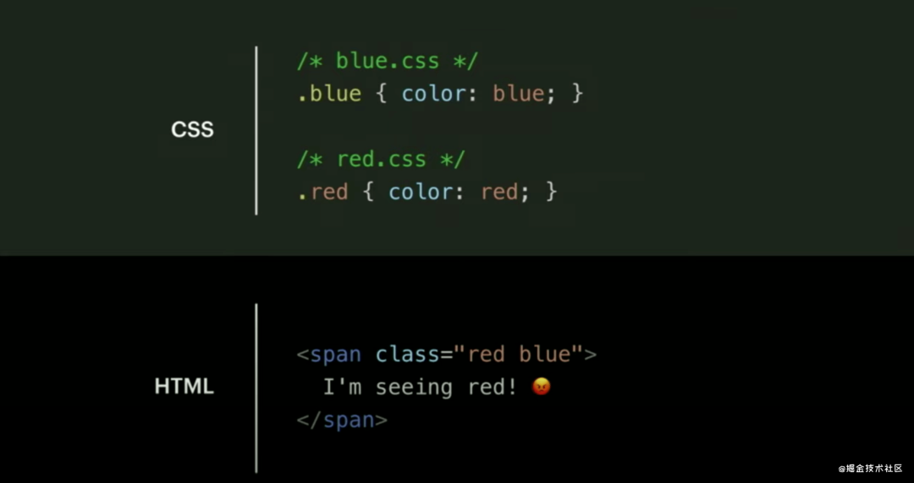

# CSS

1. 框架分享: Tailwind CSS - [https://tailwindcss.com/](https://tailwindcss.com/)

   Tailwind CSS 是一个高度可定制的基础层 CSS 框架，与其它 CSS 框架不同的是，Tailwind 并不提供预先设计好的内建组件。相反，Tailwind 提供了更基础的工具类（utility classes），可以让你直接在 HTML 源码上构建一个完全定制化的设计。

   并且 Tailwind 是我见到各种框架官网中 设计得最优雅简洁的, 看一下官网Demo, 就很想去尝试使用它.

2. 快餐文分享：

   Uncommon Use Cases For Pseudo Elements

   [https://ishadeed.com/article/unusual-use-cases-pseudo-elements/](https://ishadeed.com/article/unusual-use-cases-pseudo-elements/)

   摘要：Pseudo-elements are in use for a long time. However, there are some uses cases that I feel they are not entirely known across developers. I wrote down this article to shed light on them so they can be used more.

   作者用多个案例 介绍了 CSS 伪类的使用场景。

3. 分享一个练习 CSS-Flex 语法的游戏

   [https://flexboxfroggy.com/](https://flexboxfroggy.com/)

   一共24关, 通过写 Flex, 让小青蛙移动到合适的位置 即可过关.

4. 
5. 2020 CSS 现状报告

   [https://2020.stateofcss.com/](https://2020.stateofcss.com/)

   CSS 在 2020 年使用现状统计，涉及到了 CSS 的一些特性、框架、规范。

6. [如何只使用CSS提升页面渲染速度](https://mp.weixin.qq.com/s/aPguK-dZr7JMA-s2OOFyjg)
7. 好文分享:

   CSS Utility Classes and "Separation of Concerns"

   [https://adamwathan.me/css-utility-classes-and-separation-of-concerns/](https://adamwathan.me/css-utility-classes-and-separation-of-concerns/)

   摘要: Over the last several years, the way I write CSS has transitioned from a very "semantic" approach to something much more like what is often called "functional CSS."  
   这篇文章介绍了 HTML-CSS 编写的多种范式 以及 各种范式之间的差异与感触.本文的作者同时也是 TailWind CSS 的作者, 值得一读. 说实话 我几乎没有思考过 CSS HTML 之间的依赖, 一直按照文中的第一种 或者 BEM 规范去写, 原来它们之间一直没有做到 关注点分离, 一直存在依赖. 不过 现在 CSS IN JS, CSS Module 方案已经从编译方面打开了新出路

8. 快餐文分享:  来自新时代的 CSS  [https://mp.weixin.qq.com/s/pPtzhXbAaXfoTV2q3u0Dww](https://mp.weixin.qq.com/s/pPtzhXbAaXfoTV2q3u0Dww) 文中列举很多关于 CSS 现在发展的一些技术 特性.  1. css 命名规范, 遗憾的是 文章只提了 结构与样式分离的规范: BEM, 应该扯扯 构建函数单元的 css 命名规范  2. 简单介绍预处理器: less sass stylus  3. 发展了很多年也没有声音的 CSS Houdini, 还不如说 css in js  4. postcss, postcss 之于 css 就好比 babel 之于 js  5. css module: 没说清楚..  6. stylelint 规范工具  7. postcss-preset-env 的规范: cssdb
9. 3行核心CSS代码的rate评分组件，秀到你怀疑人生

   [https://mp.weixin.qq.com/s/FE3IuNu66VxLDgHCHWIRVA](https://mp.weixin.qq.com/s/FE3IuNu66VxLDgHCHWIRVA)

10. 分享篇文章，讲的挺好的

    Facebook 重构：抛弃 Sass / Less ，迎接原子化 CSS 时代 [https://mp.weixin.qq.com/s/NmHUYZh\_ILG-Phe53NcoEg](https://mp.weixin.qq.com/s/NmHUYZh_ILG-Phe53NcoEg)

11. 
12. 动漫版 flexbox cheat sheets，图示敲可爱~

    [https://dev.to/joyshaheb/flexbox-cheat-sheets-in-2021-css-2021-3edl?utm\_source=digest\_mailer&utm\_medium=email&utm\_campaign=digest\_email](https://dev.to/joyshaheb/flexbox-cheat-sheets-in-2021-css-2021-3edl?utm_source=digest_mailer&utm_medium=email&utm_campaign=digest_email)

13. CSS 目前的三种趋势:  CSS-in-CSS \(e.g. CSS, Preloader, CSS Modules\)  CSS-in-JS \(e.g. Styled Components, Emotion\)  Utility-First-CSS \(e.g. Tailwind CSS\)
14. 点击网页的按钮, 如何只利用 CSS 发起网络请求:

    .some-button:active { background-image: url\('some\_image.jpg'\) }

    点击按钮时, 触发 按钮 active 状态, 然后应用到 CSS 规则的 background-image: url\(图片地址\) 这就相当于对 图片地址 发起了一次网络请求..

15. 分享个网站: cssdb [https://cssdb.org/](https://cssdb.org/)

    cssdb is a comprehensive list of CSS features and their positions in the process of becoming implemented web standards.

    未来 CSS 的新feature 都可以在这里找到~

    @media \(480px &lt;= width &lt; 768px\) {}

    关于媒体查询器, 新的语法方案, 看起来挺期待的.

16. 快餐文分享:

    CSS Tips you won't see in most tutorials [https://denic.hashnode.dev/css-tips-you-wont-see-in-most-tutorials](https://denic.hashnode.dev/css-tips-you-wont-see-in-most-tutorials)

17. 快餐文分享: CSS Grid 网格布局教程 [http://www.ruanyifeng.com/blog/2019/03/grid-layout-tutorial.html](http://www.ruanyifeng.com/blog/2019/03/grid-layout-tutorial.html)

    摘要: Grid 布局与 Flex 布局有一定的相似性，都可以指定容器内部多个项目的位置。但是，它们也存在重大区别。 Flex 布局是轴线布局，只能指定"项目"针对轴线的位置，可以看作是一维布局。Grid 布局则是将容器划分成"行"和"列"，产生单元格，然后指定"项目所在"的单元格，可以看作是二维布局。Grid 布局远比 Flex 布局强大。

18. 快餐文分享: Scoping CSS using Shadow DOM [https://blog.bitsrc.io/scoping-css-using-shadow-dom-a548985b73af](https://blog.bitsrc.io/scoping-css-using-shadow-dom-a548985b73af)

    使用 Shadow DOM 去隔离 不同应用之间的样式

    应用场景 太适合 微前端了..

19. Chrome 88 支持新的 CSS 属性`aspect-ratio`，可以设置容器的长宽比。

    这么常见的UI构建功能，现在才出现...

    

20. 分享篇好文：   
    Things You Can Do With CSS Today   
    [https://www.smashingmagazine.com/2021/02/things-you-can-do-with-css-today/](https://www.smashingmagazine.com/2021/02/things-you-can-do-with-css-today/)

    总结：

    1. grid 网格布局
    2. is 伪类选择器 .post :is\(h1, h2, h3\)
    3. where 选择器
    4. min max clamp 函数
    5. ch ex 字体尺寸单位
    6. text decoration 的一些 rule
    7. scroll-margin-top
    8. 之前分享过的 aspect-ratio 尺寸等比划分
    9. content-visibility：google 带头提出的一个特性，刚出的时候让我很惊艳，具体做的是：With content-visibility: auto, you can tell the browser not to worry about rendering the elements in there while they are outside of the viewport, which can have a massive impact on initial loading speeds.
    10. 支持嵌套选择

21. 分享篇文章:   
    CSS奇思妙想 -- 使用 background 创造各种美妙的背景   
    [https://juejin.cn/post/6925600887947657224](https://juejin.cn/post/6925600887947657224)

    chokcoco 每篇文章都很有艺术气息aaa..

22. 快餐文分享：

    如何把css'content的操作跟价值发挥到最大  
    [https://juejin.cn/post/6844903917348732936](https://juejin.cn/post/6844903917348732936)

    counter 函数 与 content 中的字符拼接 可以关注一下

23. 惊讶系列分享，文中 画板的例子太秀了。  你可能不知道的 transition 技巧与细节  [https://juejin.cn/post/6924114612799406093](https://juejin.cn/post/6924114612799406093)
24. CSS奇思妙想 -- 使用 CSS 创造艺术  [https://juejin.cn/post/6922257014840098830](https://juejin.cn/post/6922257014840098830)  我愿称为大艺术家chokcoco~
25. Tailwind CSS （可能）是名过其实的  [https://juejin.cn/post/6930196913119576077](https://juejin.cn/post/6930196913119576077)  分享篇文章，文中的观点很赞同：对于原子类的使用，一直有这样的痛点：当封装的粒度太小时，会显得异常繁琐，反之想自定制化时又经常不合适。

